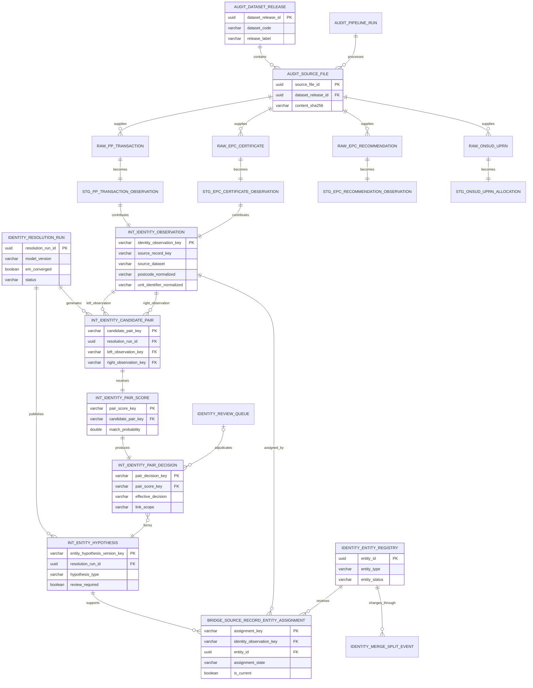

# EPC v4 Data Model Design

## 1. Who This Document Is For

This document is for two readers at once.

The first is a data engineer who can build a sound dbt project but may not yet know the UK property, Energy Performance Certificate (EPC), Price Paid Data (PPD), or geography landscape. The opening chapters tell the story in ordinary language before introducing the contracts.

The second is a coding model or engineer implementing EPC v4. The model cards define grain, keys, materialisation, dependencies, population rules, types, tests, and deliberate non-goals. They are intended to remove guesswork without pretending that uncertain property identity can be made certain by a database schema.

### 1.1 The short version

We receive records about places. We do not receive a perfect list of places.

- A sale row says that a transaction was recorded against an address.
- An EPC row says that a certificate described a subject at an inspection and lodgement time.
- An EPC recommendation row says that the certificate contained a recommendation.
- An ONSUD row links a Unique Property Reference Number (UPRN) to geography in a particular release.

EPC v4 keeps those observations intact, then makes separate, versioned assertions about which real-world premises, building, or dwelling they concern. It derives current-looking state only for a stated `as_of_date`, and evaluates policy only against a named, dated ruleset.

```text
evidence                 assertion                  dated interpretation
--------                 ---------                  --------------------
PP row -----------+      source record              dwelling EPC history
EPC row ----------+----> assignment ----+---------> current EPC as at D
Recommendation ---+                     |
ONSUD row ----------------> location ----+---------> MEES screen as at D

Nothing on the right rewrites or deletes the evidence on the left.
```

DuckDB and dbt are authoritative. Neo4j is a curated projection of selected nodes and relationships. A graph can make evidence paths easy to explore, but it must never become a second, diverging source of truth.

### 1.2 How to read the document

1. Read Chapters 2 to 8 for the domain, architecture, keys, and operating approach.
2. Use Chapters 9 to 16 as implementation contracts. Every important model has a model card.
3. Follow the Merton Lane examples to see uncertainty survive from source rows to graph edges.
4. Use Chapters 17 to 24 for graph contracts, end-to-end acceptance, delivery phases, governance, references, and open decisions.

### 1.3 Evidence vocabulary used throughout

| Label | Name | Meaning | Example |
|---|---|---|---|
| `[F]` | Source fact | Faithful typed representation of supplied evidence | EPC source says current energy rating is `D` |
| `[A]` | Inferred assertion | A versioned conclusion supported by evidence and a method | EPC likely concerns Dwelling D-42 |
| `[S]` | Dated state | A deterministic derivation meaningful only as at a date | Certificate C-9 is selected as current at 2026-07-14 |
| `[P]` | Policy evaluation | Cautious result from applying a versioned policy rule | Dwelling needs MEES evidence review under rule R-3 |
| `[C]` | Control fact | Operational provenance, run, release, file, or export metadata | File checksum was loaded in run R-8 |

An assertion is not upgraded into a source fact because its confidence is high. A dated state is not timeless. A policy evaluation is not a legal determination.

## 2. A Friendly Source Dataset Primer

### 2.1 HM Land Registry Price Paid Data

Price Paid Data, shortened to PP or PPD, contains residential property transactions lodged with HM Land Registry. A row normally includes a transaction identifier, price, transfer date, address fields, property type, old/new indicator, duration, category, and record status.

It is useful evidence of a transaction at a written address. It does not, by itself, prove the current owner, current occupation, current tenancy, exact building geometry, or that two similarly written addresses are the same dwelling.

PPD Category B means an additional transaction category under the publisher's definition. It may cover several kinds of transaction. EPC v4 names the derived boolean `is_additional_ppd_transaction`; it never calls Category B an investment or buy-to-let sale.

### 2.2 EPC certificates

An Energy Performance Certificate records an assessment of a subject, usually with an address, inspection and lodgement dates, ratings, scores, construction descriptions, and a UPRN where supplied. The bulk data is evidence from published extracts, not a promise that a record is the authoritative live-register state at query time.

An EPC-recorded tenure is what the certificate says at assessment time. It is not proof of a current tenancy. A rating is an assessment result, not a direct measurement of every building component, and the model must not turn descriptive fields such as `Poor` into invented numeric values.

### 2.3 EPC recommendations

Recommendations are child observations belonging to a certificate. They may include source wording, indicative costs, and an improvement identifier or item order. They are facts about what the certificate recommended, not proof that work was suitable, commissioned, paid for, or installed.

EPC v4 maps recommendation wording to a canonical `MeasureConcept` separately. That mapping is versioned, can be one-to-many, and carries confidence. The raw recommendation remains available even if the taxonomy changes.

### 2.4 ONSUD

The Office for National Statistics UPRN Directory, shortened to ONSUD, allocates UPRNs to statistical and administrative geography codes for a published release. A direct UPRN allocation is the strongest location method in this design, but it is still release-aware: boundaries, codes, and allocations can change.

Coordinates derived from a postcode centroid are approximate. A postcode-sector centroid is broader still. The correct sector for `S4 8GG` is `S4 8`, retaining the inward-code sector digit. Neither centroid method may assign an exact LSOA, MSOA, or local authority district (LAD) to an entity.

### 2.5 What the four sources can and cannot prove

| Source | Strong evidence for | Does not establish on its own |
|---|---|---|
| PPD | A recorded transaction, amount, date, and supplied address | Current ownership, investment intent, tenancy, exact dwelling identity |
| EPC | Certificate observation, attributes, dates, supplied address/UPRN | Current tenancy, live-register validity, legal compliance, installed measures |
| Recommendation | Recommendation wording and indicative source values | Technical suitability, expenditure, completion, exemption |
| ONSUD | Release-specific UPRN allocation and official geography codes | Timeless location, a missing UPRN, exact geography from centroid fallbacks |

## 3. Running Example: Merton Lane

Merton Lane is a fictional teaching example. IDs, people-free addresses, prices, dates, scores, and outcomes below are illustrative; they are not validation claims about a real street.

```text
12 Merton Lane, S4 8GG
  PP transaction PP-TX-100: "12 MERTON LANE", GBP 180,000, 2022-06-10
  EPC certificate EPC-C-100: "12 Merton Lane", UPRN 100012345001, D, 2021-04-02
  EPC certificate EPC-C-101: "12 Merton Lane", UPRN 100012345001, C, 2025-09-01

14 Merton Lane, S4 8GG
  Building candidate B-14
    Flat 1 candidate: EPC-C-200, UPRN 100012345011
    Flat 2 candidate: PP-TX-200 and EPC-C-201, UPRN 100012345012
    Unqualified address: EPC-C-202 says only "14 Merton Lane"
```

- The records for 12 Merton Lane can support a strong dwelling hypothesis, but the assignment remains an assertion with a run and method.
- Building B-14 and its dwellings are different entities.
- EPC-C-202 must not be silently attached to Flat 1 or Flat 2. It can remain assigned to an unresolved premises candidate or, if evidence supports only the building, receive a building-subject assertion.
- EPC-C-101 may be selected as current for the 12 Merton Lane dwelling as at a date, using chronology and a deterministic tie-break. That is dated state, not a rewrite of EPC-C-100.

```text
(Source:EPC-C-202)
       | ASSIGNED_TO {status: "UNRESOLVED", confidence: 0.58}
       v
(PremisesCandidate:PC-14-UNQUALIFIED)
       | MAY_REFER_TO {review_required: true}
       v
(Building:B-14)-[:CONTAINS]->(Dwelling:D-14-F1)
              `-[:CONTAINS]->(Dwelling:D-14-F2)
```

## 4. Target Architecture

### 4.1 Layers and schemas

The physical schemas are `audit`, `bronze`, `silver`, `identity`, `core`, `mart`, and `graph_export`. Intermediate models live in the domain schema that owns their contract: identity intermediates in `identity`, location and EPC intermediates in `core`, and scope/export products in `graph_export`.

```text
External files
     |
     v
+-----------+    +-----------+    +-----------+
| audit     |--->| bronze    |--->| silver    |
| manifests |    | immutable |    | typed and |
| and runs  |    | evidence  |    | cleaned   |
+-----------+    +-----------+    +-----------+
                                      |
                    +-----------------+------------------+
                    v                                    v
              +-----------+                       +-----------+
              | identity  |---------------------->| core      |
              | evidence, |                       | facts and |
              | registry  |                       | entities  |
              +-----------+                       +-----------+
                                                        |
                                                        v
                                                  +-----------+
                                                  | mart      |
                                                  | dated and |
                                                  | policy    |
                                                  +-----------+
                                                        |
                                                        v
                                                  +-----------+
                                                  | graph     | --> Neo4j
                                                  | export    |     projection
                                                  +-----------+
```

### 4.2 End-to-end DAG

```text
audit_dataset_release -> audit_source_file -> raw_* -> stg_*_observation
                                               |       |
                                               |       +-> atomic facts
                                               +-> identity observations

int_identity_observation -> candidate_pair -> pair_score -> pair_decision
  -> entity_hypothesis -> source_record_entity_assignment
  -> premises candidate / building / dwelling

EPC fact + subject assertion -> EPC history -> current EPC as at D
  -> MEES screening under rule R -> retrofit candidate

ONSUD release + required UPRNs -> location assertions -> geography bridge

core + mart + graph scope -> graph nodes/relationships -> manifest
  -> DuckDB COPY stream -> Neo4j
```

### 4.3 Entity–relationship diagrams

The full project contains many operational and export tables, so one enormous diagram would be difficult to read. The model is shown in three connected views:

1. source evidence and identity resolution;
2. buildings, dwellings, facts, location, and policy state;
3. the Neo4j export projection.

The diagrams use Mermaid ER syntax. GitHub and many Markdown viewers render Mermaid directly. The relationship labels are also readable in the source text when Mermaid rendering is unavailable.

#### 4.3.1 Source evidence and identity resolution

This diagram shows how immutable source observations become candidate pairs, scored decisions, run-specific hypotheses, and eventually versioned assignments to persistent entity IDs.



The important path is:

```text
Source observation
    -> candidate comparison
    -> model score
    -> accepted/reviewed/rejected decision
    -> run-specific hypothesis
    -> versioned assignment
    -> persistent entity registry ID
```

Splink scores never become entity IDs. Singleton observations travel through the same assignment path and therefore remain represented.

#### 4.3.2 Core entities, facts, location, and dated state

This diagram begins once the identity layer has persistent premises, building, and dwelling IDs. It separates physical/entity topology from immutable events and from dated analytical conclusions.

```mermaid
erDiagram
    IDENTITY_ENTITY_REGISTRY ||--o| DIM_RESOLVED_PREMISES_CANDIDATE : represents
    IDENTITY_ENTITY_REGISTRY ||--o| DIM_BUILDING : represents
    IDENTITY_ENTITY_REGISTRY ||--o| DIM_DWELLING : represents

    DIM_BUILDING ||--o{ BRIDGE_BUILDING_DWELLING : contains
    DIM_DWELLING ||--o{ BRIDGE_BUILDING_DWELLING : belongs_to

    FCT_EPC_CERTIFICATE ||--o{ FCT_EPC_SUBJECT_ASSERTION : asserted_about
    IDENTITY_ENTITY_REGISTRY ||--o{ FCT_EPC_SUBJECT_ASSERTION : receives
    FCT_SALE_TRANSACTION ||--o{ FCT_TRANSACTION_SUBJECT_ASSERTION : asserted_about
    IDENTITY_ENTITY_REGISTRY ||--o{ FCT_TRANSACTION_SUBJECT_ASSERTION : receives

    FCT_EPC_CERTIFICATE ||--o{ FCT_EPC_RECOMMENDATION_OBSERVATION : contains
    FCT_EPC_RECOMMENDATION_OBSERVATION ||--o{ BRIDGE_RECOMMENDATION_MEASURE_MAPPING : interpreted_by
    DIM_MEASURE_CONCEPT ||--o{ BRIDGE_RECOMMENDATION_MEASURE_MAPPING : classifies
    FCT_EPC_CERTIFICATE ||--o| INT_EPC_RECOMMENDATION_AGG : summarized_by

    IDENTITY_ENTITY_REGISTRY ||--o{ FCT_ENTITY_LOCATION_ASSERTION : located_by
    INT_COORDINATE_WGS84 ||--o{ FCT_ENTITY_LOCATION_ASSERTION : supplies_coordinate
    IDENTITY_ENTITY_REGISTRY ||--o{ BRIDGE_ENTITY_GEOGRAPHY : allocated_to
    DIM_GEOGRAPHY ||--o{ BRIDGE_ENTITY_GEOGRAPHY : receives_entity
    DIM_GEOGRAPHY o|--o{ DIM_GEOGRAPHY : parent_of

    DIM_DWELLING ||--o{ MART_DWELLING_EPC_HISTORY : has_history
    FCT_EPC_CERTIFICATE ||--o{ MART_DWELLING_EPC_HISTORY : appears_in
    DIM_DWELLING ||--o{ MART_DWELLING_CURRENT_EPC : evaluated_as_of
    FCT_EPC_CERTIFICATE o|--o{ MART_DWELLING_CURRENT_EPC : selected_as

    DIM_MEES_POLICY_RULE ||--o{ SNAPSHOT_DWELLING_MEES_RISK : governs
    DIM_DWELLING ||--o{ SNAPSHOT_DWELLING_MEES_RISK : screened
    MART_DWELLING_CURRENT_EPC ||--o{ SNAPSHOT_DWELLING_MEES_RISK : supplies_epc_evidence
    FCT_EXEMPTION_OBSERVATION }o--|| DIM_DWELLING : observed_for

    DIM_DWELLING ||--o{ MART_RETROFIT_CAMPAIGN_CANDIDATE : considered_for
    DIM_MEASURE_CONCEPT ||--o{ MART_RETROFIT_CAMPAIGN_CANDIDATE : groups_by
    SNAPSHOT_DWELLING_MEES_RISK o|--o{ MART_RETROFIT_CAMPAIGN_CANDIDATE : informs

    DIM_BUILDING {
        uuid building_id PK
        varchar identity_status
    }
    DIM_DWELLING {
        uuid dwelling_id PK
        varchar identity_status
    }
    BRIDGE_BUILDING_DWELLING {
        varchar relationship_key PK
        uuid building_id FK
        uuid dwelling_id FK
        double confidence
    }
    FCT_EPC_CERTIFICATE {
        varchar epc_certificate_key PK
        varchar certificate_number
        date lodgement_date
    }
    FCT_SALE_TRANSACTION {
        varchar sale_transaction_key PK
        varchar transaction_id
        date transfer_date
    }
    FCT_EPC_RECOMMENDATION_OBSERVATION {
        varchar recommendation_observation_key PK
        varchar epc_certificate_key FK
        integer improvement_item
    }
    DIM_MEASURE_CONCEPT {
        varchar measure_concept_key PK
        varchar taxonomy_version
        varchar measure_code
    }
    INT_COORDINATE_WGS84 {
        varchar coordinate_key PK
        double longitude
        double latitude
    }
    DIM_GEOGRAPHY {
        varchar geography_key PK
        varchar geography_type
        varchar geography_code
        uuid geography_release_id
    }
    MART_DWELLING_CURRENT_EPC {
        uuid dwelling_id FK
        date as_of_date
        varchar selected_epc_certificate_key FK
        varchar currentness_status
    }
    DIM_MEES_POLICY_RULE {
        varchar policy_rule_id PK
        varchar policy_status
        date effective_from
    }
    SNAPSHOT_DWELLING_MEES_RISK {
        varchar screening_key PK
        uuid dwelling_id FK
        varchar policy_rule_id FK
        date evaluation_as_of_date
        varchar screening_outcome
    }
```



The core distinction is visible in the centre:

```text
Dwelling ------------------------------ stable entity
EPC / sale / recommendation ----------- immutable observations
Current EPC ---------------------------- as-of derivation
MEES screening ------------------------- policy-versioned evaluation
Campaign candidate --------------------- planning output
```

These grains should not be collapsed into one wide property row.

#### 4.3.3 Graph export projection

The graph export models do not create another source of truth. They copy a permitted, scoped, referentially closed subset of the relationships above.

```mermaid
erDiagram
    GRAPH_EXPORT_MANIFEST ||--o{ GRAPH_SCOPE_ENTITY : defines
    GRAPH_SCOPE_ENTITY ||--o| GRAPH_NODE_SOURCE_RECORD : includes
    GRAPH_SCOPE_ENTITY ||--o| GRAPH_NODE_PREMISES_CANDIDATE : includes
    GRAPH_SCOPE_ENTITY ||--o| GRAPH_NODE_BUILDING : includes
    GRAPH_SCOPE_ENTITY ||--o| GRAPH_NODE_DWELLING : includes
    GRAPH_SCOPE_ENTITY ||--o| GRAPH_NODE_EPC : includes
    GRAPH_SCOPE_ENTITY ||--o| GRAPH_NODE_RECOMMENDATION : includes
    GRAPH_SCOPE_ENTITY ||--o| GRAPH_NODE_MEASURE : includes
    GRAPH_SCOPE_ENTITY ||--o| GRAPH_NODE_SALE : includes
    GRAPH_SCOPE_ENTITY ||--o| GRAPH_NODE_GEOGRAPHY : includes
    GRAPH_SCOPE_ENTITY ||--o| GRAPH_NODE_MEES_SCREENING : includes

    GRAPH_NODE_SOURCE_RECORD ||--o{ GRAPH_REL_SOURCE_ASSIGNMENT : starts
    GRAPH_NODE_DWELLING ||--o{ GRAPH_REL_SOURCE_ASSIGNMENT : ends
    GRAPH_NODE_BUILDING ||--o{ GRAPH_REL_BUILDING_DWELLING : starts
    GRAPH_NODE_DWELLING ||--o{ GRAPH_REL_BUILDING_DWELLING : ends
    GRAPH_NODE_DWELLING ||--o{ GRAPH_REL_DWELLING_EPC : starts
    GRAPH_NODE_EPC ||--o{ GRAPH_REL_DWELLING_EPC : ends
    GRAPH_NODE_EPC ||--o{ GRAPH_REL_EPC_RECOMMENDATION : starts
    GRAPH_NODE_RECOMMENDATION ||--o{ GRAPH_REL_EPC_RECOMMENDATION : ends
    GRAPH_NODE_RECOMMENDATION ||--o{ GRAPH_REL_RECOMMENDATION_MEASURE : starts
    GRAPH_NODE_MEASURE ||--o{ GRAPH_REL_RECOMMENDATION_MEASURE : ends
    GRAPH_NODE_DWELLING ||--o{ GRAPH_REL_DWELLING_SALE : starts
    GRAPH_NODE_SALE ||--o{ GRAPH_REL_DWELLING_SALE : ends
    GRAPH_NODE_DWELLING ||--o{ GRAPH_REL_DWELLING_GEOGRAPHY : starts
    GRAPH_NODE_GEOGRAPHY ||--o{ GRAPH_REL_DWELLING_GEOGRAPHY : ends
    GRAPH_NODE_EPC ||--o{ GRAPH_REL_EPC_NEXT : precedes
    GRAPH_NODE_EPC ||--o{ GRAPH_REL_EPC_NEXT : follows
    GRAPH_NODE_DWELLING ||--o{ GRAPH_REL_DWELLING_MEES_SCREENING : starts
    GRAPH_NODE_MEES_SCREENING ||--o{ GRAPH_REL_DWELLING_MEES_SCREENING : ends

    GRAPH_EXPORT_MANIFEST {
        uuid export_run_id PK
        date as_of_date
        varchar graph_schema_version
        varchar status
    }
    GRAPH_SCOPE_ENTITY {
        uuid export_run_id FK
        varchar graph_id
        varchar node_label
        varchar inclusion_rule
    }
    GRAPH_NODE_DWELLING {
        varchar graph_id PK
        uuid dwelling_id
        varchar identity_status
    }
    GRAPH_NODE_EPC {
        varchar graph_id PK
        varchar epc_certificate_key
        date inspection_date
    }
    GRAPH_REL_DWELLING_EPC {
        varchar relationship_id PK
        varchar start_graph_id FK
        varchar end_graph_id FK
        double subject_confidence
    }
```



The export gate is simple:

```text
Every relationship start ID exists as a node.
Every relationship end ID exists as a node.
Every row belongs to the same export manifest.
No relationship is allowed to pull the whole national graph into a small scope.
```

### 4.4 Authority and mutation rules

1. Bronze source observations are immutable evidence. Corrections arrive as new release/file records or explicit status observations.
2. Silver may clean and type but retains raw values where cleaning can change meaning.
3. Identity outputs are versioned assertions. Splink scores are evidence for decisions, not entity IDs.
4. Persistent registry UUIDs identify evolving premises, building, and dwelling entities.
5. Core facts retain natural keys and deterministic technical keys.
6. Mart state declares `as_of_date`; policy outputs also declare `policy_rule_id`.
7. Neo4j imports graph marts and does not become an alternative authority.

## 5. Naming and Contract Conventions

| Prefix | Meaning | Typical grain |
|---|---|---|
| `audit_` | Operational control and provenance | one release, file, or run |
| `raw_` | Immutable source-shaped evidence | one supplied row |
| `stg_` | Typed source observation | one accepted source row |
| `int_` | Reusable intermediate calculation | explicitly documented |
| `dim_` | Descriptive entity or ruleset | one entity/rule version |
| `fct_` | Atomic event or assertion | one event/assertion |
| `bridge_` | Many-to-many/time-bounded relationship | one relationship interval |
| `mart_` | Consumer-facing derived product | declared business grain |
| `snapshot_` | As-of state/policy evaluation | entity + date + ruleset |
| `graph_node_`, `graph_rel_` | Scoped graph exports | one export node/edge |

Use `*_id` for durable identifiers, `*_key` for deterministic SHA-256 keys, `*_code` for controlled codes, `*_at` for timestamps, and `*_date` for dates. Booleans begin `is_`, `has_`, or `requires_`.

Standard source lineage is `dataset_release_id UUID`, `source_file_id UUID`, `source_row_number UBIGINT`, `source_record_key VARCHAR`, `pipeline_run_id UUID`, and `loaded_at TIMESTAMPTZ`. Timestamps are UTC. Money is `DECIMAL(18,2)` with a currency where exposed outside a UK-only model.

SQL `NULL` is never silently changed to zero. Empty strings become null only in Silver, while Bronze preserves them. Unknown categories get a status/reason rather than the nearest plausible value.

## 6. Stable Key and Entity ID Strategy

### 6.1 Two kinds of identity

| Mechanism | Used for | Property |
|---|---|---|
| Deterministic SHA-256 hex key | Immutable source rows, events, relationship observations | Rebuilds identically from canonical inputs |
| Persistent registry UUID | Evolving premises candidates, buildings, dwellings | Survives evidence changes through history |

Natural PPD transaction IDs, EPC certificate numbers, recommendation item identifiers, UPRNs, and geography codes remain columns. A hash supplements provenance and joins; it does not erase source identity.

### 6.2 Canonical dbt/DuckDB SHA-256 macro

The encoding prevents concatenation ambiguity, distinguishes null from empty text, preserves position, and allows versioning. Present components have a UTF-8 byte-length prefix.

```sql

  '{{ value | replace("'", "''") }}'



  case
    when {{ expression }} is null then 'N;'
    else concat(
      'V',
      lpad(cast(octet_length(encode(cast({{ expression }} as varchar)))
                as varchar), 20, '0'),
      ':', cast({{ expression }} as varchar), ';'
    )
  end



  sha256(concat(
    'SK1;',
    'NS=', {{ _stable_key_component(_stable_key_sql_literal(key_namespace)) }},
    'PV=', {{ _stable_key_component(_stable_key_sql_literal(payload_version)) }}
    ,
    'P', lpad('{{ loop.index }}', 20, '0'), '=',
    {{ _stable_key_component(field) }}
    
  ))

```

```sql
{{ stable_sha256(
  'uk.gov.landregistry.ppd.transaction', 'v1',
  ['transaction_id', "strftime(transfer_date, '%Y-%m-%d')",
   'cast(price_paid as decimal(18,2))']
) }} as sale_transaction_key
```

Call-site requirements:

1. Namespace the object, not the transient table.
2. Change payload version only when canonical semantics change.
3. Keep field order explicit; never derive it from unordered metadata.
4. Format dates/timestamps explicitly in UTC and decimals at declared scale.
5. Serialise booleans explicitly and version any text normalisation.
6. Prefer immutable natural keys; use file checksum plus row number as fallback.
7. Test null, empty text, Unicode, delimiters, leading zeros, positions, namespaces, and versions.

DuckDB `sha256` returns the required lowercase 64-character hexadecimal `VARCHAR`. `local_md5` has weaker collision resistance and does not define these serialization semantics. `ROW_NUMBER()` changes when order or population changes. Neither is safe for durable references or Neo4j `MERGE` identifiers.

### 6.3 Registry UUID lifecycle

`identity_entity_registry` allocates `uuid()` once when a hypothesis is promoted. Later runs reuse it through continuity rules. A merge records aliases and a survivor. A split retires or marks the old UUID ambiguous and allocates new UUIDs; historical assignments are superseded explicitly.

```text
Hypothesis H1 --PROMOTED_AS--> UUID D1
Hypothesis H2 --CONTINUES----> UUID D1
UUID D1 ------SPLIT_INTO-----> UUID D2
                           `--> UUID D3
```

## 7. Materialisation and Refresh Strategy

| Family | Default | Refresh rule |
|---|---|---|
| Audit | Incremental table | Append events; update explicit completion state only |
| Bronze | Incremental table | Idempotent by source key and file manifest |
| Silver source observations | Table initially | Rebuild affected releases; incremental after key tests |
| ONSUD | Release table | Publish whole releases; never blend silently |
| Identity evidence | Run-versioned table | Full declared population per identity run |
| Registry/events | Governed incremental | Transactional publication after gates |
| Core facts | Incremental after MVP | Upsert by stable event key |
| Entities/bridges | Table/affected-entity incremental | Preserve relationship history |
| Coordinates | Incremental table | Transform each new distinct pair once |
| EPC current state | Table | Build for requested `as_of_date` |
| MEES | Incremental snapshot | Append ruleset/as-of batch |
| Graph marts | Tables per export | Rebuild declared scope/snapshot |

Views are for cheap projections. Expensive regex, normalisation, aggregation, and spatial transformation are materialised once. Incremental processing is not approved until late files, changed assignments, and entity continuity have explicit behaviour.

## 8. DuckDB Resources, Orchestration, and Manifests

- Keep `memory_limit` below physical RAM and monitor a dedicated `temp_directory`.
- Tune `threads`; serialise heavy ONSUD, recommendation, and identity jobs unless benchmarks support overlap.
- Record time, rows, database growth, spill where observable, and free disk.
- Load spatial support in controlled setup, not in a 21-million-row post-hook.

Splink scratch tables live in `scratch/splink_<identity_run_id>.duckdb`, a separate run-specific file. Only contracted identity outputs are published. Successful scratch is closed and cleaned after checksums and gates; failed scratch may have time-limited diagnostic retention and is never an authoritative dependency.

```text
1 register -> 2 Bronze -> 3 Silver/quarantine -> 4 location lookups
-> 5 Splink scratch -> 6 identity evidence -> 7 reconcile every record
-> 8 publish registry/assignments -> 9 core -> 10 marts
-> 11 graph scope/marts -> 12 COPY/manifest -> 13 scratch cleanup
```

`audit_pipeline_run` is the parent manifest. Identity and graph have domain manifests. A success records code/dbt/software versions, source checksums, model/ruleset versions, row reconciliation, acceptance gates, timestamps, resource profile, outputs, and cleanup state.

## 9. Control and Audit Model Contracts

### 9.1 `audit_dataset_release`

**At a glance.** `[C]` One registered publication of PP, EPC, recommendations, or ONSUD.

**Direct upstream/downstream.** Upstream: publisher metadata. Downstream: `audit_source_file`, Bronze models, ONSUD allocation.

**Grain and materialisation.** One publisher/dataset/release label; incremental table in `audit`.

**Business problem.** Files need stable release context, particularly when ONSUD allocations and boundaries change.

#### How the model is populated

1. Start with the release metadata declared by the publisher for a PP, EPC, recommendation, or ONSUD publication. Keep the supplied release label and use a published release date only when one is actually known.

2. Normalise dataset and publisher names so that the same release is described consistently. Do not invent a date to fill a gap. Build the stable `release_key` from this controlled metadata so later files can refer to the same publication reliably.

3. Register the release once. If the same key is submitted again with conflicting metadata, reject the re-registration rather than silently changing the original record. Any later lifecycle change, such as moving from registered to an approved next state, happens through the audit-controlled status transition.

4. A completed row means that one publisher release now has a persistent control ID, a stable key, and an explicit lifecycle state. It provides release context for downstream data; it does not claim that the source is complete or that this release will always be the current one.

| Column | DuckDB type | Example | Meaning |
|---|---|---|---|
| `dataset_release_id` | `UUID` | `2f...` | Persistent control ID |
| `dataset_code` | `VARCHAR` | `ONSUD` | Controlled dataset code |
| `publisher` | `VARCHAR` | `ONS` | Publisher |
| `release_label` | `VARCHAR` | `2026-05` | Supplied release label |
| `release_date` | `DATE` | `2026-05-01` | Published date if known |
| `release_key` | `VARCHAR` | `9ab...` | Stable SHA-256 key |
| `status` | `VARCHAR` | `REGISTERED` | Lifecycle state |

**Tests.** Unique ID/key; unique dataset/release label; accepted status; ONSUD always has a release; conflicting dates fail.

**Non-goals.** Does not certify source completeness or make a release timelessly current.

**Graph analogy.** Usually export metadata rather than a domain node.

### 9.2 `audit_source_file`

**At a glance.** `[C]` Inventory and checksum for each source file.

**Direct upstream/downstream.** Upstream: release and file metadata. Downstream: `raw_*`, quarantine, run manifest.

**Grain and materialisation.** One logical file content checksum; incremental table in `audit`.

**Business problem.** Idempotent loading needs to identify bytes and parser contract independently of path.

#### How the model is populated

1. Before loading a source file, calculate a SHA-256 checksum from its bytes. This identifies the content independently of the filename or directory, both of which may change without changing the file itself.

2. Register the checksum together with the parent dataset release, supplied path or filename, byte size, and parser contract version. If that content has already been handled for the dataset, refuse an accidental replay instead of loading another copy.

3. Load the registered file with the named parser. Count all observed data rows, then reconcile them to the rows accepted downstream and the rows placed in quarantine. A mismatch is a load failure to investigate, not a reason to discard inconvenient rows.

4. A completed row is the durable inventory record for one logical file content. It says exactly which bytes and parser entered the pipeline and how their rows reconciled; the checksum itself is not a guarantee that the source data is good.

| Column | DuckDB type | Example | Meaning |
|---|---|---|---|
| `source_file_id` | `UUID` | `71...` | File control ID |
| `dataset_release_id` | `UUID` | `2f...` | Parent release |
| `file_name` | `VARCHAR` | `pp-2022-1.csv` | Supplied name, not identity |
| `content_sha256` | `VARCHAR` | `a91...` | Byte checksum |
| `byte_size` | `UBIGINT` | `84500210` | File size |
| `observed_row_count` | `UBIGINT` | `1000000` | Parsed data rows |
| `parser_contract_version` | `VARCHAR` | `pp_csv_v1` | Parser contract |
| `ingestion_status` | `VARCHAR` | `LOADED` | Lifecycle state |

**Tests.** Checksum uniqueness per dataset; release relationship; non-negative counts; accepted plus quarantined reconciliation.

**Non-goals.** A path is not durable identity and a checksum is not source-quality certification.

**Graph analogy.** Optional provenance node in audit-focused profiles.

### 9.3 `audit_pipeline_run`

**At a glance.** `[C]` Parent manifest for one orchestrated execution.

**Direct upstream/downstream.** Upstream: orchestrator/input files. Downstream: every publication, identity run, graph manifest.

**Grain and materialisation.** One pipeline invocation; incremental table with controlled terminal updates.

**Business problem.** Reproducibility needs code, inputs, settings, gates, and outcome together.

#### How the model is populated

1. When orchestration begins, insert one run row with `run_status = 'RUNNING'`. Capture the code revision, dbt invocation, software versions, and resource or runtime settings needed to explain how the run was executed.

2. Link the run to its registered input files and releases. As models execute, record their reconciliation and acceptance gates in the run manifest so the outcome can be reproduced from both the inputs and the applied settings.

3. Do not mark the run as terminal while publication or failure cleanup is still in progress. After outputs have been published successfully, or after failure handling has completed, set the appropriate terminal status and completion time.

4. A completed row is the parent manifest for one pipeline invocation: it connects code, inputs, settings, gates, timestamps, and outcome. It complements rather than replaces dbt artefacts and central logs.

| Column | DuckDB type | Example | Meaning |
|---|---|---|---|
| `pipeline_run_id` | `UUID` | `8d...` | Run ID |
| `dbt_invocation_id` | `UUID` | `ec...` | dbt invocation |
| `code_revision` | `VARCHAR` | `git:abc1234` | Code version |
| `started_at` | `TIMESTAMPTZ` | `2026-07-14T10:00:00Z` | Start |
| `completed_at` | `TIMESTAMPTZ` | `2026-07-14T13:00:00Z` | End |
| `run_status` | `VARCHAR` | `SUCCEEDED` | State |
| `resource_profile` | `JSON` | `{"threads":4}` | Runtime settings |
| `gate_summary` | `JSON` | `{"failed":0}` | Gate result |

**Tests.** Unique IDs; valid transitions; completion required for terminal state; revision required for publication.

**Non-goals.** Does not replace dbt artefacts or central logs.

**Graph analogy.** Optional provenance node connected to produced assertions.

### 9.4 `quarantine_source_record`

**At a glance.** `[C/F]` Preserves a source row that fails a typed contract.

**Direct upstream/downstream.** Upstream: `raw_*`, validation rules. Downstream: audit reports and controlled replay only.

**Grain and materialisation.** One failed rule per source row; incremental table in `audit`.

**Business problem.** Invalid rows must remain visible and countable, not discarded or plausibly coerced.

#### How the model is populated

1. Validation runs against parse-critical fields from the raw source rows. When a value cannot satisfy the typed contract, do not coerce it into a plausible value or let the row disappear from the file totals.

2. Write one quarantine event for each failed rule on that source row. Retain the source file and row pointer, the stable source record key, a controlled reason such as `INVALID_TRANSFER_DATE`, and the protected raw payload needed to diagnose the failure.

3. Include every quarantine event in the source-file reconciliation. If the row is corrected and replayed later, append the replay outcome to the event history rather than overwriting the original failure.

4. A completed row means that a specific validation failure is visible, countable, and traceable back to the supplied evidence. It is not an accepted Silver row, a general correction record, or a way to hide a failed quality gate.

| Column | DuckDB type | Example | Meaning |
|---|---|---|---|
| `quarantine_event_key` | `VARCHAR` | `6d2...` | Stable event key |
| `source_record_key` | `VARCHAR` | `d10...` | Affected row |
| `source_file_id` | `UUID` | `71...` | File lineage |
| `source_row_number` | `UBIGINT` | `82` | Row position |
| `rule_code` | `VARCHAR` | `INVALID_TRANSFER_DATE` | Failed rule |
| `raw_payload` | `JSON` | `{"date":"x"}` | Restricted raw evidence |
| `replay_status` | `VARCHAR` | `NOT_REPLAYED` | Remediation state |

**Tests.** Unique event; source/file relationships; accepted reason/status; no unexplained overlap with Silver.

**Non-goals.** Not a general correction table or a hiding place for failed gates.

**Graph analogy.** Excluded by default; redacted evidence in an audit profile.

## 10. Bronze Model Contracts

Bronze preserves supplied representation. Common fields are the standard lineage columns from Chapter 5.

### 10.1 `raw_pp_transaction`

**At a glance.** `[F]` Immutable source-shaped PPD transaction row. **Direct upstream/downstream.** PPD file -> staged PP observation and quarantine.

**Grain and materialisation.** One supplied row; incremental `bronze` table. **Business problem.** Preserve transaction evidence for replayable cleaning and identity.

#### How the model is populated

1. Read each supplied Price Paid Data row from a file already registered in `audit_source_file`. Bronze keeps the publisher-shaped evidence, so values that could be damaged by early parsing, such as dates, prices, address parts, and codes, remain as text.

2. Build `source_record_key` from the transaction ID when that natural identifier is usable. If it is missing or unusable, fall back to the file content checksum and source row number so the supplied row still has a deterministic identity.

3. Add the standard file, row, release, ingestion, and run lineage. Re-reading the same registered content produces the same key and must not insert a second copy; source duplicates or questionable values are retained for explicit downstream handling rather than silently cleaned here.

4. A completed row is an immutable, replayable record of one supplied PPD transaction row. It preserves transaction evidence but does not yet assert a canonical address, ownership, investment status, or dwelling identity.

| Column | DuckDB type | Example | Meaning |
|---|---|---|---|
| `source_record_key` | `VARCHAR` | `ppsha...` | Stable row key |
| `transaction_id_raw` | `VARCHAR` | `{PP-TX-100}` | Natural key text |
| `price_paid_raw` | `VARCHAR` | `180000` | Price text |
| `transfer_date_raw` | `VARCHAR` | `2022-06-10 00:00` | Date text |
| `paon_raw` | `VARCHAR` | `12` | Primary addressable object text |
| `saon_raw` | `VARCHAR` | `NULL` | Secondary/unit address text |
| `street_raw` | `VARCHAR` | `MERTON LANE` | Street text |
| `postcode_raw` | `VARCHAR` | `S4 8GG` | Postcode text |
| `category_raw` | `VARCHAR` | `A` | PPD category |
| `record_status_raw` | `VARCHAR` | `A` | Publisher record status |

**Tests.** Unique source key; file/row uniqueness; natural key or documented fallback; file reconciliation. **Non-goals.** No canonical address, ownership, investment, or dwelling assertion. **Graph analogy.** Optional `SourceRecord`; typed sale comes later.

### 10.2 `raw_epc_certificate`

**At a glance.** `[F]` Immutable source-shaped EPC row. **Direct upstream/downstream.** EPC file -> staged certificate and quarantine.

**Grain and materialisation.** One supplied certificate row/version; incremental `bronze` table. **Business problem.** Keep certificate evidence before typing.

#### How the model is populated

1. Read each EPC certificate row from its registered extract. Preserve the address, postcode, UPRN, date, rating, tenure, and other publisher labels in their supplied string form instead of interpreting them during Bronze ingestion.

2. Construct a stable source key from the certificate number, including the source version or publisher status where those fields distinguish supplied observations. When natural fields are insufficient, the standard file-and-row lineage provides the deterministic fallback.

3. Keep duplicate or conflicting certificate observations as separate evidence. Do not choose a "current" certificate or decide which value is correct in Bronze. Add lineage and make the insert idempotent so the same extract cannot create another copy of the same source row.

4. A completed row is one immutable source-shaped certificate observation with enough identity and lineage for later typing and conflict resolution. It is not a claim about the current certificate, tenancy, or dwelling.

| Column | DuckDB type | Example | Meaning |
|---|---|---|---|
| `source_record_key` | `VARCHAR` | `epcsha...` | Stable source key |
| `certificate_number_raw` | `VARCHAR` | `EPC-C-101` | Natural key |
| `address_raw` | `VARCHAR` | `12 Merton Lane` | Supplied address text |
| `postcode_raw` | `VARCHAR` | `S4 8GG` | Supplied postcode text |
| `uprn_raw` | `VARCHAR` | `100012345001` | Supplied UPRN |
| `inspection_date_raw` | `VARCHAR` | `2025-08-29` | Inspection text |
| `lodgement_date_raw` | `VARCHAR` | `2025-09-01` | Lodgement text |
| `current_rating_raw` | `VARCHAR` | `C` | Source band |
| `tenure_raw` | `VARCHAR` | `rental (private)` | Assessment-time label |

**Tests.** Unique source key; file/row uniqueness; raw labels retained; duplicate state handled downstream. **Non-goals.** No current certificate, current tenancy, or dwelling claim. **Graph analogy.** Source evidence linked later to `EPC` and a subject assertion.

### 10.3 `raw_epc_recommendation`

**At a glance.** `[F]` Immutable recommendation item. **Direct upstream/downstream.** Recommendation file -> staged recommendation and quarantine.

**Grain and materialisation.** One supplied item; incremental `bronze` table. **Business problem.** Preserve wording and cost text before interpretation.

#### How the model is populated

1. Read each recommendation item from its registered source file. Keep the certificate number that names its parent, the supplied item order and improvement code, and the full recommendation and indicative-cost wording.

2. Use the source's natural item identity where it is complete enough to identify the recommendation. Otherwise, derive the stable source key from file checksum and row lineage so an item with an incomplete parent or order is still preserved.

3. Do not parse the cost, map the wording to a measure, or drop an item because its parent reference is unclear. Add the standard lineage fields and insert idempotently, leaving those interpretations and orphan checks to later models.

4. A completed row is an immutable copy of one supplied recommendation item. It records what was recommended and how it was worded, not whether the work is suitable, installed, paid for, or exempt.

| Column | DuckDB type | Example | Meaning |
|---|---|---|---|
| `source_record_key` | `VARCHAR` | `recsha...` | Stable source key |
| `certificate_number_raw` | `VARCHAR` | `EPC-C-101` | Parent reference |
| `improvement_item_raw` | `VARCHAR` | `1` | Source order |
| `improvement_id_raw` | `VARCHAR` | `6` | Source code |
| `recommendation_text_raw` | `VARCHAR` | `Increase loft insulation...` | Source wording |
| `indicative_cost_raw` | `VARCHAR` | `GBP 100 - GBP 350` | Source cost text |

**Tests.** Unique source key; parent reference; file/row uniqueness; full text retained. **Non-goals.** No canonical measure, suitability, installation, spend, or exemption evidence. **Graph analogy.** `Recommendation` evidence with later versioned `MAPS_TO` edge.

### 10.4 `raw_onsud_uprn`

**At a glance.** `[F]` Immutable ONSUD row in one release. **Direct upstream/downstream.** ONSUD file/release -> staged allocation and quarantine.

**Grain and materialisation.** One supplied UPRN allocation per release; release-partitioned `bronze` table. **Business problem.** Preserve official allocation without blending releases.

#### How the model is populated

1. Read each ONSUD row from a registered file and bind it to the required ONSUD dataset release. This release is part of the evidence because postcode and geography allocations can change between publications.

2. Preserve the supplied UPRN, postcode, British National Grid coordinates, and geography codes as text. Bronze does not cast them or combine allocations from different releases.

3. Build the source key from the release and supplied allocation identity, with normal file-and-row lineage available to distinguish source rows. Preserve exact duplicates and conflicting rows so Silver can classify them rather than making an arbitrary choice.

4. Append the release row idempotently. A completed row means that one supplied ONSUD allocation is stored exactly in its publication context; it is not yet an entity assignment or a timeless location statement.

| Column | DuckDB type | Example | Meaning |
|---|---|---|---|
| `source_record_key` | `VARCHAR` | `onssha...` | Release-row key |
| `uprn_raw` | `VARCHAR` | `100012345001` | UPRN text |
| `postcode_raw` | `VARCHAR` | `S4 8GG` | Postcode text |
| `easting_raw` | `VARCHAR` | `435000` | BNG easting text |
| `northing_raw` | `VARCHAR` | `388000` | BNG northing text |
| `lsoa_code_raw` | `VARCHAR` | `E010...` | LSOA allocation text |
| `lad_code_raw` | `VARCHAR` | `E08000019` | LAD allocation text |
| `dataset_release_id` | `UUID` | `2f...` | Required release |

**Tests.** Release required; unique release/file/row; UPRN present or quarantined; no cross-release overwrite. **Non-goals.** No entity assignment or timeless allocation. **Graph analogy.** Release-aware geography evidence, not millions of default raw nodes.

## 11. Silver Model Contracts

### 11.1 `stg_pp_transaction_observation`

**At a glance.** `[F]` Typed PPD observation. **Direct upstream/downstream.** Raw PP -> identity input, sale fact, transaction subject assertion.

**Grain and materialisation.** One accepted source row; `silver` table. **Business problem.** Parse once and expose comparable address fields without asserting a property.

#### How the model is populated

1. Start with a Bronze PPD row and validate its transaction identifier. Parse the transfer date and price into their typed columns. Rows that fail the required typed contract are accounted for in quarantine instead of being turned into believable dates or amounts.

2. Normalise the postcode and build `address_comparison` from the supplied address parts with the named, versioned address-normalisation rules. This creates consistent matching inputs while the original Bronze text remains available through lineage.

3. Copy the publisher's PPD category and map Category B only to `is_additional_ppd_transaction = true`. Do not reinterpret that category as evidence of investment, ownership, tenancy, or any other property state.

4. A completed row is one accepted, typed transaction observation with deterministic comparison fields, a parse status, and a route back to its raw source. It can feed identity matching and sale facts, but it does not yet say which dwelling the transaction concerns.

| Column | DuckDB type | Example | Meaning |
|---|---|---|---|
| `source_record_key` | `VARCHAR` | `ppsha...` | Bronze key |
| `transaction_id` | `VARCHAR` | `PP-TX-100` | Natural key retained |
| `transfer_date` | `DATE` | `2022-06-10` | Transaction date |
| `price_paid` | `DECIMAL(18,2)` | `180000.00` | Amount |
| `paon` | `VARCHAR` | `12` | Typed primary address part |
| `saon` | `VARCHAR` | `NULL` | Typed unit address part |
| `postcode` | `VARCHAR` | `S4 8GG` | Normalised postcode |
| `address_comparison` | `VARCHAR` | `12 MERTON LANE` | Matching text |
| `ppd_category` | `VARCHAR` | `A` | Source category |
| `is_additional_ppd_transaction` | `BOOLEAN` | `false` | Category B meaning only |
| `parse_status` | `VARCHAR` | `VALID` | Parse result |

**Tests.** Unique source/natural key under status rules; valid date/price; postcode fixture; Category B mapping; no investment flag. **Non-goals.** No ownership, tenancy, investment, subject, or current-state conclusion. **Graph analogy.** Supplies `Sale` plus source provenance.

### 11.2 `stg_epc_certificate_observation`

**At a glance.** `[F]` Typed EPC observation retaining source descriptions. **Direct upstream/downstream.** Raw EPC -> identity, EPC fact, recommendations, required UPRNs.

**Grain and materialisation.** One accepted observation; `silver` table. **Business problem.** Parse evidence without confusing certificate attributes with dwelling/current state.

#### How the model is populated

1. Start with a Bronze EPC row and validate the certificate identifier. Parse inspection and lodgement dates, numeric energy scores, and the UPRN when supplied. Required values that cannot be parsed follow the explicit invalid or quarantine path rather than being guessed.

2. Keep qualitative fields, such as energy-efficiency descriptions, as source text. Normalise the postcode and use the versioned address normaliser to produce `address_comparison`, while retaining lineage back to every original label.

3. Where observations for the same natural certificate key disagree, apply the deterministic conflict rules and expose the conflict state; do not silently choose whichever row happened to load first. Keep `tenure_observation` only as the label recorded at assessment time, not as current tenancy evidence.

4. A completed row is one accepted, typed EPC observation whose dates, scores, address fields, source labels, and conflict status are explicit. It is evidence for later identity and EPC facts, not a final dwelling identity or a statement that the certificate or tenure is current.

| Column | DuckDB type | Example | Meaning |
|---|---|---|---|
| `source_record_key` | `VARCHAR` | `epcsha...` | Bronze key |
| `certificate_number` | `VARCHAR` | `EPC-C-101` | Natural key |
| `inspection_date` | `DATE` | `2025-08-29` | Assessment inspection date |
| `lodgement_date` | `DATE` | `2025-09-01` | Register lodgement chronology |
| `uprn` | `UBIGINT` | `100012345001` | Supplied valid UPRN |
| `address_comparison` | `VARCHAR` | `12 MERTON LANE` | Matching text |
| `postcode` | `VARCHAR` | `S4 8GG` | Normalised postcode |
| `current_energy_rating` | `VARCHAR` | `C` | Source band |
| `current_energy_efficiency` | `SMALLINT` | `70` | Source score |
| `tenure_observation` | `VARCHAR` | `rental (private)` | Certificate-time label |
| `walls_energy_eff` | `VARCHAR` | `Poor` | Qualitative source label |
| `parse_status` | `VARCHAR` | `VALID` | Parse result |

**Tests.** Natural key/conflict rules; band/range checks; plausible dates; qualitative fields remain text; UPRN parse status. **Non-goals.** No current tenancy, current certificate, legal validity, or final dwelling identity. **Graph analogy.** `EPC` evidence plus a separate subject edge.

### 11.3 `stg_epc_recommendation_observation`

**At a glance.** `[F]` Typed recommendation with cautious costs. **Direct upstream/downstream.** Raw recommendation/certificate lookup -> recommendation fact, mapping, aggregate.

**Grain and materialisation.** One accepted item; `silver` table. **Business problem.** Reuse item identity and recognised costs without changing source meaning.

#### How the model is populated

1. Start with a Bronze recommendation and look up its certificate number in the accepted certificate observations. Record `MATCHED_CERTIFICATE` when the parent can be resolved; otherwise retain the recommendation and mark it as an orphan instead of dropping it.

2. Parse the supplied item order and carry the improvement code into their typed forms, while preserving the complete recommendation wording. Invalid required fields use the declared invalid path; unclear source meaning is not repaired by rewriting the text.

3. Parse `indicative_cost_raw` only when it matches a recognised cost grammar, such as a GBP range. Populate the low and high values and a precise parse status when recognised. For unknown, missing, or unsupported wording, leave the numeric values null and record the corresponding status.

4. Add lineage back to the Bronze item. A completed row is one typed recommendation observation with an explicit parent and cost outcome, including orphan and unknown-cost cases; it does not claim that the measure was suitable, installed, or purchased.

| Column | DuckDB type | Example | Meaning |
|---|---|---|---|
| `source_record_key` | `VARCHAR` | `recsha...` | Bronze key |
| `certificate_number` | `VARCHAR` | `EPC-C-101` | Parent natural key |
| `improvement_item` | `INTEGER` | `1` | Item order |
| `improvement_id` | `VARCHAR` | `6` | Source code |
| `recommendation_text` | `VARCHAR` | `Increase loft insulation...` | Source wording |
| `indicative_cost_low_gbp` | `DECIMAL(18,2)` | `100.00` | Parsed lower bound |
| `indicative_cost_high_gbp` | `DECIMAL(18,2)` | `350.00` | Parsed upper bound |
| `cost_parse_status` | `VARCHAR` | `RANGE_PARSED` | Cost outcome |
| `parent_status` | `VARCHAR` | `MATCHED_CERTIFICATE` | Parent outcome |

**Tests.** Unique source key; parent or explicit orphan; low <= high; unknown cost null; source text retained. **Non-goals.** No installed measure, spend, suitability endorsement, or exemption determination. **Graph analogy.** Observation linked to certificate and separately to concepts.

### 11.4 `stg_onsud_uprn_allocation`

**At a glance.** `[F]` Canonical narrow, typed, release-aware ONSUD allocation. **Direct upstream/downstream.** Raw ONSUD/release -> UPRN/postcode location and geography bridge.

**Grain and materialisation.** One accepted UPRN allocation per release with conflict status; release `silver` table. **Business problem.** Avoid repeated wide-source casts while preserving release meaning.

#### How the model is populated

1. Start with ONSUD Bronze rows from one explicit dataset release. Parse the UPRN and British National Grid easting and northing, normalise the unit postcode, and type only the geography codes needed by downstream models. Rows that cannot meet required typing rules are handled explicitly rather than assigned plausible substitutes.

2. Derive the postcode sector with tested UK postcode rules. For example, `S4 8GG` becomes `S4 8`; it is not produced by an untested fixed-width substring.

3. Within the release, collapse rows only when their allocation values are exact duplicates. If the same release and UPRN has genuinely different postcode, coordinate, or geography values, retain that evidence and set a conflict status instead of selecting an arbitrary value such as `MIN`.

4. A completed row is a narrow, typed, release-aware UPRN allocation with an explicit unique, duplicate, or conflict outcome. It supports later location joins but is neither a cross-release "current" allocation nor proof that a property entity has that geography.

| Column | DuckDB type | Example | Meaning |
|---|---|---|---|
| `onsud_allocation_key` | `VARCHAR` | `onsalloc...` | Release allocation key |
| `dataset_release_id` | `UUID` | `2f...` | ONSUD release |
| `uprn` | `UBIGINT` | `100012345001` | Typed UPRN |
| `postcode` | `VARCHAR` | `S4 8GG` | Unit postcode key |
| `postcode_sector` | `VARCHAR` | `S4 8` | Correct sector key |
| `easting` | `INTEGER` | `435000` | BNG easting |
| `northing` | `INTEGER` | `388000` | BNG northing |
| `lsoa_code` | `VARCHAR` | `E010...` | Official release allocation |
| `msoa_code` | `VARCHAR` | `E020...` | Official release allocation |
| `lad_code` | `VARCHAR` | `E08000019` | Official release allocation |
| `allocation_status` | `VARCHAR` | `UNIQUE` | Unique/duplicate/conflict |

**Tests.** Release/key uniqueness; sector fixtures; coordinates/codes; conflicts surfaced; no implicit current release. **Non-goals.** Not full wide ONSUD and no entity geography without direct UPRN. **Graph analogy.** Supplies release-aware location edges.

**Naming consolidation.** `stg_onsud_uprn_allocation` is canonical. `stg_onsud_core` is not created because it duplicates the same grain and makes "core" ambiguous.

## 12. Identity and Intermediate Model Contracts

Identity resolution asks, "which observations may describe the same premises subject?" Splink is a probabilistic linkage tool: it estimates how surprising field agreements are. Its output is evidence for a governed decision, not proof and not a permanent entity key.

```text
observation -> candidate pair -> score -> decision -> hypothesis
                                              |          |
                                              v          v
                                         review queue  registry UUID
                                                        |
source observation ---------------------------> assignment outcome
```

### 12.1 `int_identity_observation`

**At a glance.** `[F with derived comparison fields]` Common identity input for eligible PP and EPC records. **Direct upstream/downstream.** Staged PP/EPC -> candidate pairs and reconciliation.

**Grain and materialisation.** One source record per identity run population; run-versioned `identity` table. **Business problem.** Splink needs one typed input contract without losing source identity.

#### How the model is populated

1. Start with the staged PPD transaction and EPC certificate observations selected for the identity run. Evaluate each staged record against the run's eligibility rules so included and excluded records can be reconciled explicitly.

2. For every included observation, retain the immutable source key, source dataset, and source natural key. Apply the named address normaliser, and expose the normalised postcode, any source-supplied UPRN, and the relevant event date as comparison fields.

3. Record an eligibility status and outcome reason rather than hiding records that cannot be compared. Every eligible record remains in the population even when no blocking rule finds it a candidate partner; lack of a pair is itself an important identity outcome.

4. A completed row is one source observation in a fixed identity population, with versioned comparison fields and a route back to the original PP or EPC evidence. It is ready to be compared, but it does not decide a match or invent a missing UPRN.

| Column | DuckDB type | Example | Meaning |
|---|---|---|---|
| `identity_observation_key` | `VARCHAR` | `idobs...` | Run-independent observation key |
| `source_record_key` | `VARCHAR` | `epcsha...` | Immutable source row |
| `source_dataset` | `VARCHAR` | `EPC` | PP or EPC |
| `source_natural_key` | `VARCHAR` | `EPC-C-202` | Retained source key |
| `address_comparison` | `VARCHAR` | `14 MERTON LANE` | Normalised matching text |
| `postcode` | `VARCHAR` | `S4 8GG` | Normalised postcode |
| `uprn` | `UBIGINT` | `NULL` | Source-supplied UPRN |
| `event_date` | `DATE` | `2025-03-02` | Relevant source chronology |
| `normaliser_version` | `VARCHAR` | `address_v1` | Comparison contract |
| `eligibility_status` | `VARCHAR` | `ELIGIBLE` | Inclusion outcome |

**Tests.** Unique source key; all staged records reconciled to eligible/ineligible; accepted datasets/statuses; deterministic normalisation fixtures; no null source identity. **Non-goals.** It does not decide matches or invent a UPRN. **Graph analogy.** A `SourceRecord` node with comparison properties only in restricted identity exports.

### 12.2 `identity_resolution_run`

**At a glance.** `[C]` Manifest for one fixed identity population and model. **Direct upstream/downstream.** Pipeline run/config -> all identity evidence, assignments, registry events.

**Grain and materialisation.** One identity execution; incremental `identity` table with terminal transition. **Business problem.** Scores cannot be interpreted without model, thresholds, population, and software versions.

#### How the model is populated

1. Before linkage starts, register the population query and its checksum. Record the Splink and software versions, linkage model, address normaliser, blocking rules, and decision policy so later users can interpret the results in the exact context that produced them.

2. Run candidate generation and scoring in a separate, run-specific scratch DuckDB file. This keeps Splink's temporary working tables out of the authoritative identity schemas while retaining a restricted diagnostic location for the duration allowed by the cleanup policy.

3. Publish input, candidate, decision, and assignment counts together with quality gates and scratch-cleanup state. If counts disagree, ambiguity remains unaccounted for, or a gate fails, do not call the identity run successful.

4. A completed row is the manifest for one fixed population and one fixed linkage policy. It reaches `PUBLISHED` only after every eligible observation has an assignment outcome and the run has reconciled; the run ID is provenance, not an entity or cluster ID.

| Column | DuckDB type | Example | Meaning |
|---|---|---|---|
| `identity_resolution_run_id` | `UUID` | `ir...` | Identity run ID |
| `pipeline_run_id` | `UUID` | `8d...` | Parent pipeline run |
| `model_version` | `VARCHAR` | `splink_pp_epc_v1` | Linkage model |
| `population_sha256` | `VARCHAR` | `8aa...` | Input population fingerprint |
| `decision_policy_version` | `VARCHAR` | `decision_v1` | Threshold/rule contract |
| `scratch_database_uri` | `VARCHAR` | `scratch/splink_ir.duckdb` | Restricted diagnostic location |
| `eligible_count` | `UBIGINT` | `5` | Eligible input rows |
| `assigned_outcome_count` | `UBIGINT` | `5` | Reconciled outcomes |
| `run_status` | `VARCHAR` | `PUBLISHED` | Lifecycle state |
| `scratch_cleanup_status` | `VARCHAR` | `REMOVED` | Cleanup result |

**Tests.** Unique run; parent relationship; model/policy non-null; eligible equals assignment outcomes at publish; terminal cleanup policy. **Non-goals.** Run ID is not a cluster/entity identifier. **Graph analogy.** Provenance node behind inferred edges, usually represented by `run_id` properties.

### 12.3 `int_identity_candidate_pair`

**At a glance.** `[A: candidate only]` Pairs admitted by one or more blocking rules. **Direct upstream/downstream.** Identity observations/run -> pair scores.

**Grain and materialisation.** One unordered record pair per run, with aggregated blocking provenance; run-versioned `identity` table. **Business problem.** Candidate generation must be inspectable separately from probability and acceptance.

#### How the model is populated

1. Apply the run's versioned blocking rules to identity observations in the scratch database. Blocking narrows a very large all-to-all comparison to plausible pairs, for example records sharing a UPRN or a compatible postcode and address; admission means only "compare these records."

2. Reject self-pairs, then order each pair lexically by source record key so the same two endpoints always have the same left and right positions. This gives an unordered real-world pair one deterministic database representation.

3. A pair may be admitted by several blocking rules. Collapse those duplicates, retain every admitting rule code in a sorted list, choose the primary rule by the declared deterministic ranking, and build the stable run/pair key.

4. A completed row is one unique candidate comparison for the run, with both existing endpoints and inspectable blocking provenance. It does not say that the two records describe the same premises.

| Column | DuckDB type | Example | Meaning |
|---|---|---|---|
| `candidate_pair_key` | `VARCHAR` | `pair...` | Stable run/pair key |
| `identity_resolution_run_id` | `UUID` | `ir...` | Run |
| `left_source_record_key` | `VARCHAR` | `ppsha...` | Lexically lower endpoint |
| `right_source_record_key` | `VARCHAR` | `epcsha...` | Other endpoint |
| `blocking_rule_codes` | `VARCHAR[]` | `[UPRN_EXACT,POSTCODE_ADDRESS]` | Admission reasons |
| `primary_blocking_rule` | `VARCHAR` | `UPRN_EXACT` | Deterministically ranked rule |
| `generated_at` | `TIMESTAMPTZ` | `2026-07-14T11:00:00Z` | Operational time |

**Tests.** Unique run/endpoints; left < right; endpoints exist; no self-pair; accepted rules; candidate count recorded. **Non-goals.** Candidate means "compare", not "same premises". **Graph analogy.** Optional `CANDIDATE_MATCH` relationship in an identity-debug graph.

### 12.4 `int_identity_pair_score`

**At a glance.** `[A: model output]` Splink comparison evidence and probability for each candidate. **Direct upstream/downstream.** Candidate pairs/model -> pair decisions and review queue.

**Grain and materialisation.** One scored candidate pair per run/model; run-versioned `identity` table. **Business problem.** A probability without field contributions, model version, and alternatives is hard to audit.

#### How the model is populated

1. Send every candidate pair through the recorded Splink model in the scratch database. Capture the model's match weight and probability for the pair; no candidate is removed just because its score is low.

2. Retain the field-level comparison outcomes and the selected feature contributions, such as whether postcodes agreed exactly. These details and the model version explain why a probability was produced instead of presenting it as an unexplained number.

3. For each endpoint, calculate its best and second-best competing scores, excluding the pair itself where appropriate, and derive the best-versus-second-best margin. A high pair score with a similarly strong alternative is ambiguous and must remain visible.

4. A completed row is the full scoring evidence for one candidate under one model version, including its strongest alternative and margin. It is published without an acceptance threshold because probability is evidence, not certainty or a match decision.

| Column | DuckDB type | Example | Meaning |
|---|---|---|---|
| `pair_score_key` | `VARCHAR` | `score...` | Run/pair/model key |
| `candidate_pair_key` | `VARCHAR` | `pair...` | Candidate reference |
| `model_version` | `VARCHAR` | `splink_pp_epc_v1` | Model contract |
| `match_weight` | `DOUBLE` | `12.84` | Splink log-weight output |
| `match_probability` | `DOUBLE` | `0.982` | Model probability |
| `comparison_levels` | `JSON` | `{"postcode":"exact"}` | Field evidence |
| `best_alternative_probability` | `DOUBLE` | `0.731` | Strongest competing pair |
| `best_second_best_margin` | `DOUBLE` | `0.251` | Ambiguity diagnostic |

**Tests.** One score per candidate/model; probability bounds; finite weight; feature schema version; alternatives exclude same pair. **Non-goals.** Probability is not certainty, calibration proof, or a decision. **Graph analogy.** Evidence properties on a candidate edge, not a permanent `SAME_AS` edge.

### 12.5 `int_identity_pair_decision`

**At a glance.** `[A]` Versioned acceptance, rejection, or review decision for a scored pair. **Direct upstream/downstream.** Pair score plus policy -> hypotheses, review queue, assignments.

**Grain and materialisation.** One decision per pair/run/policy; run-versioned `identity` table. **Business problem.** Thresholding and hard conflict rules must not be hidden inside clustering.

#### How the model is populated

1. Start with every scored candidate and apply the versioned decision policy. Test hard contradictions first, including incompatible high-confidence UPRNs; a hard-conflict pair cannot be accepted even when other fields look similar.

2. For pairs without a hard contradiction, evaluate both the match-probability threshold and the margin over competing alternatives. This prevents a superficially strong score from being accepted when the evidence fits two possible properties almost equally well.

3. Assign `ACCEPT`, `REJECT`, or `REVIEW` and retain controlled reason codes. Ambiguous pairs go to review, only policy-permitted pairs become accepted edges, and rejected pairs remain stored as evidence rather than disappearing.

4. A completed row is one explainable policy decision linked to its score, model, and run. It can supply an edge for hypothesis building, but it does not itself create a durable premises entity.

| Column | DuckDB type | Example | Meaning |
|---|---|---|---|
| `pair_decision_key` | `VARCHAR` | `decision...` | Stable decision key |
| `pair_score_key` | `VARCHAR` | `score...` | Score evidence |
| `decision_policy_version` | `VARCHAR` | `decision_v1` | Applied rules |
| `decision_status` | `VARCHAR` | `REVIEW` | `ACCEPT`, `REJECT`, `REVIEW` |
| `reason_codes` | `VARCHAR[]` | `[AMBIGUOUS_UNIT]` | Explainable reasons |
| `is_hard_conflict` | `BOOLEAN` | `false` | Contradiction flag |
| `decided_at` | `TIMESTAMPTZ` | `2026-07-14T11:20:00Z` | Evaluation time |

**Tests.** One decision per score/policy; accepted status/reasons; hard conflict never accepted; every score has decision. **Non-goals.** Does not itself create a durable premises entity. **Graph analogy.** `POSSIBLY_SAME_AS` evidence edge with decision metadata.

### 12.6 `int_entity_hypothesis`

**At a glance.** `[A]` Connected or singleton grouping proposed by one identity run. **Direct upstream/downstream.** Decisions plus all eligible observations -> registry, assignments, review.

**Grain and materialisation.** One hypothesis per run-connected component, including each singleton; run-versioned `identity` table. **Business problem.** Clustering needs diagnostics and must never lose records that have no accepted edge.

#### How the model is populated

1. Treat eligible observations as endpoints and policy-accepted pair decisions as edges. Build connected components from those accepted edges; rejected and review-only pairs do not join records into the same component.

2. Anti-join the component membership back to the full eligible population. Emit every observation with no accepted edge as its own singleton hypothesis, so an unmatched EPC or sale record is represented rather than lost.

3. For each connected or singleton group, aggregate member counts, source-family counts, UPRN conflicts, and accepted-score diagnostics. Use those diagnostics to propose an entity kind and to mark whether the group is eligible for registry promotion or requires review.

4. A completed row is a run-specific hypothesis containing one or more source observations, including explicit singletons. It is a grouping supported by the current evidence, not proof that a real-world dwelling or building has been confirmed.

| Column | DuckDB type | Example | Meaning |
|---|---|---|---|
| `entity_hypothesis_key` | `VARCHAR` | `hyp...` | Run-stable component key |
| `identity_resolution_run_id` | `UUID` | `ir...` | Run |
| `member_count` | `UINTEGER` | `2` | Source records in hypothesis |
| `source_dataset_count` | `UTINYINT` | `2` | Distinct source families |
| `hypothesis_kind` | `VARCHAR` | `DWELLING_CANDIDATE` | Proposed semantic kind |
| `distinct_uprn_count` | `UINTEGER` | `1` | UPRN diagnostic |
| `minimum_accepted_probability` | `DOUBLE` | `0.982` | Weakest accepted edge |
| `is_singleton` | `BOOLEAN` | `false` | No accepted partner |
| `promotion_status` | `VARCHAR` | `ELIGIBLE_FOR_PROMOTION` | Registry decision input |

**Tests.** Every eligible observation belongs to exactly one hypothesis; singleton count reconciles; no overlapping members; conflicts surfaced; deterministic members. **Non-goals.** A connected component is not automatically a confirmed dwelling/building. **Graph analogy.** Temporary `IdentityHypothesis` node joining evidence before registry promotion.

For Merton Lane, EPC-C-202 receives its own singleton or unresolved component if no edge is accepted. It does not disappear merely because Flat 1 and Flat 2 have stronger identities.

### 12.7 `bridge_source_record_entity_assignment`

**At a glance.** `[A]` Authoritative versioned ledger of each eligible source record's entity-resolution outcome. **Direct upstream/downstream.** Hypotheses/registry/decisions -> all subject assertions, core facts, entities, graph assignment edges.

**Grain and materialisation.** One source record outcome per identity run, plus validity history; governed incremental `identity` table. **Business problem.** Every record needs an explicit outcome, including unresolved records and singletons.

#### How the model is populated

1. Begin with every eligible identity observation, not just records that received an accepted pair. Attach the run's hypothesis to each record and, where promotion has succeeded, attach the persistent registry entity as well.

2. Give every record one explicit outcome: `RESOLVED`, `PROVISIONAL_SINGLE_SOURCE`, `CONFLICTED`, `UNRESOLVED`, or `REJECTED`. Record the assignment method, confidence, and reason codes so a null registry entity is explained rather than left ambiguous.

3. When a later governed run changes the outcome, close the previous current assignment by setting its exclusive validity end and append the new assignment. Before publication, assert that the number of eligible source records exactly equals the number of assignment outcomes.

4. A completed row is one immutable, time-bounded entry in the authoritative assignment ledger. It tells downstream models how one source row currently relates, or fails to relate, to a hypothesis and durable entity without altering the source fact or claiming legal identity.

| Column | DuckDB type | Example | Meaning |
|---|---|---|---|
| `assignment_key` | `VARCHAR` | `assign...` | Immutable assignment event key |
| `source_record_key` | `VARCHAR` | `epcsha202` | Assigned source row |
| `identity_resolution_run_id` | `UUID` | `ir...` | Producing run |
| `entity_hypothesis_key` | `VARCHAR` | `hyp202...` | Hypothesis, always for eligible row |
| `registry_entity_id` | `UUID` | `NULL` | Durable entity when promoted |
| `assignment_status` | `VARCHAR` | `UNRESOLVED` | Required outcome |
| `assignment_method` | `VARCHAR` | `SINGLETON_ADDRESS` | Method code |
| `assignment_confidence` | `DOUBLE` | `0.58` | Calibrated/declared confidence |
| `reason_codes` | `VARCHAR[]` | `[UNIT_MISSING]` | Explanation |
| `valid_from` | `TIMESTAMPTZ` | `2026-07-14T11:40:00Z` | Assertion validity start |
| `valid_to` | `TIMESTAMPTZ` | `NULL` | Assertion validity end, exclusive |
| `is_current` | `BOOLEAN` | `true` | Current assertion version |

**Tests.** Eligible count equals outcome count; exactly one current outcome per eligible source; singleton presence; entity relationship when resolved; confidence bounds; no unexplained null entity. **Non-goals.** Assignment does not alter source facts or claim legal address identity. **Graph analogy.** `(SourceRecord)-[:ASSIGNED_TO {status,run,confidence}]->(Entity)`; unresolved assignments target a premises candidate rather than vanishing.

### 12.8 `identity_review_queue`

**At a glance.** `[A/C]` Prioritised human-review work item for ambiguous identity evidence. **Direct upstream/downstream.** Decisions/hypotheses/assignments -> governed review outcomes and future merge/split events.

**Grain and materialisation.** One review issue per subject and reason, versioned by creation run; incremental `identity` table. **Business problem.** Ambiguity should be queued and traceable rather than resolved through silent heuristics.

#### How the model is populated

1. Select pair decisions marked for review, conflicted hypotheses or assignments, and risky component shapes such as ambiguous unit relationships. Consolidate repeated signals so the same subject and reason produce one open issue rather than a stack of duplicate tasks.

2. Calculate an operational priority from the likely impact on evidence and downstream outputs. This score orders work; it is not a legal judgement. Attach only the redacted context that an authorised reviewer needs to understand the candidates and reasons.

3. Append the reviewer's decision, workflow status, and review time without mutating the historical identity output that created the task. An approved correction becomes input to a later governed identity run or merge/split event rather than an immediate free-text override.

4. A completed row is a traceable review issue for one subject and reason, either open with its priority or closed with a recorded decision and time. It documents ambiguity; it does not silently settle master data or legal property identity.

| Column | DuckDB type | Example | Meaning |
|---|---|---|---|
| `review_item_id` | `UUID` | `rv...` | Work item ID |
| `identity_resolution_run_id` | `UUID` | `ir...` | Creation run |
| `subject_key` | `VARCHAR` | `hyp202...` | Pair/hypothesis/assignment reference |
| `review_reason` | `VARCHAR` | `AMBIGUOUS_UNIT` | Main issue |
| `priority_score` | `DOUBLE` | `72.0` | Operational ranking |
| `review_status` | `VARCHAR` | `OPEN` | Workflow state |
| `review_decision` | `VARCHAR` | `NULL` | Recorded outcome |
| `reviewed_at` | `TIMESTAMPTZ` | `NULL` | Outcome time |

**Tests.** Unique open issue per subject/reason; accepted states; closed item has decision/time; no direct mutation of historical output. **Non-goals.** Not a free-text master-data override or legal judgement. **Graph analogy.** A review task attached to disputed edges/nodes in a restricted graph.

### 12.9 `identity_entity_registry`

**At a glance.** `[A/C]` Persistent UUID registry for evolving premises candidates, buildings, and dwellings. **Direct upstream/downstream.** Promoted hypotheses/review/events -> core dimensions and all durable entity references.

**Grain and materialisation.** One durable registry entity UUID; governed incremental `identity` table. **Business problem.** Entity IDs must survive reruns while allowing evidence-led merge, split, and retirement.

#### How the model is populated

1. Take hypotheses that meet the promotion rules and compare them with existing registry entities under the versioned continuity policy. Similarity alone is not enough: the existing UUID is reused only when the policy approves continuity of the entity across runs.

2. If continuity is approved, keep the existing UUID. Otherwise allocate `uuid()` exactly once for the new premises candidate, building, or dwelling. Record its entity kind, registry status, originating hypothesis, and first and last supporting evidence dates.

3. Never recycle an allocated UUID, even after an entity is retired, merged, or split. Any topology or classification change is represented by a governed event and, where needed, a surviving-entity alias rather than by rewriting identity history.

4. A completed row is the durable registry identity for one evidence-led entity concept with an explicit lifecycle state. Persistence makes references stable; it does not make the identity certain and it does not replace an official UPRN.

| Column | DuckDB type | Example | Meaning |
|---|---|---|---|
| `registry_entity_id` | `UUID` | `d1...` | Persistent entity ID |
| `entity_kind` | `VARCHAR` | `DWELLING` | Candidate/building/dwelling |
| `registry_status` | `VARCHAR` | `ACTIVE` | Active/retired/merged/split/review |
| `created_from_hypothesis_key` | `VARCHAR` | `hyp12...` | First evidence hypothesis |
| `first_observed_date` | `DATE` | `2021-04-02` | Earliest supporting observation |
| `last_observed_date` | `DATE` | `2025-09-01` | Latest supporting observation |
| `surviving_entity_id` | `UUID` | `NULL` | Merge alias target if applicable |
| `created_at` | `TIMESTAMPTZ` | `2026-07-14T11:40:00Z` | Registry allocation time |

**Tests.** Unique UUID; accepted kind/status; no ID reuse; valid surviving target; event exists for terminal transition; continuity regression fixtures. **Non-goals.** A UUID does not make identity certain and does not replace UPRN. **Graph analogy.** Durable IDs for `PremisesCandidate`, `Building`, and `Dwelling` nodes.

### 12.10 `identity_merge_split_event`

**At a glance.** `[A/C]` Append-only history of governed registry topology changes. **Direct upstream/downstream.** Registry/review/new runs -> registry status, assignment history, graph aliases.

**Grain and materialisation.** One entity participation per merge/split/retire event; incremental append-only `identity` table. **Business problem.** Changing evidence must not rewrite entity history invisibly.

#### How the model is populated

1. When new evidence or an approved review requires a merge, split, retirement, or reclassification, register a new event UUID, event type, effective time, and controlled reasons. Link the event to the authorising identity run and optional review item.

2. Add one participation row for every affected registry entity and label its role as input, output, survivor, or alias. Validate the complete topology first: merges need a survivor, splits need at least two outputs, and no event may introduce a cycle.

3. Apply the related registry-status and assignment transitions transactionally so readers cannot see half a merge or split. Keep superseded IDs resolvable through aliases and append-only history rather than deleting them or reusing their UUIDs.

4. A completed row means that one entity's role in a governed topology event is recorded with its authority and evidence reasons. Together, the event rows explain the whole change without rewriting immutable source observations or event keys.

| Column | DuckDB type | Example | Meaning |
|---|---|---|---|
| `merge_split_event_id` | `UUID` | `ms...` | Event ID |
| `event_type` | `VARCHAR` | `SPLIT` | Merge/split/retire/reclassify |
| `registry_entity_id` | `UUID` | `d1...` | Participating entity |
| `entity_role` | `VARCHAR` | `INPUT` | Input/output/survivor/alias |
| `effective_at` | `TIMESTAMPTZ` | `2026-08-01T09:00:00Z` | Assertion effect time |
| `reason_codes` | `VARCHAR[]` | `[UNIT_EVIDENCE_ADDED]` | Evidence reason |
| `identity_resolution_run_id` | `UUID` | `ir2...` | Approving run |
| `review_item_id` | `UUID` | `rv...` | Optional review authority |

**Tests.** Event has valid inputs/outputs; merge has survivor; split has at least two outputs; no cycles; registry transitions agree. **Non-goals.** Does not rewrite immutable event keys or source observations. **Graph analogy.** Optional `MERGED_INTO`/`SPLIT_INTO` lineage, not ordinary current topology.

## 13. Core Entity and Assertion Contracts

Buildings and dwellings are not synonyms. A building is a physical structure candidate; a dwelling is a residential unit candidate. A house may be one building containing one dwelling. A block may contain many dwellings. Evidence too weak to support either remains a premises candidate.

### 13.1 `dim_resolved_premises_candidate`

**At a glance.** `[A]` Identity-reconciled candidate that is not safely promoted to a building or dwelling. **Direct upstream/downstream.** Registry/assignments/hypotheses -> subject assertions, review, graph source assignments.

**Grain and materialisation.** One active premises-candidate registry UUID; `core` table. **Business problem.** Unresolved records need an explicit home without pretending they identify a dwelling.

#### How the model is populated

1. Start with active registry entities whose kind is `PREMISES_CANDIDATE`. These are the explicit homes for source records that the identity workflow cannot safely promote to a building or dwelling, including candidates supported by only one source record.

2. Summarise the current source-record assignments and hypothesis diagnostics for each candidate. Rank the available address and postcode evidence with the declared deterministic rules to choose a representative display, rather than treating the first or most convenient value as a legal address.

3. Keep source counts, distinct-UPRN counts, conflicts, confidence, resolution state, and review state visible. Ambiguous unit evidence remains ambiguous, and singleton candidates are never dropped merely because they lack a matching partner.

4. A completed row is the current core representation of one persistent premises-candidate UUID and its evidence summary. It means the record has been processed by identity resolution, not that a physical or legal property has been confirmed.

| Column | DuckDB type | Example | Meaning |
|---|---|---|---|
| `premises_candidate_id` | `UUID` | `pc202...` | Persistent registry UUID |
| `canonical_address_display` | `VARCHAR` | `14 Merton Lane, S4 8GG` | Deterministic display, not legal address |
| `postcode` | `VARCHAR` | `S4 8GG` | Representative observed postcode |
| `resolution_status` | `VARCHAR` | `UNRESOLVED_UNIT` | Current identity state |
| `source_record_count` | `UINTEGER` | `1` | Assigned records |
| `distinct_uprn_count` | `UINTEGER` | `0` | Conflict diagnostic |
| `identity_confidence` | `DOUBLE` | `0.58` | Assertion confidence |
| `requires_review` | `BOOLEAN` | `true` | Queue flag |

**Tests.** Unique UUID; current registry relationship; every assignment target represented; singleton retained; deterministic display; conflict flags. **Non-goals.** "Resolved" means processed by identity workflow, not confirmed as a physical/legal property. It is not a spare dwelling dimension. **Graph analogy.** `(PremisesCandidate)` can receive source assignments and later be promoted/split.

### 13.2 `dim_building`

**At a glance.** `[A]` Durable building identity and slow-changing identity descriptors. **Direct upstream/downstream.** Building registry entries/assignments -> building-dwelling bridge, locations, graph building node.

**Grain and materialisation.** One active or historically addressable building UUID; `core` table. **Business problem.** Multi-unit structures need identity distinct from their dwellings.

#### How the model is populated

1. Select persistent registry entities whose kind is `BUILDING`, including entities that remain historically addressable under the registry lifecycle. Bring in their supporting assignments and identity evidence, not time-varying EPC or policy facts.

2. Use the explicit evidence ranking to derive the representative building address or location reference. Populate a building-level UPRN only when the applicable rules make it unambiguous, and retain whether each identifier is authoritative or merely a candidate.

3. Aggregate only identity diagnostics such as confidence, evidence dates, conflicts, review need, and registry status. If the evidence cannot support a single identifier or reference, expose that uncertainty instead of borrowing a unit's value or choosing arbitrarily.

4. A completed row is the durable core identity record for one building UUID, with its slow-changing descriptors and current registry state. It deliberately contains no changing EPC rating, tenure label, or policy outcome.

| Column | DuckDB type | Example | Meaning |
|---|---|---|---|
| `building_id` | `UUID` | `b14...` | Persistent building UUID |
| `building_reference` | `VARCHAR` | `14 MERTON LANE` | Candidate display reference |
| `canonical_uprn` | `UBIGINT` | `NULL` | Building-level UPRN only if unambiguous |
| `identity_status` | `VARCHAR` | `PROVISIONAL` | Registry identity state |
| `identity_confidence` | `DOUBLE` | `0.87` | Evidence confidence |
| `first_observed_date` | `DATE` | `2020-02-01` | Evidence range start |
| `last_observed_date` | `DATE` | `2025-03-02` | Evidence range end |
| `requires_review` | `BOOLEAN` | `true` | Identity review flag |

**Tests.** Unique ID; registry kind; UPRN uniqueness only under declared building rules; no band/SAP/tenure columns; valid evidence dates. **Non-goals.** Does not assert building footprint, ownership, legal title, or that every premises candidate is a building. **Graph analogy.** `(Building:B-14)-[:CONTAINS]->(Dwelling)`.

### 13.3 `dim_dwelling`

**At a glance.** `[A]` Durable residential-unit identity with slow-changing identity descriptors. **Direct upstream/downstream.** Dwelling registry/assignments -> subject assertions, EPC/sale/location marts, graph dwelling.

**Grain and materialisation.** One dwelling registry UUID; `core` table. **Business problem.** Repeated observations need a stable residential-unit identity without embedding current EPC state.

#### How the model is populated

1. Select registry entities whose kind is `DWELLING` and collect their current assignments and supporting identity diagnostics. A dwelling here is a residential-unit identity candidate, distinct from the building that may contain it.

2. Set `canonical_uprn` only when the promotion rules find one unambiguous UPRN. Choose the display address with the deterministic evidence ranking; conflicting UPRNs or addresses remain diagnostics and are not resolved by taking an arbitrary minimum or latest value.

3. Carry the first and last supporting evidence dates, identity status, confidence, conflict counts, and review flag. Keep latest EPC rating, assessment-time tenure, and policy screening results in their time-varying facts and snapshots rather than copying them into this dimension.

4. A completed row is the durable core identity for one dwelling UUID with cautious, evidence-ranked descriptors. It supports repeated observations over time but does not represent title, a household, occupancy, tenancy, a building, or current property state.

| Column | DuckDB type | Example | Meaning |
|---|---|---|---|
| `dwelling_id` | `UUID` | `d12...` | Persistent dwelling UUID |
| `canonical_uprn` | `UBIGINT` | `100012345001` | Unambiguous candidate UPRN |
| `canonical_address_display` | `VARCHAR` | `12 Merton Lane, S4 8GG` | Evidence-ranked display |
| `identity_status` | `VARCHAR` | `RESOLVED` | Current registry state |
| `identity_confidence` | `DOUBLE` | `0.982` | Assignment evidence summary |
| `first_observed_date` | `DATE` | `2021-04-02` | Evidence range start |
| `last_observed_date` | `DATE` | `2025-09-01` | Evidence range end |
| `uprn_conflict_count` | `UINTEGER` | `0` | UPRN diagnostic |
| `requires_review` | `BOOLEAN` | `false` | Review flag |

**Tests.** Unique ID; registry kind; no unexplained UPRN conflict; date order; no EPC band/SAP/tenure/policy fields; every resolved dwelling assignment has row. **Non-goals.** Not title, household, person, tenancy, building, or current-state dimension. **Graph analogy.** Durable `(Dwelling:D-12)` joined to time-varying evidence nodes.

### 13.4 `bridge_building_dwelling`

**At a glance.** `[A]` Versioned containment assertion between building and dwelling. **Direct upstream/downstream.** Building/dwelling entities plus identity evidence -> graph containment and building roll-ups.

**Grain and materialisation.** One building/dwelling relationship validity interval; incremental history table in `core`. **Business problem.** Containment may be inferred, change, or remain uncertain and must not be a hidden foreign key.

#### How the model is populated

1. Start with building and dwelling registry entities and generate possible containment links from shared authoritative references or the declared address-and-unit topology rules. Co-location or similar text alone is not silently turned into containment.

2. For every candidate link, record the inference method, supporting assignment keys, and confidence. Classify the evidence as an accepted, provisional, or review relationship so ambiguous parentage remains visible instead of being forced into a building foreign key.

3. When later evidence supersedes a current relationship, close its validity interval and append the replacement. Prohibit overlapping current building parents for a dwelling unless the model's explicit evidence rules support that exceptional topology.

4. A completed row is one versioned assertion that a building contains a dwelling, with method, evidence, confidence, status, and validity dates. It does not prove freehold boundaries, title, or physical access.

| Column | DuckDB type | Example | Meaning |
|---|---|---|---|
| `building_dwelling_key` | `VARCHAR` | `bd...` | Immutable relationship event key |
| `building_id` | `UUID` | `b14...` | Building endpoint |
| `dwelling_id` | `UUID` | `d14f2...` | Dwelling endpoint |
| `relationship_status` | `VARCHAR` | `PROVISIONAL` | Accepted/provisional/review |
| `assignment_method` | `VARCHAR` | `ADDRESS_UNIT_HIERARCHY` | Inference method |
| `confidence` | `DOUBLE` | `0.91` | Assertion confidence |
| `supporting_assignment_keys` | `VARCHAR[]` | `[assign1,assign2]` | Evidence references |
| `valid_from` | `TIMESTAMPTZ` | `2026-07-14T11:40:00Z` | Validity start |
| `valid_to` | `TIMESTAMPTZ` | `NULL` | Validity end, exclusive |
| `is_current` | `BOOLEAN` | `true` | Current relation |

**Tests.** Endpoint relationships; unique current pair; interval validity; confidence bounds; no self-kind error; parent cardinality rule. **Non-goals.** Does not prove freehold/title boundaries or physical access. **Graph analogy.** `(Building)-[:CONTAINS {method,confidence}]->(Dwelling)`.

### 13.5 `fct_epc_subject_assertion`

**At a glance.** `[A]` Versioned assertion about what an EPC certificate assesses. **Direct upstream/downstream.** EPC fact plus assignment ledger/entities -> EPC history and graph dwelling-EPC/building evidence.

**Grain and materialisation.** One certificate-to-subject assertion validity interval; incremental history `core` table. **Business problem.** A certificate can concern a dwelling, a building-level subject, or unresolved premises; this must be explicit.

#### How the model is populated

1. Start with an EPC certificate fact, follow its source record to the current entry in the identity assignment ledger, and inspect the registry entity supported by that assignment. This keeps the certificate itself separate from the question of what premises it assesses.

2. Choose only the subject kind and UUID permitted by the evidence: a dwelling, a building, or a premises candidate. Record the assignment and identity run, assertion method, and confidence. If unit-level evidence is insufficient, point to the unresolved premises candidate rather than guessing a flat.

3. When a later governed identity result changes the subject, close the previous assertion's validity interval and append the new assertion. Ambiguous evidence remains explicit; for example, an unqualified `EPC-C-202` must never be forced onto Flat 1 or Flat 2.

4. A completed row is one time-bounded, evidence-backed assertion about the subject of one EPC certificate. It gives downstream history and graph models an explicit endpoint without claiming that the certificate is currently valid or current on the register.

| Column | DuckDB type | Example | Meaning |
|---|---|---|---|
| `epc_subject_assertion_key` | `VARCHAR` | `epcsub...` | Assertion event key |
| `epc_certificate_key` | `VARCHAR` | `epckey202...` | Certificate fact |
| `subject_kind` | `VARCHAR` | `PREMISES_CANDIDATE` | Dwelling/building/candidate |
| `subject_id` | `UUID` | `pc202...` | Polymorphic registry endpoint |
| `assignment_key` | `VARCHAR` | `assign202...` | Identity evidence |
| `assertion_method` | `VARCHAR` | `UNQUALIFIED_ADDRESS` | Method |
| `assertion_confidence` | `DOUBLE` | `0.58` | Confidence |
| `valid_from` | `TIMESTAMPTZ` | `2026-07-14T11:40:00Z` | Assertion start |
| `valid_to` | `TIMESTAMPTZ` | `NULL` | Assertion end, exclusive |
| `is_current` | `BOOLEAN` | `true` | Current assertion |

**Tests.** Certificate and subject endpoint closure by kind; one current primary assertion per certificate; confidence; unresolved reason; interval validity. **Non-goals.** Does not assert certificate live-register validity or currentness. **Graph analogy.** `(EPC)-[:ASSESSES {confidence,run}]->(Dwelling|Building|PremisesCandidate)`.

### 13.6 `fct_transaction_subject_assertion`

**At a glance.** `[A]` Versioned assertion about the premises subject of a PPD transaction. **Direct upstream/downstream.** Sale fact plus assignment/entities -> dwelling-sale mart/graph.

**Grain and materialisation.** One transaction-to-subject assertion validity interval; incremental history `core` table. **Business problem.** Addressed sale evidence must not be embedded as a permanent dwelling foreign key.

#### How the model is populated

1. Start with a sale transaction fact, follow its source record to the identity assignment ledger, and inspect the current assignment outcome. This separates the supplied sale event from the evidence-led decision about which premises the address describes.

2. Under the versioned subject policy, select a dwelling UUID when the evidence supports one or a premises-candidate UUID when it does not. Preserve unresolved and conflicted outcomes, and record the assignment evidence, producing run, method, and confidence instead of forcing a dwelling match.

3. If a later identity run changes the supported subject, close the old assertion's validity interval and append its successor. Keep the publisher's Category B meaning on the transaction independently; subject resolution must not turn that category into an ownership, occupancy, or investment claim.

4. A completed row is one versioned assertion about the premises concerned by a PPD transaction, with an explicit endpoint and evidence quality. It does not prove current ownership, occupancy, or investment status.

| Column | DuckDB type | Example | Meaning |
|---|---|---|---|
| `transaction_subject_assertion_key` | `VARCHAR` | `salesub...` | Assertion event key |
| `sale_transaction_key` | `VARCHAR` | `salekey200...` | Sale fact |
| `subject_kind` | `VARCHAR` | `DWELLING` | Dwelling or premises candidate |
| `subject_id` | `UUID` | `d14f2...` | Registry endpoint |
| `assignment_key` | `VARCHAR` | `assignpp200...` | Identity evidence |
| `assertion_method` | `VARCHAR` | `UPRN_ADDRESS_MATCH` | Method |
| `assertion_confidence` | `DOUBLE` | `0.97` | Confidence |
| `valid_from` | `TIMESTAMPTZ` | `2026-07-14T11:40:00Z` | Assertion start |
| `valid_to` | `TIMESTAMPTZ` | `NULL` | Assertion end, exclusive |
| `is_current` | `BOOLEAN` | `true` | Current assertion |

**Tests.** Sale/subject endpoints; one current primary assertion; confidence; explicit unresolved outcome; intervals. **Non-goals.** Does not prove current ownership, occupancy, or investment. **Graph analogy.** `(Sale)-[:CONCERNS {confidence}]->(Dwelling|PremisesCandidate)`.

## 14. Atomic Facts and Recommendation Concepts

### 14.1 `fct_sale_transaction`

**At a glance.** `[F]` Typed atomic PPD transaction, independent of changing subject identity. **Direct upstream/downstream.** Staged PP -> transaction subject assertion, EPC history context, graph sale.

**Grain and materialisation.** One publisher transaction natural key/status observation according to dedup contract; incremental `core` fact. **Business problem.** Keep sale event stable while identity can evolve.

#### How the model is populated

Start with Price Paid Data rows that passed the staging checks. Interpret the publisher's record status using the documented rules, but do not delete the underlying staged evidence when a transaction is corrected or withdrawn.

Create the stable, namespaced SHA-256 event key from the transaction identity defined by the contract. Carry forward the publisher's natural key, transfer date, amount, source address and PPD category, and label the resulting record as active, corrected, or otherwise affected by publisher status.

Each output row means "this transaction was published with this status and these values." It does not mean that the matched dwelling is certainly correct, so a dwelling ID is deliberately not stored here; the separate transaction-subject assertion can change as identity evidence improves.

This atomic fact does no coordinate transformation or geography assignment. Location consumers should follow the subject assertion and reuse the narrow coordinate and official-geography models in section 15, rather than running `ST_Transform` over sale rows or inferring geography from the source postcode.

| Column | DuckDB type | Example | Meaning |
|---|---|---|---|
| `sale_transaction_key` | `VARCHAR` | `salekey100...` | Stable event key |
| `transaction_id` | `VARCHAR` | `PP-TX-100` | Natural key |
| `transfer_date` | `DATE` | `2022-06-10` | Event date |
| `price_paid` | `DECIMAL(18,2)` | `180000.00` | Recorded amount |
| `currency_code` | `VARCHAR` | `GBP` | Currency |
| `postcode` | `VARCHAR` | `S4 8GG` | Source address postcode |
| `ppd_category` | `VARCHAR` | `A` | Category source fact |
| `is_additional_ppd_transaction` | `BOOLEAN` | `false` | Category B indicator only |
| `source_record_key` | `VARCHAR` | `ppsha100...` | Source provenance |
| `record_status` | `VARCHAR` | `ACTIVE` | Publisher-status interpretation |

**Tests.** Stable/unique event key; natural key retained; amount/date validation; source relationship; Category B mapping; no dwelling foreign key. **Non-goals.** Not ownership history, valuation, investment proof, or subject assertion. **Graph analogy.** `(Sale)` connected to its subject by a separate edge.

### 14.2 `fct_epc_certificate`

**At a glance.** `[F]` Atomic typed certificate observation independent of subject/currentness. **Direct upstream/downstream.** Staged EPC -> subject assertion, recommendations, EPC history/current.

**Grain and materialisation.** One canonical publisher certificate observation under duplicate-status rules; incremental `core` fact. **Business problem.** Preserve assessment evidence while current selection and identity change.

#### How the model is populated

Start with typed EPC certificate observations from staging. Where the same publisher certificate appears more than once, apply the explicit publisher-status rules first and then the documented deterministic lineage tie-break; do not quietly choose a row because it happened to load first.

Keep evidence of conflicting duplicates visible. Build the stable certificate key from the certificate natural key and its relevant version, then retain the typed assessment dates, ratings, scores, assessment-time tenure text, observed UPRN, record status, and source lineage.

Each output row is the canonical publisher certificate observation under that duplicate contract. It is still assessment evidence, not a statement that the certificate is current or that it belongs to a particular dwelling, so neither a dwelling ID nor a currentness flag belongs in this fact.

The observed UPRN is passed on as identity and location evidence, not transformed here. Downstream location models de-duplicate British National Grid coordinate pairs before calling `ST_Transform`, and official geography is assigned only through a defensible release-aware UPRN allocation.

| Column | DuckDB type | Example | Meaning |
|---|---|---|---|
| `epc_certificate_key` | `VARCHAR` | `epckey101...` | Stable certificate key |
| `certificate_number` | `VARCHAR` | `EPC-C-101` | Natural key |
| `inspection_date` | `DATE` | `2025-08-29` | Inspection chronology |
| `lodgement_date` | `DATE` | `2025-09-01` | Lodgement chronology |
| `current_energy_rating` | `VARCHAR` | `C` | Source band at assessment |
| `current_energy_efficiency` | `SMALLINT` | `70` | Source score |
| `potential_energy_rating` | `VARCHAR` | `B` | Source potential band |
| `tenure_observation` | `VARCHAR` | `rental (private)` | Assessment-time source label |
| `uprn_observation` | `UBIGINT` | `100012345001` | Source-supplied UPRN |
| `source_record_key` | `VARCHAR` | `epcsha101...` | Provenance |
| `certificate_record_status` | `VARCHAR` | `OBSERVED` | Bulk-record state |

**Tests.** Unique key/natural-key policy; date and score ranges; qualitative labels preserved; source relation; no current/tenancy assertion. **Non-goals.** No legal validity, current EPC, current tenancy, or dwelling foreign key. **Graph analogy.** `(EPC)` with evidence properties and separate subject/current sequence edges.

### 14.3 `fct_epc_recommendation_observation`

**At a glance.** `[F]` Atomic recommendation item exactly as observed and cautiously typed. **Direct upstream/downstream.** Staged recommendation/certificate -> aggregate, concept mapping, graph recommendation.

**Grain and materialisation.** One certificate/item/source observation; incremental `core` fact. **Business problem.** Recommendations must remain evidence even as taxonomy mappings change.

#### How the model is populated

Begin with staged recommendation items and look up the parent certificate using the publisher's certificate natural key. If no parent can be resolved, retain the item with an explicit orphan outcome instead of dropping evidence that may become linkable after a later load.

Create a stable recommendation key from the certificate identity, item identity, and lineage fallback required by the contract. Preserve the original wording, source code, and item order, and carry parsed cost bounds only when the text matches a recognised cost grammar; the parse status explains parsed, missing, or unrecognised values.

Each row means "this recommendation item was observed for this certificate source context." It does not assert that the work is suitable, installed, or priced as quoted, and it does not copy changing dwelling identity, geography, or current EPC band onto the recommendation.

No spatial operation is needed for recommendation evidence. When a consumer needs location, it should traverse the separate certificate-subject assertion, much like following an edge in Neo4j, and then reuse the selected location or official geography rather than recalculating `ST_Transform` here.

| Column | DuckDB type | Example | Meaning |
|---|---|---|---|
| `epc_recommendation_key` | `VARCHAR` | `reckey10101...` | Stable item key |
| `epc_certificate_key` | `VARCHAR` | `epckey101...` | Parent certificate |
| `improvement_item` | `INTEGER` | `1` | Source order |
| `improvement_id` | `VARCHAR` | `6` | Source code |
| `recommendation_text` | `VARCHAR` | `Increase loft insulation...` | Source wording |
| `indicative_cost_low_gbp` | `DECIMAL(18,2)` | `100.00` | Parsed source lower bound |
| `indicative_cost_high_gbp` | `DECIMAL(18,2)` | `350.00` | Parsed source upper bound |
| `cost_parse_status` | `VARCHAR` | `RANGE_PARSED` | Parse evidence |
| `source_record_key` | `VARCHAR` | `recsha...` | Provenance |

**Tests.** Unique stable key; parent or orphan status; cost ordering; lineage; wording retained; no duplicated entity columns. **Non-goals.** No installation, suitability, expenditure, savings guarantee, or exemption claim. **Graph analogy.** `(EPC)-[:HAS_RECOMMENDATION]->(Recommendation)`.

### 14.4 `int_epc_recommendation_agg`

**At a glance.** `[S-like aggregate, not policy]` Reusable recommendation summary per certificate. **Direct upstream/downstream.** Recommendation facts/mappings -> MEES screening, campaign mart, graph EPC properties.

**Grain and materialisation.** One EPC certificate; `core` table, incrementally rebuilt by changed certificate later. **Business problem.** Avoid rescanning the full item population for every consumer.

#### How the model is populated

Read all recommendation observations for each certificate, including items whose cost or concept mapping is incomplete. Group at certificate grain and count the source items and their cost-parse states so missing and unrecognised values remain visible.

Add lower and upper indicative costs only for items with successfully parsed values. If no item has a parsed cost, leave the total null rather than turning "not known" into zero. Count concept mappings under the stated mapper version and calculate coverage against the eligible item population.

Each output row is a versioned summary cache for one certificate. Its timestamp, mapper version, counts, nulls, and aggregate status explain exactly which evidence was available; the source recommendation rows remain the authoritative observations.

This aggregate does not acquire dwelling or geography meaning merely because downstream marts join it to a dwelling. It performs no `ST_Transform`; spatial consumers should reuse section 15's coordinate cache and release-aware geography bridge.

| Column | DuckDB type | Example | Meaning |
|---|---|---|---|
| `epc_certificate_key` | `VARCHAR` | `epckey101...` | Aggregate key |
| `recommendation_count` | `UINTEGER` | `3` | Source item count |
| `parsed_cost_count` | `UINTEGER` | `2` | Items with parsed ranges |
| `indicative_cost_low_total_gbp` | `DECIMAL(20,2)` | `450.00` | Sum of parsed lower bounds |
| `indicative_cost_high_total_gbp` | `DECIMAL(20,2)` | `1200.00` | Sum of parsed upper bounds |
| `mapping_coverage_ratio` | `DOUBLE` | `0.667` | Mapped items / eligible items |
| `mapper_version` | `VARCHAR` | `measure_map_v1` | Mapping basis |
| `aggregate_status` | `VARCHAR` | `PARTIAL_COSTS` | Completeness indicator |

**Tests.** Unique certificate; counts reconcile; sums null when no parsed items rather than zero; ratio bounds; parent closure. **Non-goals.** Totals are not quotations, spend, installed-work cost, or exemption evidence. **Graph analogy.** Summary property cache; source recommendation nodes remain authoritative evidence.

### 14.5 `dim_measure_concept`

**At a glance.** `[A: governed taxonomy]` Versioned canonical retrofit measure concept. **Direct upstream/downstream.** Curated taxonomy source -> recommendation mapping, campaign mart, graph measure.

**Grain and materialisation.** One concept per taxonomy version; seed/snapshot table in `core`. **Business problem.** Similar wording needs shared concepts without overwriting source recommendation facts.

#### How the model is populated

Load only an approved version of the retrofit measure taxonomy. For each controlled code, allocate the stable namespaced concept key and supply the preferred label, cautious definition, and optional broader concept.

Record the taxonomy version, source, and validity interval. When terminology or hierarchy changes, publish the governed replacement version and retire the old one through validity metadata rather than renaming historical concepts in place.

Each output row represents one concept in one taxonomy version, similar to a shared `(Measure)` node that many recommendation observations may point to. Its definition groups related wording but does not promise a product specification, technical suitability, performance, or installation.

Measure concepts carry no property location. They neither transform coordinates nor assign geography; campaign models must obtain those attributes from the entity location and official geography contracts without adding spatial meaning to the taxonomy.

| Column | DuckDB type | Example | Meaning |
|---|---|---|---|
| `measure_concept_key` | `VARCHAR` | `measure:loft_insulation` | Stable namespaced key |
| `taxonomy_version` | `VARCHAR` | `retrofit_v1` | Taxonomy version |
| `concept_code` | `VARCHAR` | `LOFT_INSULATION` | Controlled code |
| `preferred_label` | `VARCHAR` | `Loft insulation` | Human label |
| `broader_concept_key` | `VARCHAR` | `measure:insulation` | Optional hierarchy parent |
| `valid_from` | `DATE` | `2026-01-01` | Taxonomy validity start |
| `valid_to` | `DATE` | `NULL` | Taxonomy validity end |
| `definition` | `VARCHAR` | `Insulation at roof/loft level...` | Cautious concept definition |

**Tests.** Unique version/code and key contract; parent acyclic/closed; validity; non-empty definition. **Non-goals.** Not a product, specification, guarantee, installed measure, or professional advice. **Graph analogy.** Shared `(Measure)` node joining many recommendation observations.

### 14.6 `bridge_recommendation_measure_mapping`

**At a glance.** `[A]` Versioned, confidence-bearing mapping from source recommendation to zero or more concepts. **Direct upstream/downstream.** Recommendation fact + taxonomy + mapper -> aggregate, campaign, graph mapping edge.

**Grain and materialisation.** One recommendation/concept/mapper-version assertion; versioned `core` table. **Business problem.** Text classification changes and may be one-to-many, so it cannot be a column that overwrites source meaning.

#### How the model is populated

Take recommendation observations that meet the mapper's eligibility rules and run the declared mapper version. The mapper may use the publisher's source code, the preserved recommendation text, governed rules, or a versioned classification model.

A recommendation may produce no concept, one concept, or several candidate concepts. For every candidate assertion, store the confidence, reason codes, taxonomy version, mapper version, and accepted, review, or rejected status; report unmapped eligible items through the coverage measures rather than forcing a match.

Each output row is one versioned recommendation-to-concept assertion, analogous to a Neo4j `MAPS_TO` edge with method and confidence properties. Keep rows from older mapper versions so a later classifier does not rewrite what an earlier published result meant.

The mapping says only how source wording relates to a controlled concept. It does no entity, coordinate, or geography work, and downstream consumers should reuse precomputed location rows instead of invoking `ST_Transform` while expanding recommendation mappings.

| Column | DuckDB type | Example | Meaning |
|---|---|---|---|
| `recommendation_measure_mapping_key` | `VARCHAR` | `recmap...` | Stable assertion key |
| `epc_recommendation_key` | `VARCHAR` | `reckey10101...` | Source observation |
| `measure_concept_key` | `VARCHAR` | `measure:loft_insulation` | Canonical concept |
| `taxonomy_version` | `VARCHAR` | `retrofit_v1` | Taxonomy basis |
| `mapper_version` | `VARCHAR` | `measure_map_v1` | Mapping method version |
| `mapping_confidence` | `DOUBLE` | `0.94` | Classification confidence |
| `mapping_status` | `VARCHAR` | `ACCEPTED` | Accepted/review/rejected |
| `reason_codes` | `VARCHAR[]` | `[SOURCE_CODE_6,TEXT_RULE_14]` | Explainability |
| `review_item_id` | `UUID` | `NULL` | Optional review link |

**Tests.** Endpoint closure; unique assertion; confidence bounds; accepted mapping uses active concept version; one-to-many supported; unmapped coverage reported. **Non-goals.** Mapping does not assert suitability or installation. **Graph analogy.** `(Recommendation)-[:MAPS_TO {version,confidence}]->(Measure)`.

## 15. Location Model Contracts

Location has two separate questions: "where should this entity be plotted?" and "which official geography did a release allocate its UPRN to?" A coordinate fallback can answer the first approximately without being allowed to fabricate the second.

```text
direct UPRN allocation ------> point + exact release geography assertion
unit postcode centroid ------> approximate point; no exact LSOA/MSOA/LAD
postcode-sector centroid ----> broader approximate point; no exact geography
```

### 15.1 `int_required_uprn`

**At a glance.** `[F-derived set]` Distinct source/entity UPRNs actually required by downstream work. **Direct upstream/downstream.** Staged EPC, assignments, entity dimensions, graph scope -> `int_uprn_location`.

**Grain and materialisation.** One UPRN per requirement scope/snapshot; `core` table or scoped incremental table. **Business problem.** A national ONSUD release need not be repeatedly materialised just to enrich a smaller active UPRN set.

#### How the model is populated

Collect syntactically valid UPRNs from the source evidence and from entities included in the current processing or graph scope. Retain every reason a lookup is required, such as an EPC observation or a scoped dwelling, and count how many source or entity rows referred to the UPRN.

De-duplicate these requests at UPRN, requested ONSUD release, and optional scope grain. This creates a small lookup frontier rather than repeatedly scanning a national ONSUD release for every downstream model.

Each output row means "look up this UPRN in this release for these reasons." It does not endorse the UPRN as the correct identifier for an entity, and a missing ONSUD allocation is left for `int_uprn_location` to report explicitly.

There are no coordinates to transform in this model. Its narrow, de-duplicated output makes the later semi-join and coordinate-pair cache efficient, ensuring `ST_Transform` is eventually run once per distinct valid pair rather than once per source reference.

| Column | DuckDB type | Example | Meaning |
|---|---|---|---|
| `required_uprn_key` | `VARCHAR` | `requprn...` | Scope/UPRN key |
| `uprn` | `UBIGINT` | `100012345001` | Required UPRN |
| `onsud_release_id` | `UUID` | `2f...` | Requested release |
| `requirement_reasons` | `VARCHAR[]` | `[DWELLING,EPC]` | Why lookup is needed |
| `reference_count` | `UBIGINT` | `3` | Requiring rows |
| `scope_id` | `UUID` | `scope...` | Optional graph/processing scope |

**Tests.** Unique UPRN/release/scope; valid UPRN; release relationship; reason non-empty; source counts reconcile. **Non-goals.** Does not assert that a supplied UPRN is correct for an entity. **Graph analogy.** An internal frontier, not a node.

### 15.2 `int_uprn_location`

**At a glance.** `[F]` Requested direct UPRN allocation from one ONSUD release. **Direct upstream/downstream.** Required UPRNs + staged ONSUD -> coordinate pairs, entity location and geography assertions.

**Grain and materialisation.** One required UPRN/release allocation outcome; `core` table. **Business problem.** Direct UPRN is strongest, but missing and conflicting allocations must remain explicit.

#### How the model is populated

Use the required-UPRN set to semi-join the selected ONSUD release, so the model reads only allocations needed by downstream work. For every requested UPRN, classify the release result as uniquely found, missing, or conflicting rather than hiding missing requests or choosing an arbitrary duplicate.

Only a defensible unique allocation may carry British National Grid easting and northing values and the official geography codes supplied by that release. Build the coordinate key from the accepted pair under the coordinate contract; leave coordinate and exact-code fields null for outcomes that cannot support them.

Each output row is the allocation outcome for one required UPRN in one ONSUD release. The model deliberately does not try a postcode or sector fallback, because that would blur direct official allocation with an approximate plotting method.

Send accepted coordinate keys to the distinct-pair transformation models rather than calling `ST_Transform` here for every UPRN reference. Likewise, publish exact geography only from the release fields on a defensible direct allocation; never reverse-geocode a transformed point or centroid to manufacture the same claim.

| Column | DuckDB type | Example | Meaning |
|---|---|---|---|
| `uprn_location_key` | `VARCHAR` | `uprnloc...` | UPRN/release key |
| `uprn` | `UBIGINT` | `100012345001` | Requested UPRN |
| `onsud_release_id` | `UUID` | `2f...` | Allocation release |
| `allocation_status` | `VARCHAR` | `FOUND_UNIQUE` | Found/missing/conflict |
| `easting` | `INTEGER` | `435000` | Direct BNG easting |
| `northing` | `INTEGER` | `388000` | Direct BNG northing |
| `coordinate_key` | `VARCHAR` | `coord...` | Distinct pair key |
| `lsoa_code` | `VARCHAR` | `E010...` | Official LSOA allocation |
| `msoa_code` | `VARCHAR` | `E020...` | Official MSOA allocation |
| `lad_code` | `VARCHAR` | `E08000019` | Official LAD allocation |

**Tests.** Unique UPRN/release; all required UPRNs have outcome; exact-code fields null unless found defensibly; conflict preserved; release closure. **Non-goals.** No postcode fallback and no claim that ONSUD proves source-to-entity identity. **Graph analogy.** Evidence behind a release-aware `LOCATED_IN` edge.

### 15.3 `int_postcode_coordinate`

**At a glance.** `[A: approximate coordinate]` Unit-postcode centroid fallback from one declared coordinate release/method. **Direct upstream/downstream.** Staged ONSUD coordinates -> required coordinate pairs and entity location assertion.

**Grain and materialisation.** One normalised unit postcode per release; `core` table. **Business problem.** Records lacking usable UPRN still need an honestly labelled approximate map point.

#### How the model is populated

Start with valid ONSUD British National Grid points and group them by normalised unit postcode and release. Reduce exact duplicate easting/northing pairs first, then calculate the centroid deterministically from the remaining distinct points.

Store the number of contributing points and their maximum spread so users can see how approximate the postcode point is. Create a coordinate key for the centroid pair, but do not carry an LSOA, MSOA, LAD, or other official code chosen with `MIN`, `MAX`, or any similarly arbitrary aggregate.

Each output row is an approximate plotting coordinate for one unit postcode in one release and method. It is not a building, delivery point, or exact geography allocation, and a wide spread is evidence that the approximation deserves extra caution.

Queue each distinct centroid pair through `int_required_coordinate_pair` and transform it once in `int_coordinate_wgs84`. Reusing that transformed row is cheaper and clearer than repeating `ST_Transform` for every entity sharing the postcode, while exact geography remains available only through direct UPRN evidence.

| Column | DuckDB type | Example | Meaning |
|---|---|---|---|
| `postcode_coordinate_key` | `VARCHAR` | `pcxy...` | Release/postcode method key |
| `postcode` | `VARCHAR` | `S4 8GG` | Unit postcode |
| `onsud_release_id` | `UUID` | `2f...` | Coordinate source release |
| `centroid_easting` | `DOUBLE` | `435010.5` | Approximate BNG centroid easting |
| `centroid_northing` | `DOUBLE` | `388012.0` | Approximate BNG centroid northing |
| `distinct_point_count` | `UINTEGER` | `18` | Input point count |
| `max_point_spread_m` | `DOUBLE` | `142.3` | Precision diagnostic |
| `coordinate_key` | `VARCHAR` | `coordpc...` | Transform lookup key |
| `coordinate_method` | `VARCHAR` | `POSTCODE_CENTROID` | Explicit approximation |

**Tests.** Unique release/postcode; normalised postcode; valid coordinates; no LSOA/MSOA/LAD columns; spread/count populated. **Non-goals.** Not a building point, delivery point, official postcode centroid unless separately sourced, or exact geography allocation. **Graph analogy.** Approximate location property with provenance, not a definitive small-area edge.

### 15.4 `int_postcode_sector_coordinate`

**At a glance.** `[A: broad approximate coordinate]` True postcode-sector centroid, retaining the inward sector digit. **Direct upstream/downstream.** Unit-postcode coordinate -> required coordinate pairs and broad location fallback.

**Grain and materialisation.** One correctly parsed postcode sector per release/method; `core` table. **Business problem.** Broad campaign mapping needs a fallback coarser than unit postcode but not a mislabelled district.

#### How the model is populated

Parse the postcode sector with the tested UK postcode grammar, retaining the inward sector digit: for example, `S4 8GG` belongs to `S4 8`. Map each distinct unit-postcode centroid from the selected release to its parsed sector.

Average the distinct unit-postcode centroids, not all underlying UPRN points. This prevents a postcode containing many UPRNs from silently receiving more weight than another postcode, and the contributing postcode count and maximum spread describe how broad the result is.

Each output row is one coarse sector centroid for a release and coordinate method. The coordinate key identifies that pair, but the row contains no exact official geography code and must not be presented as a premise or postcode-district location.

As with unit postcodes, place the distinct centroid pair in the shared transformation queue and reuse its WGS84 result. This keeps `ST_Transform` off wide entity tables and prevents a broad visualisation fallback from being mistaken for an LSOA, MSOA, or LAD assignment.

| Column | DuckDB type | Example | Meaning |
|---|---|---|---|
| `postcode_sector_coordinate_key` | `VARCHAR` | `secxy...` | Release/sector key |
| `postcode_sector` | `VARCHAR` | `S4 8` | Correct sector for `S4 8GG` |
| `onsud_release_id` | `UUID` | `2f...` | Coordinate release |
| `centroid_easting` | `DOUBLE` | `434800.0` | Broad BNG centroid easting |
| `centroid_northing` | `DOUBLE` | `388200.0` | Broad BNG centroid northing |
| `unit_postcode_count` | `UINTEGER` | `112` | Distinct postcode inputs |
| `max_point_spread_m` | `DOUBLE` | `2430.0` | Breadth diagnostic |
| `coordinate_key` | `VARCHAR` | `coordsec...` | Transform key |
| `coordinate_method` | `VARCHAR` | `POSTCODE_SECTOR_CENTROID` | Broad fallback label |

**Tests.** `S4 8GG -> S4 8` fixture; unique release/sector; valid coordinates; no geography-code columns; count/spread. **Non-goals.** Not postcode district, precise premise location, or exact LSOA/MSOA/LAD. **Graph analogy.** Coarse visualisation coordinate, normally not a geography relationship.

### 15.5 `int_required_coordinate_pair`

**At a glance.** `[A/C]` Narrow de-duplicated queue of BNG pairs that actually require WGS84 transformation. **Direct upstream/downstream.** UPRN/postcode/sector location models -> `int_coordinate_wgs84`.

**Grain and materialisation.** One canonical easting/northing pair and transform contract; incremental `core` table. **Business problem.** Spatial transformation should occur once per distinct pair, not in a post-hook over a wide entity table.

#### How the model is populated

Union the easting/northing pairs requested by direct UPRN, unit-postcode, sector, and any other approved coordinate methods. Apply the documented numeric scale and rounding contract first so values that represent the same pair do not receive different cache keys because of harmless numeric formatting.

Validate British National Grid bounds before any spatial work, then de-duplicate by source CRS, canonical pair, target CRS, and transform-contract version. Invalid pairs remain identifiable through validation status but are not sent to the transformer.

Each output row is a value-object-style transformation request for one canonical pair, not a property or geography. Its coordinate key, reference count, and contributing methods show how widely the transformed result can be reused.

This narrow queue is the main efficiency control for `ST_Transform`: only valid, previously unseen pair/version combinations need spatial computation. Entity, postcode, and geography semantics stay in their own models, so the cache cannot accidentally turn an approximate point into an official allocation.

| Column | DuckDB type | Example | Meaning |
|---|---|---|---|
| `coordinate_key` | `VARCHAR` | `coord...` | Pair/CRS/version key |
| `easting` | `DOUBLE` | `435000.0` | Canonical BNG easting |
| `northing` | `DOUBLE` | `388000.0` | Canonical BNG northing |
| `source_crs` | `VARCHAR` | `EPSG:27700` | Source reference system |
| `target_crs` | `VARCHAR` | `EPSG:4326` | Target reference system |
| `transform_contract_version` | `VARCHAR` | `bng_wgs84_v1` | Pinned semantics |
| `reference_count` | `UBIGINT` | `25` | Reuse count |
| `coordinate_methods` | `VARCHAR[]` | `[DIRECT_UPRN]` | Calling methods |
| `validation_status` | `VARCHAR` | `VALID` | Pre-transform status |

**Tests.** Unique canonical pair/CRS/version; key stability; BNG bounds; all source coordinate keys represented; invalid pairs not transformed. **Non-goals.** No entity, postcode, or geography semantics. **Graph analogy.** Internal value-object cache, not a node.

### 15.6 `int_coordinate_wgs84`

**At a glance.** `[A: deterministic spatial derivation]` One transformed WGS84 result per required BNG pair. **Direct upstream/downstream.** Required coordinate pairs + pinned DuckDB spatial extension -> entity location assertions and graph coordinates.

**Grain and materialisation.** One coordinate key/transform version; incremental narrow `core` table. **Business problem.** Avoid duplicate `ST_Transform` work and wide full-table updates.

#### How the model is populated

Read only valid coordinate pairs that are new for the pinned transform-contract version. Build one `ST_Point(easting, northing)` per row and call `ST_Transform` once with `EPSG:27700`, `EPSG:4326`, and `always_xy := true`; reuse the resulting geometry expression when extracting longitude and latitude.

Check world and expected UK bounds, axis order, and known British National Grid benchmark fixtures. Retain the transform-contract and DuckDB spatial-extension versions so the result can be reproduced, and do not publish a new batch unless those benchmarks pass.

Each output row is the WGS84 representation of one required canonical coordinate pair. It may include the reusable geometry alongside longitude and latitude, but it does not add precision beyond the source method that requested the pair.

Because entities join this table by `coordinate_key`, a popular postcode centroid or direct coordinate is transformed once rather than thousands of times. No official geography is derived from the WGS84 point; release-aware geography codes continue to come from the direct ONSUD allocation path.

```sql
with transformed as (
  select
    coordinate_key,
    ST_Transform(
      ST_Point(easting, northing),
      'EPSG:27700', 'EPSG:4326', always_xy := true
    ) as wgs84_point
  from {{ ref('int_required_coordinate_pair') }}
  where validation_status = 'VALID'
)
select coordinate_key,
       ST_X(wgs84_point) as longitude,
       ST_Y(wgs84_point) as latitude
from transformed
```

| Column | DuckDB type | Example | Meaning |
|---|---|---|---|
| `coordinate_key` | `VARCHAR` | `coord...` | Required pair key |
| `longitude` | `DOUBLE` | `-1.4702` | WGS84 X |
| `latitude` | `DOUBLE` | `53.3811` | WGS84 Y |
| `wgs84_point` | `GEOMETRY` | `POINT(-1.47 53.38)` | Optional reusable geometry |
| `transform_contract_version` | `VARCHAR` | `bng_wgs84_v1` | Transform semantics |
| `spatial_extension_version` | `VARCHAR` | `pinned-version` | Reproducibility metadata |
| `transform_status` | `VARCHAR` | `VALID` | Output status |

**Tests.** One row per valid required pair; latitude/longitude bounds; known BNG benchmark tolerance; axis-order fixture; deterministic version; no null valid output. **Non-goals.** No 21-million-row post-hook update, entity duplication, or invented precision. **Graph analogy.** Reused coordinate properties on scoped nodes.

### 15.7 `fct_entity_location_assertion`

**At a glance.** `[A]` Versioned assertion selecting a direct or approximate coordinate for an entity. **Direct upstream/downstream.** Entities, assignments, UPRN/postcode/sector coordinates, WGS84 -> graph node coordinates and location consumers.

**Grain and materialisation.** One entity/location-method/release validity interval, with one selected current coordinate per use profile; incremental `core` history. **Business problem.** Consumers need one usable point with provenance and precision, while alternative evidence remains visible.

#### How the model is populated

Gather the accepted UPRN and postcode evidence for each entity and build the available location candidates. Under the declared use profile, rank a unique direct-UPRN coordinate above a unit-postcode centroid, and rank that above a sector centroid.

Keep the candidate assertions visible and mark which one is selected for the profile rather than deleting alternatives. Join the chosen `coordinate_key` to the precomputed WGS84 row, and carry a declared or estimated precision class that reflects the method instead of implying survey-grade accuracy.

Each output row is an entity/location-method/release assertion for a validity interval. When better evidence arrives or the selected release changes, close the old interval and add the replacement, preserving why an approximate point may have been selected earlier.

This model reuses transformed coordinates and therefore does not call `ST_Transform` across the entity population. It also does not turn the selected point into an exact geography: official `LOCATED_IN`-style relationships are produced separately from defensible direct-UPRN allocations.

| Column | DuckDB type | Example | Meaning |
|---|---|---|---|
| `entity_location_assertion_key` | `VARCHAR` | `entloc...` | Assertion event key |
| `entity_kind` | `VARCHAR` | `DWELLING` | Subject kind |
| `entity_id` | `UUID` | `d12...` | Subject registry UUID |
| `coordinate_key` | `VARCHAR` | `coord...` | Transformed point |
| `coordinate_method` | `VARCHAR` | `DIRECT_UPRN` | Evidence method |
| `coordinate_precision_m` | `DOUBLE` | `10.0` | Declared/estimated precision, not guarantee |
| `source_release_id` | `UUID` | `2f...` | Coordinate evidence release |
| `location_confidence` | `DOUBLE` | `0.98` | Assertion confidence |
| `is_selected` | `BOOLEAN` | `true` | Selected for use profile |
| `valid_from` | `TIMESTAMPTZ` | `2026-07-14T11:40:00Z` | Assertion start |
| `valid_to` | `TIMESTAMPTZ` | `NULL` | Assertion end, exclusive |

**Tests.** Entity/coordinate closure; method hierarchy; precision required; one selected current per profile; no sector labelled exact; intervals. **Non-goals.** A selected point is not a surveyed entrance, title centroid, or proof of residence. **Graph analogy.** Coordinate properties with a provenance edge to location evidence.

At 12 Merton Lane, direct UPRN 100012345001 wins. EPC-C-202 at unqualified 14 Merton Lane may receive only the `S4 8GG` centroid until identity/location evidence improves; it must be labelled approximate.

### 15.8 `dim_geography`

**At a glance.** `[O]` Release-aware reference dimension for official geography codes and their names. **Direct upstream/downstream.** Official ONS names-and-codes releases and boundary-vintage metadata -> `bridge_entity_geography`, graph geography nodes, area reporting, and geography hierarchy.

**Grain and materialisation.** One geography type/code/reference-release combination; versioned `core` dimension. A code reused or redefined in another release is a different dimension row. **Business problem.** Entity-geography assertions need a governed endpoint rather than pointing only at unvalidated code strings.

#### How the model is populated

Register the official names-and-codes or boundary reference release before loading its geography code, official name, type, country, and known validity metadata. Derive the stable SHA-256 geography key from the geography type, code, and release so the same-looking code in a different vintage remains a distinct row.

Connect a child geography to a parent only when that relationship is supplied by the release or derived from an approved official lookup with compatible vintages. Retain historical rows when names, codes, boundaries, or hierarchies change instead of overwriting them with today's reference data.

Each output row is one official geography concept in one reference release, analogous to a versioned `(:Geography)` node. It provides a governed endpoint for allocation assertions; it does not itself decide that an entity lies in the area.

No `ST_Transform`, centroid calculation, or address parsing is used to populate this dimension. In particular, geography names and hierarchy must never be manufactured from plotting coordinates; entity allocation is handled by the direct-UPRN bridge using compatible official releases.

| Column | DuckDB type | Example | Meaning |
|---|---|---|---|
| `geography_key` | `VARCHAR` | `geo...` | Stable geography/version key |
| `geography_type` | `VARCHAR` | `LAD` | LSOA/MSOA/LAD/region/country etc. |
| `geography_code` | `VARCHAR` | `E08000019` | Official code |
| `geography_name` | `VARCHAR` | `Sheffield` | Official name for this release |
| `geography_release_id` | `UUID` | `2f...` | Names/codes or boundary release |
| `parent_geography_key` | `VARCHAR` | `geo-parent...` | Approved parent relationship, if supplied |
| `country_code` | `VARCHAR` | `E92000001` | Official country code |
| `valid_from` | `DATE` | `2025-04-01` | Reference validity start where known |
| `valid_to` | `DATE` | `NULL` | Reference validity end where known |
| `source_dataset_release_id` | `UUID` | `2f...` | Audit provenance |
| `is_current_release` | `BOOLEAN` | `true` | Convenience flag, not timeless truth |

**Tests.** Unique geography key; unique type/code/release; official code-format checks; parent exists in the same compatible release; no hierarchy cycles; names and releases are populated; historical rows remain available. **Non-goals.** Does not allocate entities to geography, infer boundaries from coordinates, or declare an old code currently valid. **Graph analogy.** `(:Geography {type:'LAD', code:'E08000019', release:'2025-04'})`.

### 15.9 `bridge_entity_geography`

**At a glance.** `[A grounded in release fact]` Release-aware official geography assertion for an entity through a defensible direct UPRN allocation. **Direct upstream/downstream.** Entity assignments + `int_uprn_location` -> policy/campaign scoping and graph geography edges.

**Grain and materialisation.** One entity/geography type/code/ONSUD release assertion interval; incremental `core` bridge. **Business problem.** Geography codes change and must not be guessed from approximate centroids.

#### How the model is populated

Start only with accepted entity-to-UPRN evidence, then join the UPRN to a unique, defensible allocation in the selected ONSUD release. Validate the supplied official codes against the compatible geography reference data before turning the LSOA, MSOA, LAD, region, and other supported code columns into separate rows.

For missing or conflicting UPRN allocations, emit no exact geography assertion. A unit-postcode or sector centroid may still support approximate plotting, but it is not allowed to fill an official code on this bridge.

Each output row is one versioned entity-to-geography relationship for a geography type, code, and release, with its direct-UPRN method and confidence. When the selected release changes, close the previous interval and add the new assertion rather than deleting history.

This path uses official allocation fields and does not need `ST_Transform`. Keeping point transformation and geography assignment separate is intentional: reverse-geocoding a cached WGS84 point, especially a centroid fallback, would overstate the evidence and make boundary-vintage changes hard to reproduce.

| Column | DuckDB type | Example | Meaning |
|---|---|---|---|
| `entity_geography_key` | `VARCHAR` | `entgeo...` | Relationship assertion key |
| `entity_kind` | `VARCHAR` | `DWELLING` | Entity endpoint kind |
| `entity_id` | `UUID` | `d12...` | Entity endpoint UUID |
| `geography_type` | `VARCHAR` | `LAD` | LSOA/MSOA/LAD/region/country |
| `geography_code` | `VARCHAR` | `E08000019` | Official code |
| `onsud_release_id` | `UUID` | `2f...` | Allocation release |
| `assignment_method` | `VARCHAR` | `DIRECT_UPRN` | Required exact method |
| `geography_confidence` | `DOUBLE` | `0.98` | Combined identity/allocation confidence |
| `valid_from` | `DATE` | `2026-05-01` | Release-aware start |
| `valid_to` | `DATE` | `NULL` | Release-aware end |
| `is_current` | `BOOLEAN` | `true` | Selected release assertion |

**Tests.** Entity/release/code closure; unique current type per entity/release; direct-UPRN-only exact codes; no postcode/sector method; valid intervals; hierarchy consistency where reference data exists. **Non-goals.** Does not infer exact geography from plotting coordinates or claim boundaries never change. **Graph analogy.** `(Dwelling)-[:LOCATED_IN {release,method}]->(Geography)`.

## 16. Temporal, Policy, and Retrofit Mart Contracts

Currentness and policy are calculated views of evidence. The selection date, identity run, chronology rule, and policy version are part of the answer.

### 16.1 `mart_dwelling_epc_history`

**At a glance.** `[S]` Deterministically ordered certificate history for each dwelling under a declared identity snapshot. **Direct upstream/downstream.** EPC facts + current subject assertions + dwelling -> current EPC mart, `NEXT_EPC` graph edges.

**Grain and materialisation.** One dwelling/certificate/identity snapshot membership; `mart` table. **Business problem.** Analysts need chronology without treating arbitrary technical IDs as time.

#### How the model is populated

For the requested identity snapshot, select the certificate-subject assertions that validly connect EPC evidence to a dwelling, then join the atomic certificate facts. This freezes which identity interpretation the history uses instead of silently changing old results when matching improves.

Within each dwelling, order certificates from oldest to newest by lodgement date, then inspection date, certificate number, and finally the stable certificate key. The last two fields are deterministic tie-breakers rather than claims that one same-day certificate legally supersedes another.

Assign the sequence number and predecessor and successor keys from that order. Preserve the reason for a same-day tie and flag impossible or suspicious chronology as an anomaly instead of changing source dates to make the sequence look tidy.

Each output row is one dwelling/certificate membership under one identity snapshot, similar to a versioned `NEXT_EPC` path in Neo4j. History construction needs no `ST_Transform` or geography derivation; consumers that need place should join the existing entity location or official geography assertions separately.

| Column | DuckDB type | Example | Meaning |
|---|---|---|---|
| `dwelling_epc_history_key` | `VARCHAR` | `hist...` | Snapshot membership key |
| `dwelling_id` | `UUID` | `d12...` | Dwelling |
| `epc_certificate_key` | `VARCHAR` | `epckey101...` | Certificate |
| `identity_resolution_run_id` | `UUID` | `ir...` | Identity snapshot |
| `sequence_number` | `UINTEGER` | `2` | Oldest-to-newest deterministic order |
| `previous_epc_certificate_key` | `VARCHAR` | `epckey100...` | Predecessor |
| `next_epc_certificate_key` | `VARCHAR` | `NULL` | Successor |
| `chronology_basis` | `VARCHAR` | `LODGEMENT_INSPECTION_CERTIFICATE` | Ordering contract |
| `chronology_status` | `VARCHAR` | `VALID` | Normal/tie/anomaly |

**Tests.** Unique dwelling/certificate/snapshot; contiguous sequence; predecessor/successor symmetry; no cycles; ordering rule; endpoint closure. **Non-goals.** Sequence does not prove legal supersession, live-register validity, or continuous occupancy. **Graph analogy.** `(EPC-C-100)-[:NEXT_EPC {dwelling}]->(EPC-C-101)`.

### 16.2 `mart_dwelling_current_epc`

**At a glance.** `[S]` One deterministic EPC-currentness result per dwelling and `as_of_date`, including no-certificate outcomes. **Direct upstream/downstream.** Dwelling + EPC history -> MEES snapshot, campaign mart, graph screening/context.

**Grain and materialisation.** One dwelling/as-of date/identity snapshot/currentness-contract version; `mart` table. **Business problem.** "Latest" is ambiguous and must not silently use load order or future lodgements.

#### How the model is populated

Begin with every dwelling in scope so a dwelling with no observed certificate still receives an explicit result. From its snapshot history, keep certificates lodged on or before `as_of_date` as selection candidates and count later lodgements for diagnostics rather than allowing future knowledge into the dated answer.

Rank eligible certificates by lodgement date descending, inspection date descending, certificate number descending, and stable certificate key descending. Record the selection reason and any same-day or identity ambiguity so the deterministic tie-break is visible rather than mistaken for stronger evidence.

For the selected certificate, calculate nominal expiry using the stated currentness-contract version and classify the cautious currentness status. Each output row means "this is the selected EPC result for this dwelling, date, identity snapshot, and contract"; the certificate key may be null when no eligible observation exists.

This mart does not transform coordinates or decide geography. Any location or policy-jurisdiction join should reuse the release-aware section 15 models, avoiding repeated `ST_Transform` work and avoiding postcode-centroid geography claims.

| Column | DuckDB type | Example | Meaning |
|---|---|---|---|
| `dwelling_current_epc_key` | `VARCHAR` | `current...` | Snapshot row key |
| `dwelling_id` | `UUID` | `d12...` | Dwelling, always represented |
| `as_of_date` | `DATE` | `2026-07-14` | State date |
| `epc_certificate_key` | `VARCHAR` | `epckey101...` | Selected certificate, nullable |
| `lodgement_date` | `DATE` | `2025-09-01` | Selected lodgement chronology |
| `inspection_date` | `DATE` | `2025-08-29` | Selected inspection chronology |
| `nominal_expiry_date` | `DATE` | `2035-08-29` | Screening convention, not authoritative status |
| `currentness_status` | `VARCHAR` | `APPARENTLY_CURRENT` | Cautious status |
| `selection_reason` | `VARCHAR` | `LATEST_LODGEMENT_THEN_INSPECTION` | Deterministic rule |
| `identity_confidence` | `DOUBLE` | `0.982` | Subject assertion confidence |
| `currentness_contract_version` | `VARCHAR` | `epc_current_v1` | Derivation version |

Accepted statuses include `APPARENTLY_CURRENT`, `LATEST_BUT_NOMINALLY_EXPIRED`, `SUBJECT_IDENTITY_AMBIGUOUS`, `NO_CERTIFICATE_OBSERVED`, and `AUTHORITATIVE_VALIDITY_UNKNOWN`. `SUPERSEDED_BY_LATER_OBSERVATION` belongs on non-selected history rows or diagnostics, not as the selected current row's main status.

**Tests.** Unique full grain; every in-scope dwelling represented; no future lodgement selected; deterministic same-day tie; selected certificate belongs to history; nominal expiry/status agreement; no arbitrary ID ordering. **Non-goals.** Not a live-register validity response, legal certificate requirement decision, or timeless `is_current` flag. **Graph analogy.** A dated `CURRENT_EPC` projection or a screening node property, not a permanent unqualified edge.

Merton Lane illustrates the as-of rule. On `2024-12-31`, EPC-C-101 has not yet been lodged, so EPC-C-100 is selected. On `2026-07-14`, EPC-C-101 is selected. Both facts remain in history.

### 16.3 `dim_mees_policy_rule`

**At a glance.** `[P/C]` Versioned machine-readable Minimum Energy Efficiency Standards (MEES) screening rule and official provenance. **Direct upstream/downstream.** Governed policy configuration/official references -> MEES snapshots.

**Grain and materialisation.** One policy rule version/jurisdiction/effective interval; governed seed or incremental `mart` dimension. **Business problem.** Current law, announced policy, and analytical scenarios must not be blended or hard-coded in SQL.

#### How the model is populated

Start from an approved official source and translate only the information that can be represented safely as a screening rule. Record the jurisdiction, effective dates, scope questions, metric basis, threshold operator and value, and cost-cap metadata where those details have been verified.

Classify the rule explicitly as `CURRENT_LAW`, `ANNOUNCED_POLICY`, or `SCENARIO`, and retain the official URL and retrieval timestamp. A governed review is required when the source changes; an announcement or analytical scenario must never become current law merely because its proposed date has arrived.

Each output row is one persistent policy version for a jurisdiction and effective interval. It is machine-readable screening configuration with provenance, not legal advice, and uncertainties that cannot be reduced to the available fields must remain in scope notes or cautious downstream outcomes.

Jurisdiction is a policy attribute, not something calculated with `ST_Transform`. Downstream screening should compare it with compatible official geography assertions and explicit applicability rules, never with a guessed area from a postcode or sector centroid.

| Column | DuckDB type | Example | Meaning |
|---|---|---|---|
| `policy_rule_id` | `UUID` | `meesrule...` | Persistent rule version ID |
| `policy_code` | `VARCHAR` | `DOMESTIC_PRS_EER_E_SCREEN` | Controlled rule name |
| `policy_version` | `VARCHAR` | `v1` | Rule version |
| `jurisdiction` | `VARCHAR` | `ENGLAND_WALES` | Applicability geography |
| `policy_status` | `VARCHAR` | `CURRENT_LAW` | Law/announcement/scenario distinction |
| `effective_from` | `DATE` | `2020-04-01` | Declared applicability start |
| `effective_to` | `DATE` | `NULL` | Declared applicability end |
| `metric_basis` | `VARCHAR` | `EPC_EER_BAND` | Screening metric |
| `threshold_operator` | `VARCHAR` | `AT_LEAST` | Evaluation operator |
| `threshold_value` | `VARCHAR` | `E` | Versioned metric threshold |
| `cost_cap_gbp` | `DECIMAL(18,2)` | `3500.00` | Rule metadata where verified/applicable |
| `official_source_url` | `VARCHAR` | `https://www.gov.uk/...` | Provenance |
| `retrieved_at` | `TIMESTAMPTZ` | `2026-07-14T00:00:00Z` | Evidence retrieval time |
| `approval_status` | `VARCHAR` | `VALIDATED` | Governance state |

**Tests.** Unique policy/version/jurisdiction; non-overlapping active version; valid status; source/retrieval required; scenarios cannot masquerade as law; metric-specific threshold validation. **Non-goals.** The dimension is not legal advice; a future dual-metric proposal must not be reduced to a legacy EER Band C proxy without explicit scenario caveats. **Graph analogy.** Usually provenance behind a `MEESScreening` node rather than a shared public rule node.

### 16.4 `fct_exemption_observation`

**At a glance.** `[F]` Evidence observation from an authorised exemption-related source, not an exemption determination. **Direct upstream/downstream.** Registered exemption evidence source + identity assertion -> MEES snapshot and restricted audit graph.

**Grain and materialisation.** One supplied exemption evidence observation/status event; incremental `core` fact. **Business problem.** Exemption evidence can exist, expire, conflict, or be unavailable and must not be inferred from recommendation costs.

#### How the model is populated

Ingest exemption-related evidence only from an authorised source under a documented licence and purpose. Preserve the supplied source reference, category, status, effective dates, observation date, and lineage, while applying the required disclosure controls to restricted fields.

Create the stable observation key deterministically and connect the evidence to a subject through a versioned subject assertion. Keep conflicting, expired, incomplete, or unavailable evidence distinguishable rather than turning any single observation into a final exemption decision.

Each output row means "this authorised source supplied this exemption-related observation at this time." It must never be generated because parsed EPC recommendation costs exceed a policy cap; recommendation costs are indicative source text, not exemption evidence.

No coordinate transformation or geography enrichment is required to preserve this evidence. If restricted screening needs jurisdiction, it should join the governed entity-geography assertion without copying sensitive detail or running `ST_Transform` over exemption rows.

| Column | DuckDB type | Example | Meaning |
|---|---|---|---|
| `exemption_observation_key` | `VARCHAR` | `exobs...` | Stable evidence key |
| `source_reference` | `VARCHAR` | `REG-REF-REDACTED` | Restricted natural reference |
| `subject_kind` | `VARCHAR` | `DWELLING` | Asserted subject kind |
| `subject_id` | `UUID` | `d12...` | Asserted subject UUID |
| `exemption_type_observed` | `VARCHAR` | `SOURCE_CATEGORY_X` | Source category, not reinterpretation |
| `observed_status` | `VARCHAR` | `REGISTERED_OBSERVATION` | Source evidence status |
| `effective_from` | `DATE` | `2024-01-01` | Supplied effective start if present |
| `effective_to` | `DATE` | `2029-01-01` | Supplied effective end if present |
| `observation_date` | `DATE` | `2026-06-01` | Evidence date |
| `source_file_id` | `UUID` | `exfile...` | Provenance |
| `disclosure_class` | `VARCHAR` | `RESTRICTED` | Governance control |

**Tests.** Stable key; protected source lineage; subject assertion; valid dates; accepted source statuses; no recommendation-cost-derived rows. **Non-goals.** Does not decide legal applicability, completeness, current exemption, or compliance. **Graph analogy.** Restricted `ExemptionObservation` evidence connected to a subject, omitted from public/default exports.

### 16.5 `snapshot_dwelling_mees_risk`

**At a glance.** `[P]` Cautious, dated screening result under one policy rule, with evidence gaps. **Direct upstream/downstream.** Current EPC + policy rule + exemption observations + source tenure evidence + geography -> campaign and graph screening.

**Grain and materialisation.** One dwelling/as-of date/policy rule/identity snapshot; append-only `mart` snapshot. **Business problem.** Prioritisation needs reproducible screening without claiming illegality or definitive compliance.

#### How the model is populated

Begin with the dwellings in the declared snapshot scope and check their available jurisdiction evidence against the exact policy rule version. Attach the selected dated EPC and its currentness result, while keeping missing or ambiguous identity, certificate, and jurisdiction evidence explicit.

Carry the EPC tenure wording and its assessment date as historical source evidence. Unless a separate authorised source establishes a current tenancy, set current-tenancy evidence to `UNKNOWN`. Attach exemption observations as evidence statuses without deciding whether an exemption is legally applicable.

Evaluate the rule only against the evidence that is available, then emit one cautious result for the dwelling, `as_of_date`, policy rule, and identity snapshot. Store the allowed screening outcome, missing-evidence codes, reason codes, and evaluation timestamp so no one has to infer certainty from a score or null.

Use the official, release-aware entity-geography bridge for jurisdiction where the policy contract permits it. The snapshot should not call `ST_Transform` or place a dwelling into a legal area from a postcode or sector centroid; plotting coordinates and official policy geography answer different questions.

| Column | DuckDB type | Example | Meaning |
|---|---|---|---|
| `mees_screening_key` | `VARCHAR` | `meessnap...` | Snapshot key |
| `dwelling_id` | `UUID` | `d12...` | Screened dwelling |
| `as_of_date` | `DATE` | `2026-07-14` | Evaluation date |
| `policy_rule_id` | `UUID` | `meesrule...` | Exact rule version |
| `epc_certificate_key` | `VARCHAR` | `epckey101...` | Selected evidence, nullable |
| `certificate_currentness_status` | `VARCHAR` | `APPARENTLY_CURRENT` | Dated EPC derivation |
| `epc_tenure_observation` | `VARCHAR` | `rental (private)` | Historical source label |
| `current_tenancy_evidence_status` | `VARCHAR` | `UNKNOWN` | No EPC-to-current-tenancy leap |
| `exemption_evidence_status` | `VARCHAR` | `NONE_OBSERVED` | Evidence availability, not legal result |
| `screening_outcome` | `VARCHAR` | `THRESHOLD_MET_ON_AVAILABLE_EPC_EVIDENCE` | Cautious output |
| `missing_evidence_codes` | `VARCHAR[]` | `[CURRENT_TENANCY]` | Gaps |
| `reason_codes` | `VARCHAR[]` | `[SELECTED_EPC_BAND_C]` | Explainability |
| `evaluated_at` | `TIMESTAMPTZ` | `2026-07-14T13:10:00Z` | Evaluation time |

Allowed outcomes include `POTENTIAL_MEES_RISK_REVIEW`, `THRESHOLD_MET_ON_AVAILABLE_EPC_EVIDENCE`, `EPC_EVIDENCE_GAP_REVIEW`, `EXEMPTION_EVIDENCE_PRESENT_REVIEW`, `OUT_OF_SCOPE_ON_AVAILABLE_EVIDENCE`, and `INSUFFICIENT_EVIDENCE`. There is no `ILLEGAL_NOW`, `COMPLIANT`, or definitive legal breach field.

**Tests.** Unique grain; exact policy/current EPC closure; policy effective-date logic; no forbidden outcome; historical EPC tenure never maps directly to current tenancy; exemption observation remains evidence; missingness explicit. **Non-goals.** No legal advice, enforcement decision, tenancy determination, exemption adjudication, or definitive compliance. **Graph analogy.** `(Dwelling)-[:HAS_MEES_SCREENING]->(MEESScreening {as_of,policy,outcome})`.

At 12 Merton Lane, the selected 2025 Band C certificate can produce `THRESHOLD_MET_ON_AVAILABLE_EPC_EVIDENCE` under an applicable EER threshold screen. The old EPC tenure text still does not prove a tenancy in July 2026, so that evidence gap remains on the row.

### 16.6 `mart_retrofit_campaign_candidate`

**At a glance.** `[P/A]` Explainable campaign candidate snapshot for outreach or analysis, not enforcement. **Direct upstream/downstream.** MEES snapshot + current EPC + recommendation aggregate/mapping + location + optional sale context -> authorised campaign extracts and graph scope.

**Grain and materialisation.** One dwelling/campaign definition/as-of date; `mart` table. **Business problem.** Campaign selection needs transparent evidence and suppression rules rather than an opaque risk score.

#### How the model is populated

Start with a versioned campaign definition and its authorised portfolio or official geography scope. Apply the declared MEES-screening and evidence criteria, then attach the relevant recommendation concepts, mapper version, and mapping-coverage diagnostics.

Apply data-quality checks, permitted-contact-purpose controls, and suppression rules before a row can be exported. Calculate operational priority from documented components and retain the reason codes; PPD Category B remains only an additional-transaction source flag and must never contribute investment points.

Each output row is one explainable dwelling candidate for a campaign definition and `as_of_date`. Its candidate status and score support outreach or analysis, while missing evidence, suppression, mapping coverage, and location precision continue to limit what may be concluded.

Join already selected location assertions and release-aware official geography rather than transforming coordinates inside the campaign mart. Reusing `coordinate_key` keeps `ST_Transform` work narrow, and retaining the precision class prevents a postcode or sector fallback from appearing to be an exact property or policy allocation.

| Column | DuckDB type | Example | Meaning |
|---|---|---|---|
| `campaign_candidate_key` | `VARCHAR` | `campaign...` | Snapshot candidate key |
| `campaign_definition_id` | `UUID` | `campdef...` | Versioned selection contract |
| `dwelling_id` | `UUID` | `d12...` | Candidate subject |
| `as_of_date` | `DATE` | `2026-07-14` | Snapshot date |
| `mees_screening_key` | `VARCHAR` | `meessnap...` | Policy evidence |
| `candidate_status` | `VARCHAR` | `ELIGIBLE_FOR_ANALYSIS` | Operational status |
| `priority_score` | `DOUBLE` | `64.5` | Explainable ranking only |
| `priority_reason_codes` | `VARCHAR[]` | `[EPC_GAP,LOFT_MEASURE]` | Score contributions |
| `measure_concept_keys` | `VARCHAR[]` | `[measure:loft_insulation]` | Mapped concepts |
| `location_precision_class` | `VARCHAR` | `UPRN_REFERENCE_POINT` | Spatial caveat |
| `suppression_reasons` | `VARCHAR[]` | `[]` | Governance exclusions |

**Tests.** Unique grain; campaign/screening/entity closure; score components reconcile; Category B absent from investment logic; suppressed rows not exported; location precision retained; mapping version recorded. **Non-goals.** Not proof of need, suitability, ownership, tenancy, investment, savings, consent, or legal non-compliance. **Graph analogy.** Better as a scoped relationship/property or `CampaignCandidateSnapshot`, never a permanent trait of a dwelling.

## 17. Graph Export Model Contracts

Neo4j receives a curated, reproducible projection. Graph marts are ordinary scoped dbt models in DuckDB; no exporter invents nodes, resolves identity, or recalculates currentness.

### 17.1 Shared graph rules

Think of an export as a frozen, self-contained subgraph rather than a query result that happens to be written to CSV. Every node and relationship row belongs to one `graph_export_id UUID`. The manifest freezes the root scope, `as_of_date`, identity run, policy version, disclosure profile, and licence context before any graph mart is published.

The population process is deliberately ordered:

1. Start with the authorised roots. A root can come from an official LAD allocation, an authorised portfolio, or an explicit list of entity IDs.
2. Follow only the bounded dependency rules declared for the export profile. This adds facts and reference entities needed to explain the roots, such as EPCs, recommendations, measures, sales, geographies, and dated screening results.
3. Apply the disclosure profile while the node and relationship sets are still candidates. Addresses, source text, coordinates, exemption evidence, and source lineage are included, redacted, or excluded here. An excluded candidate source node also excludes its candidate provenance edge; the process must not write an edge and hope that Neo4j will tolerate the missing node.
4. Build node marts from the permitted candidate set. Each `node_id` is a namespaced SHA-256 identifier derived from durable domain identity, not from row number, sort order, or the current export ID.
5. Build relationship marts from governed upstream assertions. Each `relationship_id` is also namespaced and stable, and is based on the identity of the assertion or relationship, not its output-file position.
6. Close the endpoints. For every relationship admitted to the publishable set, both `start_node_id` and `end_node_id` must occur in a node mart for the same `graph_export_id`. Closure adds a permitted missing endpoint node to scope; it never fixes a dangling published edge by silently deleting one of its endpoints.
7. Run count, label, disclosure, and endpoint tests. Properties must be scalar Neo4j-importable values, or JSON/list values serialised exactly as the import contract specifies.
8. Stream each tested mart with DuckDB `COPY (SELECT ...) TO ...`. Do not call Python `fetchall()` over a national mart. Approved exports may use compression and bounded partitioning.
9. Put the model versions, row and byte counts, file checksums, disclosure profile, and licence metadata in the manifest. A technically copyable graph is not automatically licensed for onward disclosure.

The difference between scope expansion and endpoint closure is easiest to see with a small graph:

```text
authorised root
    |
    v
[Dwelling d12] --HAS_EPC--> [EPC c101] --HAS_RECOMMENDATION--> [Recommendation r1]
    |                              |                                  |
    +--HAS_SALE--> [Sale s100]     +--NEXT_EPC--> [EPC c102]          +--MAPS_TO--> [Measure m6]
    |
    +--LOCATED_IN--> [LSOA l1] --WITHIN--> [MSOA m1] --WITHIN--> [LAD lad19]
    |
    +--HAS_MEES_SCREENING--> [MEESScreening ms1]

Candidate edge: [EPC c101] --OBSERVED_AS<-- [SourceRecord src101]
Disclosure says source lineage is not permitted:
  remove the candidate provenance edge before publication

Publishable edge: [LSOA l1] --WITHIN--> [MSOA m1]
Parent node is not yet in scope:
  add [MSOA m1] as an ENDPOINT dependency, then test closure
```

Stable graph IDs make repeated snapshots comparable:

```text
export gx-A: domain dwelling d12 -> node:dwelling:sha256(d12)
export gx-B: domain dwelling d12 -> node:dwelling:sha256(d12)

The graph_export_id changes. The node_id does not.
```

### 17.2 `graph_export_manifest`

**At a glance.** `[C]` Contract and outcome for one graph publication. **Direct upstream/downstream.** Pipeline run, graph scope/marts, disclosure policy -> COPY files and Neo4j import.

**Grain and materialisation.** One graph export ID, with child file metadata in JSON or a separate operational manifest if needed; incremental `graph_export` table. **Business problem.** A graph snapshot needs reproducible scope, counts, checksums, licences, and stale-data semantics.

#### How the model is populated

1. Create one manifest row with a new `graph_export_id` and status `BUILDING`. Freeze the root scope, `as_of_date`, pipeline run, identity-resolution run, policy version, disclosure profile, and applicable licence at this point.
2. Build `graph_scope_entity`, then build all node and relationship marts from that frozen context. The typed marts derive stable namespaced graph IDs from durable domain and assertion identity. No exporter-side code may widen the scope, resolve identity, or recalculate currentness.
3. Apply disclosure rules before files are written. The manifest must identify the exact disclosure profile used by every mart in the export.
4. Run model counts and endpoint-closure tests. Every relationship endpoint must resolve to a node in the same export. Keep the manifest in `BUILDING` if a count, label, disclosure, or closure gate fails.
5. Stream each approved node and relationship model with DuckDB `COPY`. For every file, record its model/query version, row count, byte count, SHA-256 checksum, header and escaping contract, compression, licence, and disclosure profile.
6. Reconcile `node_count` and `relationship_count` to the sums of the exported marts. Set `endpoint_closure_status` to `PASSED` only after the anti-joins for missing start and end nodes return no rows.
7. Publish the manifest only after every file and checksum is complete. Neo4j can then use the manifest's documented snapshot-replacement or stale-node/edge deletion strategy.

```text
[manifest BUILDING]
        |
        v
scope -> node marts -> relationship marts -> endpoint tests
                                               |
                         failure <-------------+-----> pass
                           |                              |
                    do not publish                 COPY files
                                                          |
                                                          v
                                           checksums -> [manifest PUBLISHED]
                                                          |
                                                          v
                                                   Neo4j load strategy
```

| Column | DuckDB type | Example | Meaning |
|---|---|---|---|
| `graph_export_id` | `UUID` | `gx...` | Export snapshot ID |
| `pipeline_run_id` | `UUID` | `8d...` | Parent run |
| `scope_definition` | `JSON` | `{"lad":"E08000019"}` | Frozen root scope |
| `as_of_date` | `DATE` | `2026-07-14` | State date |
| `identity_resolution_run_id` | `UUID` | `ir...` | Identity basis |
| `disclosure_profile` | `VARCHAR` | `INTERNAL_LICENSED` | Field/licence policy |
| `node_count` | `UBIGINT` | `1200` | Reconciled node total |
| `relationship_count` | `UBIGINT` | `3400` | Reconciled relationship total |
| `file_manifest` | `JSON` | `[{"file":"dwelling.csv.gz","sha256":"..."}]` | Output checksums |
| `endpoint_closure_status` | `VARCHAR` | `PASSED` | Referential gate |
| `export_status` | `VARCHAR` | `PUBLISHED` | Lifecycle state |

**Tests.** Unique export; frozen versions; totals equal mart sums; every file checksum; closure passed before publish; valid disclosure/licence; terminal timestamps. **Non-goals.** Manifest does not make Neo4j authoritative or permit unlicensed redistribution. **Graph analogy.** Snapshot envelope around the entire projected subgraph.

### 17.3 `graph_scope_entity`

**At a glance.** `[C/A]` Closed inventory of roots and dependency entities for one export. **Direct upstream/downstream.** Scope definition + core/marts -> every graph node/relationship model.

**Grain and materialisation.** One export/entity-kind/entity-ID inclusion; table in `graph_export`. **Business problem.** All graph models must use the same scope and explain why each entity is included.

#### How the model is populated

1. Read the frozen scope definition from the `BUILDING` manifest. Resolve roots only through an official LAD bridge, an authorised portfolio, or explicit entity IDs. Write each accepted root with `scope_role = ROOT` and `closure_depth = 0`.
2. Expand from each root using the bounded dependency rules for the export profile. For example, a dwelling can bring in its valid EPCs, their recommendations, accepted measure mappings, sales, official geographies, dated screening results, and permitted source evidence.
3. When several paths reach the same entity, keep one export/entity-kind/entity-ID row and record the shortest path, root, depth, and an explainable inclusion reason. This model is an inventory, not an unrestricted graph traversal engine.
4. Apply the disclosure profile to candidate dependencies before their relationships become publishable. Record exclusions for reconciliation. Do not leave a relationship in the publishable set when policy forbids the node that would be one of its endpoints.
5. Examine every publishable relationship candidate. If either endpoint is not already in the inventory, add the permitted entity with an endpoint/dependency role and the bounded closure path. Once an edge is publishable, do not obtain closure by dropping its endpoint.
6. Leave graph ID construction to the typed node and relationship models. They use the canonical `entity_kind` and `entity_id` recorded here to create stable namespaced SHA-256 IDs.
7. Test root depth, bounded paths, uniqueness, disclosure decisions, and complete endpoint coverage. Feed scope counts and reasons into the export manifest; downstream graph marts are then streamed with `COPY`, never materialised through Python.

```text
ROOT depth 0
[Dwelling d12]
    |
    +--dependency depth 1--> [EPC c101]
    |                            |
    |                            +--dependency depth 2--> [Recommendation r1]
    |
    +--dependency depth 1--> [LSOA l1]
                                  |
                                  +--endpoint depth 2--> [MSOA m1]

One inventory row per (export, entity kind, entity ID), even if two paths reach it.
```

| Column | DuckDB type | Example | Meaning |
|---|---|---|---|
| `graph_export_id` | `UUID` | `gx...` | Export |
| `scope_entity_key` | `VARCHAR` | `scopeent...` | Inclusion key |
| `entity_kind` | `VARCHAR` | `DWELLING` | Domain kind |
| `entity_id` | `VARCHAR` | `d12...` | Domain ID as canonical text |
| `scope_role` | `VARCHAR` | `ROOT` | Root/dependency/endpoint |
| `inclusion_reason` | `VARCHAR` | `LAD_DIRECT_UPRN` | Explainable reason |
| `root_entity_id` | `VARCHAR` | `d12...` | Origin root |
| `closure_depth` | `UTINYINT` | `0` | Bounded traversal depth |

**Tests.** Unique export/kind/ID; root depth zero; every dependency has root/path; bounded depth; disclosure exclusions; LAD roots use official bridge rather than postal town. **Non-goals.** Not a general graph traversal engine or national all-pairs expansion. **Graph analogy.** The node frontier used to cut a referentially closed subgraph.

### 17.4 `graph_node_source_record`

**At a glance.** `[F projection]` Permitted source evidence node. **Direct upstream/downstream.** Scope + Silver/Bronze lineage + disclosure profile -> source assignment/observation relationships.

**Grain and materialisation.** One exported source record; scoped `graph_export` table. **Business problem.** Evidence paths are useful, but raw text and lineage can be sensitive/licensed.

#### How the model is populated

1. Start from source records that support domain nodes already admitted by `graph_scope_entity`, including assignment evidence and source-to-observation provenance required by the export profile.
2. Apply the disclosure profile before constructing the node. Exclude quarantined records and sensitive raw payload by default. Include a natural key, source text, file detail, or release detail only at the permitted granularity.
3. Construct one `SourceRecord` node row for each permitted source key. Derive `node_id` from the source namespace and durable `source_record_key`; never derive it from a file row number or export order.
4. Add only the allowed labels and provenance properties, including `disclosure_class`. The node records supplied evidence and must not carry an identity conclusion.
5. Close the relationships that use this model. Every published `ASSIGNED_TO` or `OBSERVED_AS` edge must find its source endpoint here. If disclosure forbids a source node, remove the candidate provenance edge before publication rather than emitting a dangling edge.
6. Run uniqueness, label, disclosure, and stable-ID regression tests. Stream the approved rows with `COPY`, then add the file count and checksum to `graph_export_manifest`.

```text
[SourceRecord src101] --OBSERVED_AS--> [EPC c101]
          |
          +--ASSIGNED_TO--> [Dwelling d12]

No permitted SourceRecord node means no publishable edge starting at src101.
```

| Column | DuckDB type | Example | Meaning |
|---|---|---|---|
| `graph_export_id` | `UUID` | `gx...` | Export |
| `node_id` | `VARCHAR` | `node:source:sha...` | Stable graph ID |
| `labels` | `VARCHAR` | `SourceRecord;EPCSource` | Neo4j labels |
| `source_record_key` | `VARCHAR` | `epcsha101...` | Authoritative source key |
| `source_dataset` | `VARCHAR` | `EPC` | Source family |
| `source_natural_key` | `VARCHAR` | `EPC-C-101` | Profile-permitted key |
| `dataset_release_id` | `VARCHAR` | `2f...` | Release provenance |
| `disclosure_class` | `VARCHAR` | `LICENSED` | Import control |

**Tests.** Unique node ID/export; source closure; allowed labels; redacted fields absent under profile; stable ID regression. **Non-goals.** No raw payload by default and no identity conclusion on the node. **Graph analogy.** Literal `(SourceRecord)` evidence node.

### 17.5 `graph_node_building`

**At a glance.** `[A projection]` Scoped building entity node. **Direct upstream/downstream.** Scope + building dimension + selected location -> containment/geography edges.

**Grain and materialisation.** One building per export; scoped table. **Business problem.** Graph topology should distinguish structures from residential units.

#### How the model is populated

1. Select `BUILDING` entries from the closed scope inventory and join them to the building dimension and selected location assertion.
2. Apply the disclosure profile to the display reference and coordinates. A coordinate can be exported only with its method and precision provenance; otherwise leave the location fields absent.
3. Construct one `Building` node per scoped registry UUID. Derive the stable `node_id` from the building namespace and registry UUID, independent of export ID and file order.
4. Carry identity status, confidence/review context, and permitted display and location fields. Do not copy current EPC, MEES, dwelling arrays, ownership, or policy attributes onto the building.
5. Confirm endpoint closure for `CONTAINS`, building `LOCATED_IN`, and any permitted source-assignment edges. Each relationship must resolve to this exact `Building` label and node ID in the same export.
6. Run scope, registry, disclosure, coordinate-provenance, and stable-ID tests. Use `COPY` for the tested mart and record its rows, bytes, and checksum in the manifest.

```text
[Building b14] --CONTAINS--> [Dwelling d12]
      |
      +--LOCATED_IN--> [LAD lad19]

EPC and MEES state remain on separate nodes and edges.
```

| Column | DuckDB type | Example | Meaning |
|---|---|---|---|
| `graph_export_id` | `UUID` | `gx...` | Export |
| `node_id` | `VARCHAR` | `node:building:sha...` | Stable ID |
| `labels` | `VARCHAR` | `Building` | Labels |
| `building_id` | `UUID` | `b14...` | Registry UUID |
| `display_reference` | `VARCHAR` | `14 Merton Lane` | Profile-controlled display |
| `identity_status` | `VARCHAR` | `PROVISIONAL` | Assertion state |
| `longitude` | `DOUBLE` | `-1.47` | Selected WGS84 longitude |
| `latitude` | `DOUBLE` | `53.38` | Selected WGS84 latitude |
| `coordinate_method` | `VARCHAR` | `POSTCODE_CENTROID` | Precision provenance |

**Tests.** Unique node/export; scope/registry closure; coordinate method with point; no embedded dwellings/EPC arrays; profile redaction. **Non-goals.** Not title, owner, footprint, or aggregate dwelling. **Graph analogy.** `(Building)`.

### 17.6 `graph_node_dwelling`

**At a glance.** `[A projection]` Scoped durable dwelling node. **Direct upstream/downstream.** Scope + dwelling + selected location -> EPC/sale/geography/screening relationships.

**Grain and materialisation.** One dwelling per export; scoped table. **Business problem.** The graph needs a stable residential-unit anchor without copying time-varying claims into it.

#### How the model is populated

1. Select `DWELLING` entries from the closed scope inventory and join each registry UUID to the dwelling dimension and selected location assertion.
2. Apply the disclosure profile to the display address, UPRN, and coordinates before constructing output rows. Export a point only with its method and precision caveat.
3. Construct one `Dwelling` node per scoped registry UUID. Derive the stable `node_id` from the dwelling namespace and UUID, so the same dwelling has the same node ID in later exports.
4. Add permitted identity status, confidence, display, and location properties. Keep certificate state, tenure evidence, MEES results, sales, and geographies on connected nodes and relationships rather than turning them into timeless dwelling properties.
5. Perform endpoint closure for every published containment, EPC, sale, geography, screening, and source-assignment relationship that names this dwelling. Each one must resolve to its node row in the same export.
6. Run scope, registry, redaction, coordinate-provenance, and stable-ID tests. Stream the node mart with `COPY` and register its counts and checksum in the manifest.

```text
                         +--HAS_EPC------------> [EPC c101]
                         +--HAS_SALE-----------> [Sale s100]
[Building b14] --CONTAINS--> [Dwelling d12] --LOCATED_IN--> [LSOA l1]
                         +--HAS_MEES_SCREENING-> [MEESScreening ms1]

The dwelling is the durable anchor; dated claims remain around it.
```

| Column | DuckDB type | Example | Meaning |
|---|---|---|---|
| `graph_export_id` | `UUID` | `gx...` | Export |
| `node_id` | `VARCHAR` | `node:dwelling:sha...` | Stable ID |
| `labels` | `VARCHAR` | `Dwelling` | Label |
| `dwelling_id` | `UUID` | `d12...` | Registry UUID |
| `display_address` | `VARCHAR` | `12 Merton Lane, S4 8GG` | Controlled display |
| `identity_status` | `VARCHAR` | `RESOLVED` | Assertion state |
| `identity_confidence` | `DOUBLE` | `0.982` | Evidence summary |
| `longitude` | `DOUBLE` | `-1.47` | Selected WGS84 longitude |
| `latitude` | `DOUBLE` | `53.38` | Selected WGS84 latitude |
| `coordinate_precision_m` | `DOUBLE` | `10.0` | Precision caveat |

**Tests.** Unique node/export; scope/registry closure; profile fields; coordinate provenance; no current band/tenure/compliance property. **Non-goals.** Not person, household, title, tenancy, or building. **Graph analogy.** `(Dwelling)` anchor.

### 17.7 `graph_node_epc`

**At a glance.** `[F projection]` Scoped certificate observation node. **Direct upstream/downstream.** Scope + EPC fact/history -> dwelling-EPC, recommendation, next-EPC, source-observation edges.

**Grain and materialisation.** One certificate key per export; scoped table. **Business problem.** Certificate history is naturally represented as nodes and temporal edges.

#### How the model is populated

1. Start from EPC certificate facts reached from scoped subjects, certificate history, permitted source observations, or recommendation dependencies in the closed scope.
2. Apply the disclosure profile to the certificate natural key and assessment attributes. Retain inspection and lodgement dates and the source-status caveat where the profile permits them.
3. Construct one `EPC` node for each scoped certificate key. Derive its stable `node_id` from the EPC namespace and durable certificate key.
4. Add the permitted assessment values, but do not add an unqualified `current` flag or imply live-register or legal validity. Currentness remains a dated, versioned derivation elsewhere.
5. Close all `HAS_EPC`, `HAS_RECOMMENDATION`, `NEXT_EPC`, and `OBSERVED_AS` endpoints against the EPC node set. Both EPCs used by a `NEXT_EPC` edge must be present in the same export.
6. Run fact, date, range, disclosure, endpoint, and stable-ID tests. Stream the mart with `COPY` and write its row count and checksum to the manifest.

```text
[Dwelling d12] --HAS_EPC--> [EPC c100] --NEXT_EPC--> [EPC c101]
                                                       ^
                                                       |
[SourceRecord src101] --OBSERVED_AS---------------------+

Neither EPC node is labelled simply "current".
```

| Column | DuckDB type | Example | Meaning |
|---|---|---|---|
| `graph_export_id` | `UUID` | `gx...` | Export |
| `node_id` | `VARCHAR` | `node:epc:sha...` | Stable ID |
| `labels` | `VARCHAR` | `EPC` | Label |
| `epc_certificate_key` | `VARCHAR` | `epckey101...` | Domain key |
| `certificate_number` | `VARCHAR` | `EPC-C-101` | Natural key if permitted |
| `inspection_date` | `DATE` | `2025-08-29` | Inspection chronology |
| `lodgement_date` | `DATE` | `2025-09-01` | Lodgement chronology |
| `energy_rating` | `VARCHAR` | `C` | Source assessment band |
| `energy_efficiency` | `SMALLINT` | `70` | Source score |

**Tests.** Unique node/export; fact closure; date/range checks; no timeless current/legal-valid property; profile controls. **Non-goals.** Not a dwelling or authoritative live-register response. **Graph analogy.** `(EPC)` observation.

### 17.8 `graph_node_recommendation`

**At a glance.** `[F projection]` Scoped EPC recommendation observation node. **Direct upstream/downstream.** Scope + recommendation fact -> EPC-recommendation, recommendation-measure, source-observation edges.

**Grain and materialisation.** One recommendation observation per export; scoped table. **Business problem.** Preserve source wording while linking shared concepts separately.

#### How the model is populated

1. Select recommendation observations whose parent EPC is in the closed scope. Reconcile orphan items separately; an orphan must not acquire a fabricated parent edge.
2. Apply the disclosure profile to recommendation wording and indicative cost fields before node construction. Preserve the parse status even when the profile suppresses the source wording.
3. Construct one `Recommendation` node per durable recommendation key. Derive the stable `node_id` from the recommendation namespace and that key.
4. Retain permitted source order, source code, wording, parsed cost bounds, and parse caveats. Do not turn mapped measure concepts into labels on this node and do not claim that work was suitable or installed.
5. Check endpoint closure for incoming `HAS_RECOMMENDATION` and `OBSERVED_AS` edges and outgoing `MAPS_TO` edges. A published edge requires the corresponding EPC, source, or measure node in the same export.
6. Run parent, disclosure, cost-ordering, endpoint, and stable-ID tests. Export with `COPY` and add the file metadata and checksum to the manifest.

```text
[EPC c101] --HAS_RECOMMENDATION--> [Recommendation r1] --MAPS_TO--> [Measure m6]
                                               ^
                                               |
[SourceRecord sr1] --------OBSERVED_AS----------+

Recommendation wording stays evidence; Measure is a separate concept.
```

| Column | DuckDB type | Example | Meaning |
|---|---|---|---|
| `graph_export_id` | `UUID` | `gx...` | Export |
| `node_id` | `VARCHAR` | `node:recommendation:sha...` | Stable ID |
| `labels` | `VARCHAR` | `Recommendation` | Label |
| `epc_recommendation_key` | `VARCHAR` | `reckey10101...` | Domain key |
| `improvement_item` | `INTEGER` | `1` | Source order |
| `recommendation_text` | `VARCHAR` | `Increase loft insulation...` | Licensed/profile text |
| `cost_low_gbp` | `DECIMAL(18,2)` | `100.00` | Indicative parsed lower bound |
| `cost_high_gbp` | `DECIMAL(18,2)` | `350.00` | Indicative parsed upper bound |
| `cost_parse_status` | `VARCHAR` | `RANGE_PARSED` | Parse caveat |

**Tests.** Unique node/export; fact closure; text disclosure; cost ordering; no measure/installation conflation. **Non-goals.** Not proof of work, cost, suitability, or exemption. **Graph analogy.** `(Recommendation)` evidence.

### 17.9 `graph_node_measure`

**At a glance.** `[A projection]` Versioned canonical measure concept node. **Direct upstream/downstream.** Scope through accepted mappings + measure dimension -> recommendation-measure edges.

**Grain and materialisation.** One measure concept/version used in export; scoped table. **Business problem.** Shared concepts make patterns traversable without destroying wording provenance.

#### How the model is populated

1. Start from accepted recommendation-to-measure mappings reached from the closed recommendation scope. Use only the mapper and taxonomy versions frozen for the export.
2. If the export profile requests taxonomy hierarchy, add the required broader concepts under its bounded closure rule. Do not expand the entire taxonomy unless that profile explicitly requires it.
3. Apply the disclosure and licence rules to taxonomy labels and definitions, then construct one version-aware `Measure` node for each required concept.
4. Derive the stable `node_id` from the measure namespace plus the concept identity and taxonomy semantics. Include preferred label, cautious definition, taxonomy version, and provenance without making product, performance, or suitability promises.
5. Close every accepted `MAPS_TO` relationship against the recommendation and measure node marts. Review or rejected mappings must not be used to pull a measure node into the accepted graph.
6. Run active-version, hierarchy, disclosure, endpoint, and stable-ID tests. Stream the mart with `COPY` and record its count, bytes, and checksum in the manifest.

```text
[Recommendation r1] --MAPS_TO {mapper=measure_map_v1}--> [Measure loft_insulation]
                                                                  |
                                      optional bounded hierarchy -+-> [Measure insulation]

Only accepted mappings create the first edge.
```

| Column | DuckDB type | Example | Meaning |
|---|---|---|---|
| `graph_export_id` | `UUID` | `gx...` | Export |
| `node_id` | `VARCHAR` | `node:measure:sha...` | Stable ID |
| `labels` | `VARCHAR` | `Measure` | Label |
| `measure_concept_key` | `VARCHAR` | `measure:loft_insulation` | Domain key |
| `concept_code` | `VARCHAR` | `LOFT_INSULATION` | Controlled code |
| `preferred_label` | `VARCHAR` | `Loft insulation` | Label |
| `taxonomy_version` | `VARCHAR` | `retrofit_v1` | Version |
| `definition` | `VARCHAR` | `Insulation at roof/loft level...` | Cautious definition |

**Tests.** Unique node/export; active concept/version; all mapped endpoints included; hierarchy closure if exported; stable ID. **Non-goals.** Not product, quotation, specification, installed work, or advice. **Graph analogy.** Shared `(Measure)` hub.

### 17.10 `graph_node_sale`

**At a glance.** `[F projection]` Scoped PPD sale event node. **Direct upstream/downstream.** Scope + sale fact/current subject assertion -> dwelling-sale and source-observation edges.

**Grain and materialisation.** One sale transaction per export; scoped table. **Business problem.** Transactions are events, not attributes overwritten on dwellings.

#### How the model is populated

1. Start from sale facts reached through subject assertions for entities in the closed scope. Keep the sale as an event node rather than copying its amount or date onto a dwelling.
2. Apply the disclosure profile to source addresses and property descriptors. Include the recorded amount, date, and permitted descriptors only under the selected profile.
3. Construct one `Sale` node for each durable sale transaction key. Derive its stable `node_id` from the sale namespace and transaction key.
4. Preserve PPD category semantics, including `is_additional_ppd_transaction`. Do not create owner, current-value, valuation, or investment nodes or properties from the transaction.
5. Close incoming `HAS_SALE` and `OBSERVED_AS` relationships against the permitted sale-node set. An unresolved subject can remain visible through source evidence, but it must not be forced into a dwelling edge.
6. Run fact, amount, date, disclosure, endpoint, and stable-ID tests. Stream the node mart with `COPY` and add the file count and checksum to the manifest.

```text
[Dwelling d12] --HAS_SALE--> [Sale s100] <--OBSERVED_AS-- [SourceRecord pp100]

Sale s100 is an event. It is not an owner or a current valuation.
```

| Column | DuckDB type | Example | Meaning |
|---|---|---|---|
| `graph_export_id` | `UUID` | `gx...` | Export |
| `node_id` | `VARCHAR` | `node:sale:sha...` | Stable ID |
| `labels` | `VARCHAR` | `Sale` | Label |
| `sale_transaction_key` | `VARCHAR` | `salekey100...` | Domain key |
| `transfer_date` | `DATE` | `2022-06-10` | Event date |
| `price_paid` | `DECIMAL(18,2)` | `180000.00` | Recorded amount |
| `ppd_category` | `VARCHAR` | `A` | Source category |
| `is_additional_ppd_transaction` | `BOOLEAN` | `false` | Category B semantics only |

**Tests.** Unique node/export; fact closure; profile; valid amount/date; no investment or current-owner property. **Non-goals.** Not ownership, valuation, or investment proof. **Graph analogy.** `(Sale)` event.

### 17.11 `graph_node_geography`

**At a glance.** `[F/reference projection]` Official geography code/version node needed by scoped location edges. **Direct upstream/downstream.** Scope + geography bridge/reference hierarchy -> entity-geography and parent edges.

**Grain and materialisation.** One geography type/code/reference release per export; scoped table. **Business problem.** Geography code identity and hierarchy must remain release-aware.

#### How the model is populated

1. Start from exact official geography codes reached through in-scope direct-UPRN entity bridges. Do not create exact geography nodes from unit-postcode or sector centroids.
2. Follow the approved reference hierarchy to add parent geographies required by publishable `WITHIN` edges. Keep geography identity tied to its reference release.
3. Apply licensing and disclosure rules to official names and other reference attributes. A code can remain useful even when a licensed name cannot be exported.
4. Construct one node per geography type, code, and reference release. Derive the stable version-aware `node_id` from all three values and assign only the allowed geography labels.
5. Close dwelling/building `LOCATED_IN` and geography `WITHIN` relationships. Every child and parent endpoint must be present for the same export and reference release.
6. Run version, label, hierarchy, direct-UPRN, disclosure, endpoint, and stable-ID tests. Stream the node mart with `COPY` and record its file metadata in the manifest.

```text
[Dwelling d12] --LOCATED_IN--> [LSOA e010...] --WITHIN--> [MSOA e020...] --WITHIN--> [LAD e080...]

A point plotted at a postcode centroid does not create any of these exact-code nodes.
```

| Column | DuckDB type | Example | Meaning |
|---|---|---|---|
| `graph_export_id` | `UUID` | `gx...` | Export |
| `node_id` | `VARCHAR` | `node:geography:sha...` | Stable versioned ID |
| `labels` | `VARCHAR` | `Geography;LAD` | Labels |
| `geography_type` | `VARCHAR` | `LAD` | Geography level |
| `geography_code` | `VARCHAR` | `E08000019` | Official code |
| `geography_name` | `VARCHAR` | `Sheffield` | Official/reference name |
| `reference_release` | `VARCHAR` | `ONSUD-2026-05` | Version context |

**Tests.** Unique versioned code/export; reference closure; allowed labels; no centroid-derived exact node; parent endpoints included. **Non-goals.** Not a polygon store unless separately designed and licensed; not timeless code identity. **Graph analogy.** `(Geography:LAD)`.

### 17.12 `graph_node_mees_screening`

**At a glance.** `[P projection]` Dated cautious MEES screening result node. **Direct upstream/downstream.** Scope + MEES snapshot/disclosure profile -> dwelling-screening relationship.

**Grain and materialisation.** One screening snapshot per export/dwelling/as-of/rule; scoped table. **Business problem.** Policy evaluation needs its own dated node rather than a permanent dwelling label.

#### How the model is populated

1. Select the MEES screening snapshot that matches the manifest's `as_of_date` and frozen policy-rule version for each scoped dwelling.
2. Apply the disclosure profile before node construction. Suppress restricted exemption detail and preserve only the permitted outcome reasons, evidence gaps, and currentness status.
3. Construct one dated `MEESScreening` node per screening key. Derive the stable `node_id` from the screening namespace and durable snapshot key.
4. Carry the cautious screening outcome, exact rule version, date, missing-evidence codes, and certificate-currentness derivation. Reject forbidden labels such as `ILLEGAL_NOW` or `COMPLIANT`.
5. Close the incoming `HAS_MEES_SCREENING` relationship against the dwelling and screening node marts. The relationship and node must agree on dwelling, as-of date, and rule.
6. Run rule, as-of, disclosure, forbidden-language, endpoint, and stable-ID tests. Stream the node file with `COPY` and register its row count and checksum in the manifest.

```text
[Dwelling d12] --HAS_MEES_SCREENING--> [MEESScreening ms1]
                                              |
                                              +-- as_of=2026-07-14
                                              +-- rule=DOMESTIC_PRS...:v1
                                              `-- missing=CURRENT_TENANCY

The node is dated evidence, not a permanent legal label on the dwelling.
```

| Column | DuckDB type | Example | Meaning |
|---|---|---|---|
| `graph_export_id` | `UUID` | `gx...` | Export |
| `node_id` | `VARCHAR` | `node:mees:sha...` | Stable snapshot ID |
| `labels` | `VARCHAR` | `MEESScreening` | Label |
| `mees_screening_key` | `VARCHAR` | `meessnap...` | Domain key |
| `as_of_date` | `DATE` | `2026-07-14` | Evaluation date |
| `policy_code_version` | `VARCHAR` | `DOMESTIC_PRS...:v1` | Rule basis |
| `screening_outcome` | `VARCHAR` | `THRESHOLD_MET_ON_AVAILABLE_EPC_EVIDENCE` | Cautious result |
| `missing_evidence_codes` | `VARCHAR[]` | `[CURRENT_TENANCY]` | Gaps |
| `certificate_currentness_status` | `VARCHAR` | `APPARENTLY_CURRENT` | EPC derivation |

**Tests.** Unique node/export; snapshot/rule/as-of closure; no `ILLEGAL_NOW`/`COMPLIANT`; profile suppression; stable ID. **Non-goals.** Not legal status, current tenancy, or enforcement case. **Graph analogy.** Dated `(MEESScreening)` evidence node.

### 17.13 `graph_node_premises_candidate`

**At a glance.** `[A projection]` Scoped unresolved premises candidate required for assignment endpoint closure. **Direct upstream/downstream.** Scope + premises candidate dimension -> source-assignment relationships.

**Grain and materialisation.** One premises candidate per export; scoped table. **Business problem.** An unresolved source assignment cannot remain explicit in Neo4j if its endpoint is omitted or mislabelled as a building/dwelling.

#### How the model is populated

1. Start from in-scope source assignments whose kind-correct endpoint is a premises candidate. These rows are required so unresolved evidence does not disappear from the exported topology.
2. Apply the disclosure profile to the display address and selected approximate location. Include a location only with its method and precision caveat.
3. Construct one `PremisesCandidate` node per registry UUID. Derive the stable `node_id` from the premises-candidate namespace and UUID; do not relabel the row as a building or dwelling.
4. Carry resolution status, confidence, and review state. Export logic must never promote a candidate or resolve its identity.
5. Close every permitted source `ASSIGNED_TO` edge against this node mart. A source assigned to an unresolved candidate must end at the candidate node, not at an invented dwelling or an omitted endpoint.
6. Run kind, scope, redaction, confidence/review, endpoint, and stable-ID tests. Stream the mart with `COPY` and write its file count and checksum to the manifest.

```text
[SourceRecord epc202] --ASSIGNED_TO {status=UNRESOLVED}--> [PremisesCandidate pc202]
                                                                    |
                                                                    `-- requires_review=true

Not this:
[SourceRecord epc202] --ASSIGNED_TO--> [Dwelling invented-by-export]
```

| Column | DuckDB type | Example | Meaning |
|---|---|---|---|
| `graph_export_id` | `UUID` | `gx...` | Export |
| `node_id` | `VARCHAR` | `node:premises_candidate:sha...` | Stable ID |
| `labels` | `VARCHAR` | `PremisesCandidate` | Label |
| `premises_candidate_id` | `UUID` | `pc202...` | Registry UUID |
| `display_address` | `VARCHAR` | `14 Merton Lane, S4 8GG` | Profile-controlled display |
| `resolution_status` | `VARCHAR` | `UNRESOLVED_UNIT` | Explicit uncertainty |
| `identity_confidence` | `DOUBLE` | `0.58` | Assertion confidence |
| `requires_review` | `BOOLEAN` | `true` | Review state |

**Tests.** Unique node/export; scope/dimension closure; no building/dwelling label; review/confidence consistency; profile redaction. **Non-goals.** Not a confirmed property, building, or dwelling. **Graph analogy.** Literal `(PremisesCandidate)` endpoint.

#### Why this endpoint has its own model

`graph_node_premises_candidate` is the only added graph model in this inventory. It is required for referential closure, not included as a convenient duplicate of another entity.

An unresolved source assignment still has two real endpoints in the evidence model: the source record and the unresolved premises candidate. Omitting the candidate would create a dangling edge. Relabelling it as a building or dwelling would make the file load, but would breach the entity-kind contract and overstate what identity resolution established.

```text
correct and closed:
[SourceRecord epc202] --ASSIGNED_TO--> [PremisesCandidate pc202]

wrong: missing endpoint
[SourceRecord epc202] --ASSIGNED_TO--> [nothing exported]

wrong: invented certainty
[SourceRecord epc202] --ASSIGNED_TO--> [Dwelling pc202]
```

### 17.14 `graph_rel_source_assignment`

**At a glance.** `[A projection]` Source record to premises/building/dwelling assignment edge. **Direct upstream/downstream.** Assignment ledger + corresponding graph nodes -> Neo4j evidence topology.

**Grain and materialisation.** One exported assignment assertion event; scoped relationship table. **Business problem.** Identity provenance must remain traversable, including singleton and unresolved outcomes.

#### How the model is populated

1. Start from assignment-ledger rows that support subjects in the closed export scope, including singleton and unresolved outcomes. Use the identity run frozen in the manifest.
2. Apply the disclosure profile to source lineage and reason detail while the rows are still relationship candidates. If the source record is not permitted, exclude and reconcile the candidate edge before publication.
3. Resolve the start endpoint in `graph_node_source_record`. Resolve the end endpoint by the assignment's entity kind: building, dwelling, or premises candidate. Never substitute one kind because its node is easier to find.
4. Construct an `ASSIGNED_TO` row and derive its stable `relationship_id` from the assignment namespace and durable assignment key. Carry the identity run, status, method, confidence, and permitted reason codes.
5. Perform endpoint closure against the source and kind-correct entity node marts for the same `graph_export_id`. Unresolved premises must close through `graph_node_premises_candidate`; a missing endpoint fails publication.
6. Test stable IDs, confidence bounds, singleton reconciliation, disclosure, and both endpoints. Stream the tested edge mart with `COPY`, then record its row count and checksum in the manifest.

```text
[SourceRecord src-a] --ASSIGNED_TO {RESOLVED}-->   [Dwelling d12]
[SourceRecord src-b] --ASSIGNED_TO {UNRESOLVED}--> [PremisesCandidate pc202]

Both the left and right node IDs must exist before either edge reaches COPY.
```

| Column | DuckDB type | Example | Meaning |
|---|---|---|---|
| `graph_export_id` | `UUID` | `gx...` | Export |
| `relationship_id` | `VARCHAR` | `rel:assignment:sha...` | Stable edge ID |
| `start_node_id` | `VARCHAR` | `node:source:sha...` | Source endpoint |
| `end_node_id` | `VARCHAR` | `node:premises_candidate:sha...` | Entity endpoint |
| `relationship_type` | `VARCHAR` | `ASSIGNED_TO` | Neo4j type |
| `assignment_status` | `VARCHAR` | `UNRESOLVED` | Explicit outcome |
| `assignment_method` | `VARCHAR` | `SINGLETON_ADDRESS` | Method |
| `confidence` | `DOUBLE` | `0.58` | Assertion confidence |
| `identity_run_id` | `VARCHAR` | `ir...` | Provenance |

**Tests.** Unique edge/export; source and kind-correct endpoint closure; stable ID; status/method; confidence bounds; every exported singleton source has outcome. **Non-goals.** Not `SAME_AS` proof and no graph-side identity resolution. **Graph analogy.** Literal `ASSIGNED_TO` evidence edge.

### 17.15 `graph_rel_source_observation`

**At a glance.** `[F projection]` Connects a source record to the typed sale, EPC, or recommendation observation produced from it. **Direct upstream/downstream.** Source and domain graph nodes + core source keys -> Neo4j provenance.

**Grain and materialisation.** One source-record/domain-observation provenance relation; scoped table. **Business problem.** Consumers should be able to trace a domain event back to supplied evidence without duplicating raw fields.

#### How the model is populated

1. Start from in-scope EPC, sale, and recommendation facts that retain a source-record key. The fact and source release must belong to the frozen export context.
2. Apply the disclosure profile to source lineage, release, and status metadata before admitting the relationship. If the profile excludes the source node, exclude and reconcile this candidate edge as well.
3. Resolve the start endpoint in `graph_node_source_record` and the end endpoint in the node mart matching `observation_kind`. An EPC observation must point to an `EPC` node, not merely to any matching identifier.
4. Construct an `OBSERVED_AS` edge. Derive the stable `relationship_id` from the source node, target node, and domain observation type, then attach permitted release and status metadata.
5. Run endpoint closure for the same export. Do not publish an edge with only one endpoint and do not repair closure by changing the target kind.
6. Test uniqueness, target-kind/label agreement, disclosure, primary-source cardinality where required, and stable IDs. Stream the mart with `COPY` and add its counts and checksum to the manifest.

```text
[SourceRecord epc-file-row-101] --OBSERVED_AS--> [EPC c101]
[SourceRecord pp-file-row-100]  --OBSERVED_AS--> [Sale s100]
[SourceRecord rec-file-row-1]   --OBSERVED_AS--> [Recommendation r1]

observation_kind chooses the target node mart and label.
```

| Column | DuckDB type | Example | Meaning |
|---|---|---|---|
| `graph_export_id` | `UUID` | `gx...` | Export |
| `relationship_id` | `VARCHAR` | `rel:observed_as:sha...` | Stable edge ID |
| `start_node_id` | `VARCHAR` | `node:source:sha...` | Source endpoint |
| `end_node_id` | `VARCHAR` | `node:epc:sha...` | Domain observation endpoint |
| `relationship_type` | `VARCHAR` | `OBSERVED_AS` | Edge type |
| `observation_kind` | `VARCHAR` | `EPC` | Target kind |
| `dataset_release_id` | `VARCHAR` | `epcrel...` | Source release |

**Tests.** Unique edge/export; endpoint closure; target kind/label agreement; disclosure profile; one primary source relation where contract requires. **Non-goals.** Does not assign a real-world subject. **Graph analogy.** `(SourceRecord)-[:OBSERVED_AS]->(EPC|Sale|Recommendation)`.

### 17.16 `graph_rel_building_dwelling`

**At a glance.** `[A projection]` Current-as-export containment assertion. **Direct upstream/downstream.** Building-dwelling bridge + nodes -> Neo4j topology.

**Grain and materialisation.** One selected bridge assertion per export; scoped table. **Business problem.** Multi-unit topology needs confidence and validity, not flattened addresses.

#### How the model is populated

1. Select building-to-dwelling bridge assertions whose validity interval contains the manifest's `as_of_date` and whose entities are in the closed scope.
2. Apply disclosure rules to any relationship evidence exposed by the profile. Disclosure must not turn a provisional assertion into a stronger one.
3. Resolve the start endpoint in `graph_node_building` and the end endpoint in `graph_node_dwelling`, then construct a `CONTAINS` edge with its method, confidence, status, and validity start.
4. Derive the stable `relationship_id` from the containment namespace and durable bridge assertion event, not from the current export or row order.
5. Enforce endpoint closure and kind correctness. The start node must carry `Building`, the end node must carry `Dwelling`, and both must be present in the same export.
6. Test the as-of interval, cardinality policy, disclosure, confidence, endpoints, and stable ID. Stream the edge mart with `COPY` and register its count and checksum in the manifest.

```text
[Building b14] --CONTAINS {status=PROVISIONAL, confidence=0.91}--> [Dwelling d12]

The export preserves PROVISIONAL; it does not upgrade the assertion to fact.
```

| Column | DuckDB type | Example | Meaning |
|---|---|---|---|
| `graph_export_id` | `UUID` | `gx...` | Export |
| `relationship_id` | `VARCHAR` | `rel:contains:sha...` | Stable ID |
| `start_node_id` | `VARCHAR` | `building...` | Building endpoint |
| `end_node_id` | `VARCHAR` | `dwelling...` | Dwelling endpoint |
| `relationship_type` | `VARCHAR` | `CONTAINS` | Edge type |
| `relationship_status` | `VARCHAR` | `PROVISIONAL` | Uncertainty |
| `method` | `VARCHAR` | `ADDRESS_UNIT_HIERARCHY` | Method |
| `confidence` | `DOUBLE` | `0.91` | Confidence |
| `valid_from` | `TIMESTAMPTZ` | `2026-07-14` | Validity start |

**Tests.** Unique edge/export; building/dwelling endpoint labels; valid as-of interval; confidence; cardinality policy. **Non-goals.** Not legal/physical containment proof. **Graph analogy.** `(Building)-[:CONTAINS]->(Dwelling)`.

### 17.17 `graph_rel_dwelling_epc`

**At a glance.** `[A projection]` Dwelling-to-certificate subject assertion edge. **Direct upstream/downstream.** EPC subject assertions/history + nodes -> EPC traversal.

**Grain and materialisation.** One selected dwelling/certificate assertion per export; scoped table. **Business problem.** EPC evidence must be linked with identity confidence and not embedded in dwelling.

#### How the model is populated

1. Select EPC subject assertions valid for the frozen identity snapshot and export date, but only where the asserted subject kind is `DWELLING`. Join the deterministic EPC-history sequence for that dwelling.
2. Apply disclosure rules to assertion provenance and any exposed reason fields before edge construction.
3. Resolve the start endpoint in `graph_node_dwelling` and the end endpoint in `graph_node_epc`. Construct `HAS_EPC` with assertion method, confidence, identity run, and sequence number.
4. Derive the stable `relationship_id` from the relationship namespace and durable subject assertion. Do not derive identity from the sequence number alone.
5. Enforce label-correct endpoint closure for the same export. EPCs asserted to a building or premises candidate remain traversable through source evidence; do not pretend they belong to a dwelling unless a separately approved edge model exists.
6. Test assertion/history agreement, sequence uniqueness, confidence, disclosure, endpoints, and stable IDs. Stream with `COPY` and record the file count and checksum in the manifest.

```text
allowed:
[Dwelling d12] --HAS_EPC {sequence=2}--> [EPC c101]

not fabricated:
[PremisesCandidate pc202] --HAS_EPC--> [EPC c202]
```

| Column | DuckDB type | Example | Meaning |
|---|---|---|---|
| `graph_export_id` | `UUID` | `gx...` | Export |
| `relationship_id` | `VARCHAR` | `rel:has_epc:sha...` | Stable ID |
| `start_node_id` | `VARCHAR` | `dwelling...` | Dwelling endpoint |
| `end_node_id` | `VARCHAR` | `epc...` | EPC endpoint |
| `relationship_type` | `VARCHAR` | `HAS_EPC` | Type |
| `assertion_method` | `VARCHAR` | `DIRECT_UPRN` | Identity method |
| `confidence` | `DOUBLE` | `0.982` | Assertion confidence |
| `sequence_number` | `UINTEGER` | `2` | History order |
| `identity_run_id` | `VARCHAR` | `ir...` | Provenance |

**Tests.** Unique edge/export; label-correct endpoint closure; subject assertion/history closure; confidence; sequence uniqueness per dwelling. **Non-goals.** Does not mark current EPC or cover unresolved/building subjects by pretending they are dwellings. **Graph analogy.** `(Dwelling)-[:HAS_EPC]->(EPC)`.

### 17.18 `graph_rel_epc_recommendation`

**At a glance.** `[F projection]` Certificate-to-source-recommendation parent edge. **Direct upstream/downstream.** Recommendation facts + EPC/recommendation nodes -> Neo4j evidence chain.

**Grain and materialisation.** One EPC/recommendation parent relation; scoped table. **Business problem.** Recommendations belong to a certificate, not directly to a dwelling or building.

#### How the model is populated

1. Select scoped recommendation facts with a valid, matched parent certificate. Keep orphan recommendations in reconciliation output instead of assigning them to a convenient EPC.
2. Apply the disclosure profile to relationship-level source status before constructing the edge. Text disclosure remains the responsibility of the recommendation node.
3. Resolve the start endpoint in `graph_node_epc` and the end endpoint in `graph_node_recommendation`, then construct `HAS_RECOMMENDATION` with source item order and parent status.
4. Derive the stable `relationship_id` from the parent/item relationship namespace and durable EPC and recommendation keys.
5. Enforce endpoint closure for both typed node marts in the same export. A missing or unmatched parent fails or reconciles as an orphan; it never produces a one-ended edge.
6. Test parent-fact agreement, order, orphan reconciliation, disclosure, endpoints, and stable IDs. Stream the mart with `COPY` and record its row count and checksum in the manifest.

```text
[EPC c101] --HAS_RECOMMENDATION {item=1}--> [Recommendation r1]

[Recommendation orphan-r9] -- no edge; report MATCHED_CERTIFICATE failure instead
```

| Column | DuckDB type | Example | Meaning |
|---|---|---|---|
| `graph_export_id` | `UUID` | `gx...` | Export |
| `relationship_id` | `VARCHAR` | `rel:has_rec:sha...` | Stable ID |
| `start_node_id` | `VARCHAR` | `epc...` | EPC endpoint |
| `end_node_id` | `VARCHAR` | `recommendation...` | Recommendation endpoint |
| `relationship_type` | `VARCHAR` | `HAS_RECOMMENDATION` | Type |
| `improvement_item` | `INTEGER` | `1` | Source order |
| `source_parent_status` | `VARCHAR` | `MATCHED_CERTIFICATE` | Parent evidence status |

**Tests.** Unique edge/export; endpoint closure; parent fact agreement; order; orphan reconciliation. **Non-goals.** Does not imply recommendation suitability or installation. **Graph analogy.** Literal EPC child edge.

### 17.19 `graph_rel_recommendation_measure`

**At a glance.** `[A projection]` Versioned mapping edge from recommendation wording/code to a measure concept. **Direct upstream/downstream.** Accepted mapping bridge + nodes -> shared retrofit patterns.

**Grain and materialisation.** One accepted mapping assertion per export; scoped table. **Business problem.** Concept classification must retain confidence, mapper, and one-to-many shape.

#### How the model is populated

1. Select in-scope recommendation mappings with accepted status under the mapper and taxonomy versions frozen in the manifest. Leave review and rejected mappings out of the accepted edge set.
2. Apply the disclosure profile to mapping reason detail and taxonomy metadata while preserving the declared versions and confidence needed to explain the assertion.
3. Resolve the start endpoint in `graph_node_recommendation` and the end endpoint in `graph_node_measure`. Construct one `MAPS_TO` edge for each accepted mapping, including one-to-many mappings.
4. Derive the stable `relationship_id` from the mapping namespace and durable mapping assertion, not from the preferred label or output order.
5. Enforce endpoint closure for both nodes in the same export. A measure node enters scope through an accepted mapping or an explicitly requested bounded hierarchy, never through a rejected mapping.
6. Test accepted status, declared versions, confidence, one-to-many behavior, disclosure, endpoints, and stable IDs. Stream with `COPY` and add the file metadata to the manifest.

```text
                              +--MAPS_TO {0.94}--> [Measure loft_insulation]
[Recommendation r1] ----------+
                              +--MAPS_TO {0.82}--> [Measure roof_insulation]

One recommendation may have several accepted, separately explained mappings.
```

| Column | DuckDB type | Example | Meaning |
|---|---|---|---|
| `graph_export_id` | `UUID` | `gx...` | Export |
| `relationship_id` | `VARCHAR` | `rel:maps_to:sha...` | Stable ID |
| `start_node_id` | `VARCHAR` | `recommendation...` | Recommendation endpoint |
| `end_node_id` | `VARCHAR` | `measure...` | Measure endpoint |
| `relationship_type` | `VARCHAR` | `MAPS_TO` | Type |
| `mapper_version` | `VARCHAR` | `measure_map_v1` | Mapping implementation version |
| `taxonomy_version` | `VARCHAR` | `retrofit_v1` | Target taxonomy version |
| `confidence` | `DOUBLE` | `0.94` | Mapping confidence |
| `reason_codes` | `VARCHAR[]` | `[SOURCE_CODE_6]` | Explainability |

**Tests.** Unique mapping/export; endpoint closure; accepted status; declared versions; confidence; one-to-many allowed. **Non-goals.** Does not imply work installation or professional recommendation. **Graph analogy.** Literal `MAPS_TO` edge.

### 17.20 `graph_rel_dwelling_sale`

**At a glance.** `[A projection]` Dwelling-to-sale subject assertion. **Direct upstream/downstream.** Transaction subject assertions + nodes -> transaction history traversal.

**Grain and materialisation.** One selected dwelling/sale assertion per export; scoped table. **Business problem.** Sale history should preserve event and identity confidence.

#### How the model is populated

1. Select transaction subject assertions that are current and valid for the export snapshot and whose subject kind is `DWELLING`.
2. Apply disclosure rules to assertion provenance before edge construction. Address suppression on the sale node must not alter the identity decision recorded upstream.
3. Resolve the start endpoint in `graph_node_dwelling` and the end endpoint in `graph_node_sale`. Construct `HAS_SALE` with the assertion method, confidence, and identity run.
4. Derive the stable `relationship_id` from the sale-subject assertion namespace and durable assertion event.
5. Enforce endpoint closure for both node marts. Keep an unresolved sale off this dwelling edge rather than forcing a match; permitted source and assignment edges can still show the unresolved evidence path.
6. Test current assertion closure, confidence, unresolved reconciliation, disclosure, endpoints, and stable IDs. Stream with `COPY` and record its rows and checksum in the manifest.

```text
resolved:
[Dwelling d12] --HAS_SALE {confidence=0.97}--> [Sale s100]

unresolved:
[SourceRecord pp200] --ASSIGNED_TO--> [PremisesCandidate pc200]
                      no fabricated Dwelling--HAS_SALE edge
```

| Column | DuckDB type | Example | Meaning |
|---|---|---|---|
| `graph_export_id` | `UUID` | `gx...` | Export |
| `relationship_id` | `VARCHAR` | `rel:has_sale:sha...` | Stable ID |
| `start_node_id` | `VARCHAR` | `dwelling...` | Dwelling endpoint |
| `end_node_id` | `VARCHAR` | `sale...` | Sale endpoint |
| `relationship_type` | `VARCHAR` | `HAS_SALE` | Type |
| `assertion_method` | `VARCHAR` | `UPRN_ADDRESS_MATCH` | Method |
| `confidence` | `DOUBLE` | `0.97` | Confidence |
| `identity_run_id` | `VARCHAR` | `ir...` | Provenance |

**Tests.** Unique edge/export; endpoints; current assertion closure; confidence; unresolved reconciliation. **Non-goals.** No owner, current value, investment, or tenancy implication. **Graph analogy.** `(Dwelling)-[:HAS_SALE]->(Sale)`.

### 17.21 `graph_rel_dwelling_geography`

**At a glance.** `[A/F-backed projection]` Dwelling-to-official-geography edge from direct UPRN allocation. **Direct upstream/downstream.** Entity geography bridge + nodes -> geographic traversal.

**Grain and materialisation.** One dwelling/geography/release assertion per export; scoped table. **Business problem.** Exact area traversal needs official release provenance.

#### How the model is populated

1. Select dwelling-to-geography bridge rows based on direct UPRN allocation and valid for the ONSUD/reference release frozen in the export. Reject unit-postcode and sector fallback rows for this exact-area edge.
2. Apply disclosure and licensing rules to relationship provenance while retaining the release, `DIRECT_UPRN` method, and confidence required by the contract.
3. Resolve the start endpoint in `graph_node_dwelling` and the version-correct end endpoint in `graph_node_geography`. Construct `LOCATED_IN` only from the approved bridge.
4. Derive the stable `relationship_id` from the dwelling-geography bridge namespace and durable release-aware bridge key.
5. Enforce endpoint and release closure. The geography node's type, code, and reference version must agree with the bridge and occur in the same export.
6. Test direct-UPRN-only evidence, confidence, version identity, disclosure, endpoints, and stable IDs. Stream the mart with `COPY` and register its count and checksum in the manifest.

```text
[Dwelling d12] --LOCATED_IN {method=DIRECT_UPRN, release=2026-05}--> [LSOA e010...@2026-05]

postcode centroid --------X--------> exact LSOA edge
```

| Column | DuckDB type | Example | Meaning |
|---|---|---|---|
| `graph_export_id` | `UUID` | `gx...` | Export |
| `relationship_id` | `VARCHAR` | `rel:dwelling_geo:sha...` | Stable ID |
| `start_node_id` | `VARCHAR` | `dwelling...` | Dwelling endpoint |
| `end_node_id` | `VARCHAR` | `geography...` | Geography endpoint |
| `relationship_type` | `VARCHAR` | `LOCATED_IN` | Type |
| `onsud_release_id` | `VARCHAR` | `2f...` | Release |
| `assignment_method` | `VARCHAR` | `DIRECT_UPRN` | Required exact method |
| `confidence` | `DOUBLE` | `0.98` | Assertion confidence |

**Tests.** Unique edge/export/release; endpoint and bridge closure; direct-UPRN-only; versioned geography ID; confidence. **Non-goals.** No exact edge from centroid plotting. **Graph analogy.** `(Dwelling)-[:LOCATED_IN]->(Geography)`.

### 17.22 `graph_rel_building_geography`

**At a glance.** `[A/F-backed projection]` Building-to-official-geography edge from accepted direct building UPRN evidence. **Direct upstream/downstream.** Entity geography bridge + nodes -> building area traversal.

**Grain and materialisation.** One building/geography/release assertion per export; scoped table. **Business problem.** Building geography must not be borrowed from a dwelling or centroid without explicit evidence.

#### How the model is populated

1. Select building-to-geography bridge rows supported by accepted, building-kind direct-UPRN evidence for the release frozen in the manifest.
2. Apply disclosure and licensing rules to relationship provenance. If the building has only unit-postcode, sector, or inherited dwelling location evidence, omit this exact-area candidate.
3. Resolve the start endpoint in `graph_node_building` and the release-aware end endpoint in `graph_node_geography`. Construct `LOCATED_IN` with method, release, and confidence.
4. Derive the stable `relationship_id` from the building-geography assertion namespace and durable bridge key.
5. Enforce endpoint, kind, and release closure. Do not infer a building geography merely because a contained dwelling has one.
6. Test direct building evidence, no inherited fallback, confidence, disclosure, endpoints, and stable IDs. Stream with `COPY` and add the file count and checksum to the manifest.

```text
direct building UPRN:
[Building b14] --LOCATED_IN--> [LAD e080...@2026-05]

only this exists:
[Building b14] --CONTAINS--> [Dwelling d12] --LOCATED_IN--> [LAD e080...]
Do not manufacture the Building--LOCATED_IN edge.
```

| Column | DuckDB type | Example | Meaning |
|---|---|---|---|
| `graph_export_id` | `UUID` | `gx...` | Export |
| `relationship_id` | `VARCHAR` | `rel:building_geo:sha...` | Stable ID |
| `start_node_id` | `VARCHAR` | `building...` | Building endpoint |
| `end_node_id` | `VARCHAR` | `geography...` | Geography endpoint |
| `relationship_type` | `VARCHAR` | `LOCATED_IN` | Type |
| `onsud_release_id` | `VARCHAR` | `2f...` | Release |
| `assignment_method` | `VARCHAR` | `DIRECT_UPRN` | Required method |
| `confidence` | `DOUBLE` | `0.93` | Confidence |

**Tests.** Unique edge/export/release; kind-correct endpoints; direct building evidence; no inherited dwelling fallback; confidence. **Non-goals.** No building geography inferred merely from containment. **Graph analogy.** `(Building)-[:LOCATED_IN]->(Geography)`.

### 17.23 `graph_rel_geography_parent`

**At a glance.** `[F/reference projection]` Versioned official/reference geography hierarchy edge. **Direct upstream/downstream.** Geography reference hierarchy + geography nodes -> area roll-up traversals.

**Grain and materialisation.** One child/parent/reference-release relation per export; scoped table. **Business problem.** LSOA-to-MSOA-to-LAD roll-up should use reference data, not string assumptions.

#### How the model is populated

1. Start from in-scope geography nodes and the approved official/reference hierarchy for the same release. Select the immediate parent relationships required by the export profile.
2. Apply licensing and disclosure rules to hierarchy metadata before edge publication. Keep the exact reference release even when a name is suppressed.
3. Add any permitted parent geography missing from `graph_scope_entity`, then construct a `WITHIN` edge from child to parent.
4. Derive the stable `relationship_id` from the geography-hierarchy namespace plus child identity, parent identity, and reference release.
5. Enforce endpoint closure against version-aware geography nodes. Reject self-edges, invalid level order, release mismatches, and cycles.
6. Run hierarchy, acyclicity, reference, disclosure, endpoint, and stable-ID tests. Stream with `COPY` and record the row count and checksum in the manifest.

```text
[LSOA l1@r] --WITHIN--> [MSOA m1@r] --WITHIN--> [LAD lad19@r]

If [MSOA m1@r] is absent when the first edge is selected, closure adds that node.
It does not publish [LSOA l1@r] --WITHIN--> [missing].
```

| Column | DuckDB type | Example | Meaning |
|---|---|---|---|
| `graph_export_id` | `UUID` | `gx...` | Export |
| `relationship_id` | `VARCHAR` | `rel:geo_parent:sha...` | Stable ID |
| `start_node_id` | `VARCHAR` | `lsoa...` | Child geography endpoint |
| `end_node_id` | `VARCHAR` | `msoa...` | Parent geography endpoint |
| `relationship_type` | `VARCHAR` | `WITHIN` | Type |
| `reference_release` | `VARCHAR` | `ONSUD-2026-05` | Hierarchy version |
| `hierarchy_status` | `VARCHAR` | `OFFICIAL_ALLOCATION` | Evidence status |

**Tests.** Unique edge/export/release; endpoints; no self-edge/cycle; valid level order; reference closure. **Non-goals.** No geometry containment calculation or timeless hierarchy. **Graph analogy.** `(LSOA)-[:WITHIN]->(MSOA)-[:WITHIN]->(LAD)`.

### 17.24 `graph_rel_epc_next`

**At a glance.** `[S projection]` Deterministic next-certificate edge within one dwelling history. **Direct upstream/downstream.** EPC history + EPC nodes -> temporal graph traversal.

**Grain and materialisation.** One adjacent certificate pair per dwelling/identity snapshot/export; scoped table. **Business problem.** Chronological improvement paths should be explicit and deterministic.

#### How the model is populated

1. Select adjacent EPC-history rows for dwellings in the closed scope, using the identity snapshot and deterministic chronology rule frozen in the manifest.
2. Exclude a tie when the declared rule cannot resolve it. Preserve chronology diagnostics rather than inventing an order.
3. Resolve both endpoints in `graph_node_epc` and confirm that the contextual dwelling node also exists. Construct `NEXT_EPC` from the earlier certificate to the later one with chronology basis and dwelling context.
4. Derive the stable `relationship_id` from the chronology namespace, dwelling, from-certificate, to-certificate, and identity snapshot.
5. Enforce EPC and dwelling endpoint closure for the same export. Validate at most one predecessor and successor within a sequence, with no cycle or backward edge.
6. Apply disclosure rules to any chronology provenance, run history-agreement and stable-ID tests, then stream with `COPY` and register the count and checksum in the manifest.

```text
[Dwelling d12] provides sequence context
      |
      +-- [EPC c100] --NEXT_EPC--> [EPC c101] --NEXT_EPC--> [EPC c103]

An unresolved same-day tie produces a diagnostic, not an arbitrary arrow.
```

| Column | DuckDB type | Example | Meaning |
|---|---|---|---|
| `graph_export_id` | `UUID` | `gx...` | Export |
| `relationship_id` | `VARCHAR` | `rel:next_epc:sha...` | Stable ID |
| `start_node_id` | `VARCHAR` | `epc100...` | Earlier EPC endpoint |
| `end_node_id` | `VARCHAR` | `epc101...` | Later EPC endpoint |
| `relationship_type` | `VARCHAR` | `NEXT_EPC` | Type |
| `dwelling_node_id` | `VARCHAR` | `dwelling12...` | Sequence context |
| `chronology_basis` | `VARCHAR` | `LODGEMENT_INSPECTION_CERTIFICATE` | Ordering rule |
| `identity_run_id` | `VARCHAR` | `ir...` | Identity basis |

**Tests.** Unique edge/export/dwelling; EPC and dwelling closure; one predecessor/successor maximum within sequence; no cycles/backwards edge; history agreement. **Non-goals.** Does not prove legal supersession. **Graph analogy.** Literal `(EPC)-[:NEXT_EPC]->(EPC)`.

### 17.25 `graph_rel_dwelling_mees_screening`

**At a glance.** `[P projection]` Dwelling-to-dated-MEES-screening edge. **Direct upstream/downstream.** MEES snapshot + dwelling/screening nodes -> policy evidence traversal.

**Grain and materialisation.** One dwelling/screening snapshot relation per export; scoped table. **Business problem.** Dated policy evaluations need context and must not become permanent dwelling labels.

#### How the model is populated

1. Select the dwelling/screening snapshot pair that matches the manifest's `as_of_date` and exact policy rule. Both domain rows must already be admitted by the closed scope.
2. Apply disclosure rules to screening evidence before edge construction, including suppression of restricted exemption detail and rejection of forbidden legal language.
3. Resolve the start endpoint in `graph_node_dwelling` and the end endpoint in `graph_node_mees_screening`. Construct `HAS_MEES_SCREENING` with the as-of date and policy-rule identifier.
4. Derive the stable `relationship_id` from the screening-relationship namespace and durable dwelling/snapshot assertion.
5. Enforce endpoint, snapshot, date, and rule closure for the same export. A screening generated for another date or rule cannot be attached merely because the dwelling ID matches.
6. Run disclosure, forbidden-language, endpoint, agreement, and stable-ID tests. Stream the edge mart with `COPY` and write its row count and checksum to the manifest.

```text
[Dwelling d12]
      |
      `--HAS_MEES_SCREENING {as_of=2026-07-14, rule=v1}-->
             [MEESScreening ms1 {as_of=2026-07-14, rule=v1}]

Date and rule must agree on the edge and node.
```

| Column | DuckDB type | Example | Meaning |
|---|---|---|---|
| `graph_export_id` | `UUID` | `gx...` | Export |
| `relationship_id` | `VARCHAR` | `rel:dwelling_mees:sha...` | Stable ID |
| `start_node_id` | `VARCHAR` | `dwelling...` | Dwelling endpoint |
| `end_node_id` | `VARCHAR` | `mees...` | MEES screening endpoint |
| `relationship_type` | `VARCHAR` | `HAS_MEES_SCREENING` | Type |
| `as_of_date` | `DATE` | `2026-07-14` | Evaluation date |
| `policy_rule_id` | `VARCHAR` | `meesrule...` | Exact rule |

**Tests.** Unique edge/export; endpoint/snapshot closure; as-of/rule agreement; no forbidden legal status; disclosure. **Non-goals.** Not a legal, tenancy, enforcement, or compliance relationship. **Graph analogy.** Literal edge to a dated policy-evaluation node.

### 17.26 Streaming export contract

After a node or relationship mart passes its model, disclosure, and endpoint tests, DuckDB writes that mart directly to its export file. The process stays inside DuckDB so a national result is never pulled into Python memory before it is written.

```sql
COPY (
  SELECT * EXCLUDE (graph_export_id)
  FROM graph_export.graph_node_dwelling
  WHERE graph_export_id = $graph_export_id
  ORDER BY node_id
)
TO 'exports/<graph_export_id>/nodes/dwelling.csv.gz'
(FORMAT CSV, HEADER true, COMPRESSION gzip);
```

#### How the files are written

1. Select rows for exactly one `graph_export_id`. Remove the operational export ID from the import payload only where the file contract says to do so; it remains present in the DuckDB mart and manifest for reconciliation.
2. Order a node file by `node_id` and a relationship file by `relationship_id`. This makes repeated files easier to compare. It does not create identity, because the stable graph ID was already derived from durable domain or assertion identity.
3. Run DuckDB `COPY` directly against the tested query. Use the approved CSV header, delimiter, escaping, and compression settings. Never replace this with `fetchall()` over a large mart.
4. For a large export, partition only by an approved bounded rule such as graph label, LAD, authorised portfolio, or shard. Every partition still belongs to the same frozen export and closure test.
5. Record the query/model version, row count, byte count, SHA-256 checksum, header contract, delimiter and escaping, compression, disclosure profile, and licence for every file in `graph_export_manifest`.
6. Reconcile file counts to mart counts before changing the manifest to `PUBLISHED`. Neo4j then loads by stable ID, using either `MERGE` or snapshot replacement, and follows the manifest's explicit stale-node and stale-edge strategy.

```text
tested DuckDB marts
    |
    +-- COPY nodes/dwelling.csv.gz ------> rows + bytes + sha256 --+
    +-- COPY nodes/epc.csv.gz -----------> rows + bytes + sha256 --+--> manifest
    +-- COPY rels/has_epc.csv.gz --------> rows + bytes + sha256 --+      |
                                                                         v
                                                               Neo4j import
                                                               by stable IDs

file order may change presentation
node_id / relationship_id preserve identity
```

## 18. End-to-End Merton Lane Walkthrough

This walkthrough ties the model cards together. Values are fictional and intentionally include both easy and awkward cases.

### 18.1 Files and immutable evidence

Suppose one PP release, one EPC release, one recommendation release, and one ONSUD release are registered:

```text
(DatasetRelease:PP-2026-06) ----> pp.csv      checksum pp-file-sha
(DatasetRelease:EPC-2026-Q2) ---> epc.csv     checksum epc-file-sha
                              `-> recs.csv    checksum rec-file-sha
(DatasetRelease:ONSUD-2026-05) -> onsud.csv   checksum ons-file-sha
```

`audit_dataset_release` and `audit_source_file` record those identities before rows load. `raw_*` stores source representation and lineage. `source_record_key` is deterministic from the publisher natural key where sufficient, otherwise from a namespace, payload version, file content checksum, and source row number.

The following are evidence, not inferred property statements:

```text
[F] PP-TX-100 says address "12 MERTON LANE", price GBP 180,000,
    transfer date 2022-06-10, Category A.

[F] EPC-C-100 says "12 Merton Lane", UPRN 100012345001,
    inspected/lodged in 2021, band D.

[F] EPC-C-101 says the same supplied UPRN/address,
    inspected 2025-08-29, lodged 2025-09-01, band C.

[F] EPC-C-202 says "14 Merton Lane" without a flat and without a usable UPRN.

[F] Recommendation R-101-1 belongs to EPC-C-101 and says
    "Increase loft insulation..." with an indicative cost range.
```

Silver parses dates and amounts, normalises `S4 8GG`, and creates versioned comparison text. It does not rewrite the source. If the PP date were `not known`, that row would be quarantined under a reason code rather than assigned an invented date.

### 18.2 Identity evidence and outcomes

The run manifest fixes population/model/policy versions. Blocking emits candidate pairs; scoring and decisions remain separate:

| Pair | Blocking evidence | Illustrative probability | Decision | Why |
|---|---|---:|---|---|
| PP-TX-100 / EPC-C-100 | exact postcode/address | 0.965 | `ACCEPT` | Strong address agreement |
| EPC-C-100 / EPC-C-101 | direct same UPRN | 0.995 | `ACCEPT` | Strong direct identifier evidence |
| PP-TX-200 / EPC-C-201 | flat 2 + postcode | 0.970 | `ACCEPT` | Unit-qualified agreement |
| EPC-C-202 / EPC-C-200 | building address only | 0.610 | `REVIEW` | Missing unit, competing flats |
| EPC-C-202 / EPC-C-201 | building address only | 0.600 | `REVIEW` | Missing unit, competing flats |

These probabilities are teaching values, not recommended thresholds. Thresholds and calibration require benchmark validation.

Accepted edges create hypotheses. The all-observation anti-join then creates singleton hypotheses for records with no accepted edge. The assignment reconciliation may look like:

| Source record | Outcome | Registry target | Claim class |
|---|---|---|---|
| PP-TX-100 | `RESOLVED` | Dwelling D-12 | `[A]` |
| EPC-C-100 | `RESOLVED` | Dwelling D-12 | `[A]` |
| EPC-C-101 | `RESOLVED` | Dwelling D-12 | `[A]` |
| PP-TX-200 | `RESOLVED` | Dwelling D-14-F2 | `[A]` |
| EPC-C-201 | `RESOLVED` | Dwelling D-14-F2 | `[A]` |
| EPC-C-200 | `PROVISIONAL_SINGLE_SOURCE` | Dwelling D-14-F1 | `[A]` |
| EPC-C-202 | `UNRESOLVED` | PremisesCandidate PC-14-U | `[A]` |

The hard acceptance equality is:

```text
eligible identity observations
  = RESOLVED
  + PROVISIONAL_SINGLE_SOURCE
  + CONFLICTED
  + UNRESOLVED
  + REJECTED
```

No term is an implicit discarded bucket. Every row has one current outcome for the run.

### 18.3 Entity topology

The registry allocates persistent UUIDs only after promotion rules run. Display aliases such as D-12 are shortened examples; implementation stores UUIDs.

```text
                    (Building B-14) [A]
                       /        \
        CONTAINS .91  /          \ CONTAINS .93
                     v            v
          (Dwelling D-14-F1)   (Dwelling D-14-F2)

          (PremisesCandidate PC-14-U) [A: unresolved]
                    ^
                    |
             EPC-C-202 assignment
```

The unqualified certificate is not attached to both flats, and the building is not treated as a large dwelling. A later review might support a building-level EPC subject assertion or a split/merge event. That later evidence would append registry and assignment history rather than alter the original certificate observation.

### 18.4 Atomic facts and subject assertions

`fct_sale_transaction` stores PP-TX-100 as `[F]`. `fct_transaction_subject_assertion` says it likely concerns D-12 as `[A]`. `fct_epc_certificate` stores EPC-C-101 as `[F]`; `fct_epc_subject_assertion` links it to D-12 as `[A]`.

```text
[F] Sale PP-TX-100 ---- [A] CONCERNS (.965) ----> Dwelling D-12
[F] EPC EPC-C-101 ----- [A] ASSESSES (.995) ----> Dwelling D-12
```

This separation allows the assignment to improve without regenerating the sale or certificate event key.

Recommendation R-101-1 remains `[F]`. Mapping it to `MeasureConcept:LOFT_INSULATION` is `[A]`, carries taxonomy `retrofit_v1`, mapper `measure_map_v1`, and illustrative confidence `0.94`. Nothing in this path says insulation was installed.

### 18.5 Location and geography

The required-UPRN set contains 100012345001 and the two flat UPRNs. `int_uprn_location` finds each in ONSUD release 2026-05 and carries that release's coordinates and official geography codes.

The distinct BNG pair for D-12 enters `int_required_coordinate_pair` once. `int_coordinate_wgs84` transforms it once and all relevant rows reuse the result. There is no wide table post-hook update.

EPC-C-202 lacks accepted direct UPRN evidence. Its premises candidate may use the `S4 8GG` postcode centroid for plotting, with `coordinate_method = 'POSTCODE_CENTROID'`. If only the sector were available, `S4 8` is the correct fallback key. In either case:

```text
approximate coordinate: allowed and labelled
exact LSOA/MSOA/LAD edge: not allowed
```

D-12 can receive exact release-aware geography assertions through its direct UPRN allocation. "Exact" here means exact allocation in the source release, not surveyed geometric certainty.

### 18.6 EPC history and currentness

The D-12 history orders EPC-C-100 then EPC-C-101 by lodgement, inspection, certificate number, and stable key.

```text
(EPC-C-100 {band:D, lodged:2021})
       |
       | NEXT_EPC {dwelling:D-12}
       v
(EPC-C-101 {band:C, lodged:2025})
```

Two valid queries produce different dated state:

| `as_of_date` | Selected certificate | Reason |
|---|---|---|
| `2024-12-31` | EPC-C-100 | EPC-C-101 was not yet lodged |
| `2026-07-14` | EPC-C-101 | Latest eligible lodgement, deterministic tie-break |

The nominal expiry convention can support `APPARENTLY_CURRENT`, but it does not query or replace the authoritative live register.

### 18.7 MEES and campaign screening

Suppose an approved current-law screening rule is applicable to the selected jurisdiction/date and uses an EPC EER threshold. The 2026 snapshot may say:

```text
[P] THRESHOLD_MET_ON_AVAILABLE_EPC_EVIDENCE
    selected EPC: EPC-C-101, band C
    current EPC derivation: APPARENTLY_CURRENT
    EPC tenure observation: rental (private), observed in 2025
    current tenancy evidence: UNKNOWN
    exemption evidence: NONE_OBSERVED
    missing evidence: CURRENT_TENANCY
```

It does not say `COMPLIANT`, `ILLEGAL_NOW`, currently let, or exempt. `NONE_OBSERVED` means no exemption evidence is present in the authorised input, not proof that no exemption exists.

A campaign definition may select records with evidence gaps or mapped measures. PP Category B, if present on another sale, remains `is_additional_ppd_transaction` and contributes no "investment" score.

### 18.8 Closed graph export

For a Sheffield LAD-scoped, internally licensed export, D-12 may project as:

```text
(SourceRecord:PP-TX-100)-[:OBSERVED_AS]->(Sale:PP-TX-100)
          |                                      ^
          | ASSIGNED_TO                          | HAS_SALE
          v                                      |
     (Dwelling:D-12)-----------------------------+
          |
          +--[:HAS_EPC]-->(EPC:EPC-C-100)-[:NEXT_EPC]->(EPC:EPC-C-101)
          |                                                    |
          |                                                    v
          |                                  (Recommendation:R-101-1)
          |                                                    |
          |                                                    | MAPS_TO {.94}
          |                                                    v
          |                                     (Measure:LOFT_INSULATION)
          |
          +--[:LOCATED_IN {release:'2026-05'}]-->(Geography:LAD)
          |
          `--[:HAS_MEES_SCREENING]-->(MEESScreening:2026-07-14)
```

PC-14-U and EPC-C-202 are included only if their source/evidence path is in scope and disclosure permits it. If `ASSIGNED_TO` is exported, both endpoint nodes must be present. The manifest captures all counts, versions, checksums, licences, and the import replacement strategy.

## 19. Test Strategy and Acceptance Gates

### 19.1 Test levels

| Level | Purpose | Examples |
|---|---|---|
| Macro unit tests | Prove reusable encoding/parsing | stable-key null/empty/position; postcode sector fixture |
| Model unit tests | Prove row logic on small fixtures | EPC ties; UPRN conflict; singleton assignment |
| dbt schema tests | Prove keys, relationships, accepted values | uniqueness, not-null, endpoint closure |
| Singular reconciliation tests | Prove cross-model conservation | source count to outcomes; recommendation parent totals |
| Regression fixtures | Prove stable semantics across builds | unchanged inputs produce unchanged event/node IDs |
| Spatial benchmarks | Prove transformation axis and tolerance | known EPSG:27700 points to WGS84 |
| Policy golden cases | Prove cautious outcomes | no tenancy evidence; future scenario isolation |
| Performance benchmarks | Prove practical operation | peak spill, wall time, output size under declared hardware |

### 19.2 Hard acceptance gates

| Gate | Required condition | Failure effect |
|---|---|---|
| Release/file | Every loaded row belongs to registered file/release | Stop Silver publication |
| File reconciliation | Observed = accepted + quarantined under explicit parser accounting | Stop run |
| Stable keys | Equivalent fixture builds yield identical SHA-256 keys | Stop core/graph publication |
| Identity population | Every staged record is eligible or explicitly ineligible | Stop identity run |
| Identity outcome | Every eligible record has exactly one run outcome; singletons included | Stop registry publication |
| Identity evidence | Candidate -> score -> decision coverage is complete | Stop hypothesis publication |
| Registry | UUID/event topology valid; no reuse/cycles | Stop entity publication |
| Fact/assertion | Facts retain natural/source keys; current assertions close endpoints | Stop marts |
| EPC chronology | No future-as-of selection; ties deterministic; history acyclic | Stop current EPC mart |
| Coordinates | Transform benchmarks pass; pair coverage complete | Stop location publication |
| Geography | No postcode/sector fallback assigns exact LSOA/MSOA/LAD | Stop geography bridge |
| MEES semantics | No forbidden legal labels; policy/as-of/version present | Stop policy snapshot |
| Tenure semantics | EPC tenure never becomes current tenancy without independent evidence | Stop snapshot |
| Graph closure | Every start/end node exists in same export | Stop COPY/publish |
| Disclosure/licensing | Export fields match approved profile and licences | Stop file creation |

### 19.3 Required adversarial fixtures

- Null, empty, delimiter-bearing, Unicode, and leading-zero key components.
- Same natural key in two source files with correction/status differences.
- Two identical lodgement/inspection dates with different certificate numbers.
- Certificate lodged after the requested `as_of_date`.
- One PP or EPC singleton with no candidates at all.
- A weak edge bridging two otherwise strong clusters.
- Two strong competing flat candidates for one unqualified building address.
- Conflicting high-confidence UPRNs in one hypothesis.
- Merge followed by split, with old UUID history retained.
- `S4 8GG` sector parsing to `S4 8`.
- Postcode spanning multiple official geographies, proving no arbitrary `MIN` code.
- Missing UPRN but postcode centroid available.
- Sector-only location, proving no exact geography edge.
- Qualitative EPC efficiency label `Very Poor`, proving it stays text.
- Recommendation cost text that cannot be parsed, proving null rather than zero.
- Category B sale, proving only `is_additional_ppd_transaction = true`.
- EPC private-rental tenure with no current-tenancy evidence.
- Exemption observation absent, present, conflicting, and expired-looking without adjudication.
- Graph edge whose endpoint is excluded by disclosure, proving closure removes the edge or re-scopes endpoints before publish.

### 19.4 Repeatability acceptance

Run the same fixed fixture twice in clean databases. Immutable source, fact, relationship, graph node, and graph relationship keys must match exactly. Registry UUIDs are compared through a seeded/copied registry state because they are persistent allocations, not content hashes. Row order is never part of correctness.

National-scale performance targets are not invented in this document. Before implementation sign-off, record hardware, input scale, memory limit, thread count, temp volume, cold/warm cache conditions, wall time, peak temp usage, and output size. The open benchmark thresholds in Chapter 24 then become explicit gates.

## 20. Implementation Phases and MVP Boundary

### 20.1 Phase 0: contracts and fixtures

- Create schema conventions, stable-key macros, source definitions, controlled values, and all Merton/adversarial fixtures.
- Pin DuckDB, spatial extension, dbt adapter, and Splink versions.
- Establish audit run/release/file manifests and quality-gate reporting.
- Decide protected paths, scratch retention, temp-space guardrails, and disclosure profiles.

**Done means:** contract tests run before national data is loaded.

### 20.2 Phase 1: evidence foundation

- Build Audit, Bronze, quarantine, and the four canonical Silver observations.
- Retain natural keys and source representation.
- Reconcile every file and validate deterministic event keys.

**Done means:** accepted plus quarantined rows explain every input row, and two clean fixture builds have identical source keys.

### 20.3 Phase 2: complete identity ledger

- Build identity observation, run, candidate, score, decision, hypothesis, assignment, review, registry, and merge/split contracts.
- Use a separate per-run Splink DuckDB scratch file.
- Include all eligible records and singleton hypotheses.
- Publish assignments and registry changes transactionally only after reconciliation.

**Done means:** no eligible source row disappears and no Splink cluster/rank is used as durable entity identity.

### 20.4 Phase 3: core entities and facts

- Build premises candidates, buildings, dwellings, containment, subject assertions, and atomic facts.
- Add recommendation aggregation and versioned measure mapping.
- Prove that changing an assignment does not change an immutable sale/EPC/recommendation key.

**Done means:** facts, assertions, and entity identities have distinct grains and every foreign key is explainable.

### 20.5 Phase 4: release-aware location

- Build required UPRNs and direct ONSUD lookups.
- Correctly parse unit postcode and sector.
- Build postcode/sector coordinate-only fallbacks.
- Transform each distinct required BNG pair once in the narrow coordinate table.
- Enforce direct-UPRN-only exact geography bridges.

**Done means:** no wide post-hook transform and every coordinate/geography statement carries method, precision, and release.

### 20.6 Phase 5: temporal and policy state

- Build EPC history and as-of currentness.
- Load approved policy rule versions and optional authorised exemption observations.
- Build cautious MEES and campaign snapshots.
- Add forbidden-language and tenancy-evidence tests.

**Done means:** every current/policy statement has an `as_of_date`, exact version, selected evidence, reasons, and gaps.

### 20.7 Phase 6: graph projection

- Build one small explicit or LAD-scoped graph export first.
- Implement scope closure, all node/relationship marts, disclosure profiles, and manifests.
- Stream with DuckDB `COPY`, validate checksums, then test Neo4j replacement/merge semantics.

**Done means:** the graph can be rebuilt from DuckDB, all endpoints close, and no graph calculation changes authoritative facts.

### 20.8 MVP: build now

- Complete Audit/Bronze/Silver lineage and quarantine.
- Stable SHA-256 event keys and persistent entity UUID registry.
- Full identity outcome ledger including singletons and review states.
- Premises/building/dwelling separation and shared subject assertions.
- Atomic sale, EPC, and recommendation facts.
- Direct UPRN and coordinate fallbacks with one-time distinct-pair transforms.
- EPC history/currentness and one validated cautious current-law MEES screening rule.
- Versioned `MeasureConcept` mapping for a bounded initial taxonomy.
- One bounded graph export profile with endpoint closure and manifests.

### 20.9 Later, after evidence and benchmarks

- Identity incremental updates beyond a full declared rerun.
- More sophisticated clerical review tooling and active-learning feedback.
- Broader exemption/tenancy evidence sources under appropriate governance.
- More policy scenarios, clearly isolated from current law.
- National graph exports, graph algorithms, GraphRAG, or Text2Cypher.
- Ownership/portfolio networks from separately licensed authoritative sources.

### 20.10 Explicitly outside the MVP

- Treating a Splink component as a confirmed property.
- Treating UPRN equality as infallible when source conflicts exist.
- Flattening buildings and dwellings.
- Dropping singleton or unresolved records.
- `ILLEGAL_NOW`, definitive compliance, enforcement, or legal advice.
- Treating EPC tenure as current tenancy.
- Treating PPD Category B as investment proof.
- Treating recommendation cost as spend, quotation, or exemption evidence.
- Assigning exact LSOA/MSOA/LAD from postcode or sector centroids.
- A national Neo4j dump by default.

## 21. Licensing, Privacy, and Data Governance

### 21.1 Principles

Legal and licence terms must be checked against the exact release and intended use before implementation or disclosure. This design does not assume that because a row can be downloaded it can be republished in a graph.

- Record publisher, licence/version/link, retrieval date, permitted purpose, attribution, redistribution limits, and retention constraints at release/file level.
- Keep EPC bulk-data licensing and data-protection restrictions attached to derived exports.
- Confirm ONSUD and any names/reference data terms for the exact product/release.
- Preserve HM Land Registry attribution and check current PPD terms.
- Treat external exemption, tenancy, portfolio, contact, or ownership sources as new governed datasets, not harmless enrichments.
- Do not use Neo4j to bypass purpose limitation, field minimisation, or source deletion/correction obligations.

### 21.2 Privacy risks

Property records do not need names to create privacy risk. A graph can link addresses, transaction amounts, dates, tenure observations, energy characteristics, and campaign selection into a revealing profile. Risk grows through linkage.

Controls should include:

- role-based access to raw addresses, source text, file lineage, and exemption evidence;
- purpose-based graph scopes rather than broad exploratory copies;
- field-level disclosure profiles enforced in dbt before `COPY`;
- audit logging for exports and privileged review;
- retention and secure deletion for scratch databases and export files;
- aggregation/suppression for public outputs;
- data-protection impact assessment where processing purpose and scale require it;
- documented handling for correction, objection, deletion, and source withdrawal where applicable.

### 21.3 Disclosure profiles

| Profile | Intended use | Typical content | Exclusions |
|---|---|---|---|
| `INTERNAL_RESTRICTED` | Controlled engineering/audit | Detailed source lineage and identity evidence | Still excludes unnecessary raw payload and secrets |
| `INTERNAL_LICENSED_ANALYTIC` | Authorised analysis/campaign design | Scoped entities, facts, approximate/exact provenance, cautious screens | Restricted exemption detail, unneeded source rows |
| `PARTNER_MINIMISED` | Contracted limited sharing | Required fields and bounded scope only | Raw source text, file paths, review notes, unneeded addresses |
| `PUBLIC_AGGREGATE` | Published statistics | Disclosure-controlled aggregates built outside entity graph export | Row-level dwelling/building/source graph |

The profile is part of `graph_export_manifest`, not a convention remembered by the exporter.

### 21.4 Data classification

| Class | Examples | Default handling |
|---|---|---|
| Public-source licensed | Some PPD/reference fields subject to current terms | Attribute and retain release/licence |
| Licensed/restricted | EPC bulk address/text, product-specific ONSUD fields | Controlled access and export profile |
| Sensitive inferred | Identity confidence, review conflicts, campaign score | Internal purpose-limited access |
| Policy evaluation | MEES outcome and missing evidence | Dated, explainable, no legal wording |
| Operational confidential | File paths, temp locations, logs | Do not export to domain graph |

## 22. Official References

These are starting points for implementation review, not frozen legal interpretations. Retrieval should be recorded in `dim_mees_policy_rule` or release manifests, and policy/licence pages should be rechecked before each governed release.

### 22.1 UK property and EPC sources

- HM Land Registry, About the Price Paid Data: <https://www.gov.uk/about-the-price-paid-data>
- HM Land Registry, Price Paid Data download: <https://www.gov.uk/government/statistical-data-sets/price-paid-data-downloads>
- Energy Performance of Buildings Data, bulk data service: <https://epc.opendatacommunities.org/>
- EPC bulk-data limitations: <https://get-energy-performance-data.communities.gov.uk/guidance/data-limitations>
- EPC data-protection requirements: <https://get-energy-performance-data.communities.gov.uk/guidance/data-protection-requirements>
- EPC licensing restrictions: <https://get-energy-performance-data.communities.gov.uk/guidance/licensing-restrictions>

### 22.2 Geography and UPRNs

- ONS, National Statistics UPRN products including ONSUD: <https://www.ons.gov.uk/methodology/geography/geographicalproducts/nationalstatisticsaddressproducts>
- ONS Geography portal and product documentation: <https://geoportal.statistics.gov.uk/>
- GeoPlace, UPRN information: <https://www.geoplace.co.uk/addresses-streets/location-data/the-uprn>
- Ordnance Survey, British National Grid: <https://www.ordnancesurvey.co.uk/documents/resources/guide-coordinate-systems-great-britain.pdf>

### 22.3 MEES and policy

- UK Government, Domestic private rented property minimum energy efficiency standard landlord guidance: <https://www.gov.uk/guidance/domestic-private-rented-property-minimum-energy-efficiency-standard-landlord-guidance>
- UK Government, Improving the energy performance of privately rented homes consultation/policy pages: <https://www.gov.uk/government/consultations/improving-the-energy-performance-of-privately-rented-homes-2025-update>
- UK legislation service for checking enacted regulations: <https://www.legislation.gov.uk/>

### 22.4 Technical products

- DuckDB documentation: <https://duckdb.org/docs/stable/>
- DuckDB hashing functions: <https://duckdb.org/docs/stable/sql/functions/hashing.html>
- DuckDB spatial extension: <https://duckdb.org/docs/stable/core_extensions/spatial/overview.html>
- DuckDB `COPY`: <https://duckdb.org/docs/stable/sql/statements/copy>
- dbt documentation: <https://docs.getdbt.com/docs/introduction>
- Splink documentation: <https://moj-analytical-services.github.io/splink/index.html>
- Neo4j operations manual, importing data: <https://neo4j.com/docs/operations-manual/current/import/>

### 22.5 Evidence note

The existing v3 design review informed the architectural problem statement, especially evidence preservation, singleton coverage, entity separation, spatial lookup reuse, and graph closure. Its observed row counts, current-database defects, and validation results are not treated here as facts about a future v4 implementation. V4 must establish its own baselines and acceptance evidence.

## 23. Glossary

| Term | Plain-English meaning |
|---|---|
| Address comparison field | Normalised text used to compare records; not an official address |
| As-of date | Date at which a state or policy question is evaluated |
| Assertion | A versioned conclusion from evidence, method, and often confidence |
| BNG | British National Grid, the `EPSG:27700` coordinate system used for eastings/northings |
| Blocking rule | Cheap rule that chooses which record pairs Splink should compare |
| Bronze | Immutable, source-shaped evidence layer |
| Candidate pair | Two records selected for comparison; not necessarily a match |
| Connected component | Records joined through accepted pair edges; still only an identity hypothesis |
| Currentness | Deterministic as-of selection under a declared chronology contract |
| dbt | Transformation framework that builds, tests, and documents SQL models |
| Disclosure profile | Versioned rule defining fields and records allowed in an export |
| DuckDB | Embedded analytical database that is authoritative for EPC v4 outputs |
| Dwelling | Candidate residential unit, distinct from its containing building |
| EPC | Energy Performance Certificate observation/assessment |
| EER | Energy Efficiency Rating basis used in relevant EPC/policy contexts |
| Endpoint closure | Requirement that every exported graph edge's start/end nodes are included |
| Entity registry | Persistent UUID ledger for evolving premises/building/dwelling identities |
| Evidence | Supplied source observation retained with provenance |
| Graph mart | Scoped dbt table shaped for Neo4j node or relationship import |
| Grain | Exactly what one table row represents |
| Identity resolution | Process of deciding which records may describe the same subject |
| LAD | Local authority district geography |
| Lodgement date | Date an EPC record says the certificate was lodged; key chronology field |
| LSOA | Lower Layer Super Output Area statistical geography |
| Materialisation | Whether dbt builds a model as table, view, incremental table, or other form |
| MEES | Minimum Energy Efficiency Standards; evaluated here only as cautious screening |
| MSOA | Middle Layer Super Output Area statistical geography |
| Natural key | Identifier supplied by the source, such as transaction ID or certificate number |
| Neo4j | Graph database receiving a curated, non-authoritative projection |
| ONSUD | ONS UPRN Directory, allocating UPRNs to geography for a release |
| PAON | Primary Addressable Object Name, often building number or name in PPD |
| PPD/PP | HM Land Registry Price Paid Data |
| Postcode centroid | Approximate centre derived for a unit postcode's points; not a premise point |
| Postcode sector | Outward code plus first inward digit, for example `S4 8` |
| Premises candidate | Explicit unresolved identity that is not yet a building or dwelling |
| Registry UUID | Persistent random identifier allocated once and maintained through history |
| SAON | Secondary Addressable Object Name, often flat/unit in PPD |
| Silver | Typed and cleaned source-observation layer |
| Singleton | Eligible identity observation with no accepted match edge; still gets an outcome |
| Source fact | What a source supplied, without identity/current-policy reinterpretation |
| Splink | Probabilistic record-linkage library used to score candidate pairs |
| Stable key | Deterministic namespaced SHA-256 hex identifier for immutable content/event identity |
| UPRN | Unique Property Reference Number, a property-location reference identifier |
| WGS84 | Longitude/latitude coordinate system, `EPSG:4326` |

## 24. Decisions That Remain to Validate

These decisions are intentionally not disguised as settled facts. Each needs a named owner, benchmark/fixture set, decision record, and review date.

### 24.1 Exact Splink model boundaries

- Which PP date range and EPC populations are eligible in each linkage model?
- Is one national model adequate, or should model parameters vary by source period/property topology while preserving one observation contract?
- Which blocking rules provide acceptable candidate recall at feasible cost?
- Which comparison levels, term-frequency adjustments, and training approach are calibrated on representative labelled data?
- How are weak bridge edges and cluster-level risk constrained after pair acceptance?

Validation evidence: labelled pairs, clerical review sample, pairwise precision/recall estimates with uncertainty, cluster error analysis, candidate recall, runtime, and spill usage.

### 24.2 Promotion and continuity rules

- What evidence promotes a hypothesis to premises candidate, building, or dwelling?
- When is a direct UPRN sufficient, and which UPRN conflicts block promotion?
- How much unit evidence is required for a building/dwelling containment assertion?
- How are registry continuity, merge, split, retirement, and alias lookup approved?
- Can a singleton be promoted provisionally, and which downstream uses are allowed at each status?

Validation evidence: Merton/adversarial fixtures, reviewed real samples, false-merge/false-split costs, registry event simulations, and governance sign-off.

### 24.3 Incremental strategy

- Which source status changes require upsert versus append-only observation?
- How are late files and corrected certificates/transactions detected?
- What is the affected-entity frontier after one assignment changes?
- Can identity be incremented safely, or is a full declared rerun preferable initially?
- How are old as-of snapshots retained when identity assertions change?

Validation evidence: backfill/replay tests, changed-record impact analysis, full-versus-incremental checksum comparison, failure recovery, and runtime/storage measurements.

### 24.4 Benchmark thresholds

- Maximum wall time, peak memory, and temp spill per major model on declared hardware.
- Minimum free-space reserve before identity, ONSUD, recommendation, and graph runs.
- Maximum graph node/edge/file shard size for reliable Neo4j import.
- Spatial benchmark tolerance under the pinned extension/projection data.
- Identity quality thresholds, score-margin policy, and review queue capacity.
- Maximum acceptable unmapped recommendation and missing-location coverage by use case.

Thresholds must be measured and approved; this document does not invent national-scale performance claims.

### 24.5 Policy, release, and governance choices

- Which official ONSUD release is selected for each as-of use, and how are boundary reference versions aligned?
- Which MEES rule translation has policy/legal review, and how often is it revalidated?
- Which authorised source, if any, supplies current tenancy or exemption observations?
- Which fields are permitted in each Neo4j disclosure profile and partner contract?
- What is the retention period for source files, quarantine payloads, failed scratch databases, graph exports, and review evidence?

### 24.6 Final design maxim

```text
Source facts are immutable evidence.
Identity and location links are versioned assertions.
Current EPC is an as-of derivation.
MEES is a policy-versioned cautious screen.
DuckDB/dbt is authoritative.
Neo4j is a scoped, licensed, referentially closed projection.
Uncertainty is data, not an error to hide.
```
